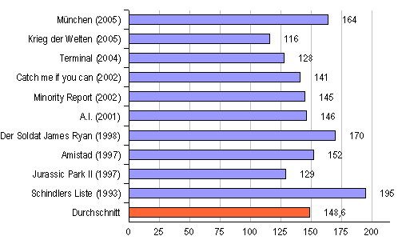

Ausgehend von meiner Kritik zu [München](/2006/02/07/munchen/) und der gestrigen South-Park-Folge (in welcher die Herren Spielberg und Lucas schreckliche Neufassungen ihrer alten Filme ins Kino bringen) ist mir eingefallen, dass Steven Spielberg gerne dazu neigt, Filme unnötig in die Länge zu ziehen - ich bin bei [A.I.](/2001/09/18/ai-kunstliche-intelligenz/) am Ende fast eingeschlafen!

Also habe ich schnell die [IMDB](http://www.imdb.com) zu Rate gezogen und einen Filmlängenvergleich der letzten zehn Kinofilme des Regisseurs erstellt, um herauszufinden, ob dies nur Zufall ist oder ein Schema dahinter steckt.

Auffallend ist, dass die vier längsten Filme alle auf realen Ereignissen basieren. Steven Spielberg neigt also scheinbar dazu, bei diesen Filmen die Geschichte sehr ausführlich und genau auf der Leinwand umzusetzen. Doch während *Schindlers Liste* als Extrem durchaus zu überzeugen weiß, ist [München](/2006/02/07/munchen/) etwas zu lang geraten.

Ebenso ist [A.I.](/2001/09/18/ai-kunstliche-intelligenz/) nur eine Minute länger als [Minority Report](/2002/10/15/minority-report/), obwohl letzterer Film aufgrund des höheren Tempos und der actionreichen Inszenierung dem Zuschauer deutlich kürzer erscheint. Und nur bei einem der letzten zehn Filme konnte ich den Kinosaal vor der 2-Stunden-Marke verlassen, der Durchschnitt liegt gar bei 2,5 Stunden!

Steven Spielberg scheint also bei Schnitt und Regie die Angewohnheit zu haben, seine Filme etwas in die Länge zu ziehen - als Serien-Blockbuster-Regisseur mit eigenem Studio kann er sich das erlauben. Und doch ist die übermäßige Länge seiner Filme nicht immer richtig eingesetzt - manchmal fehlt einfach das Tempo in der Inszenierung. Trotzdem weiß er, dass er diese Angewohnheit bei den ernsten Themen weiter treiben kann als bei Actionfilmen oder Komödien, da das Zielpublikum eher zu Geduld im Kinosessel neigt.
