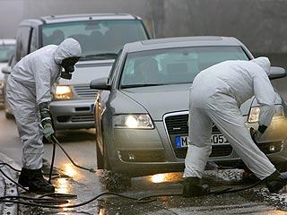

> Für alle Reisenden* beim Verlassen der [Insel Rügen](http://www.ruegen.de/) über den Rügendamm**. 

Ein Service Ihrer [Bundeswehr](http://www.bundeswehr.de).

* das Angebot ist zeitlich beschränkt, eine Garantie auf eine kostenlose Autowäsche wird nicht gegeben
** bald auch in anderen Bundesländern verfügbar

(Dies ist natürlich nur eine Satire, aber vielleicht kann ich damit die negativen Auswirkungen auf die Tourismusindustrie der Ostseeinsel begrenzen. Man muss das Thema nur richtig vermarkten!)
