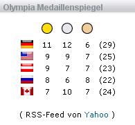

Olympia ist vorbei, alle Medaillen sind vergeben. Da wird es Zeit, den [Medaillenspiegel](/blog/2006/02/17/der-kampf-um-die-goldenen-ananasscheiben/) wieder aus der Sidebar zu entfernen. Zuvor will ich jedoch noch ein paar Auswertungen vorstellen.

Deutschland hat zum dritten Mal nach der Wiedervereinigung die Wertung [der erfolgreichsten Nation](http://www.torino2006.org/ENG/IDF/MDL/MDL_Big.html) bei einer Winterolympiade gewonnen, so dass sich zumindest im Wintersport [die Hoffnungen von Franz Beckenbauer](http://www.netzeitung.de/sport/357174.html) erfüllt haben. Mit den 29 Turiner Medaillen ist mein Heimatland im [ewigen Medaillenspiegel](http://www.kicker.de/content/olympia/olympia.asp?mode=medaillenspiegelewig&folder=22011) nun ganz dicht an Russland herangerückt - wobei diese Liste aufgrund der zwischenzeitlichen Teilung von Deutschland und dem Zerfall der UDSSR eher skeptisch betrachtet werden sollte.

Den größten Anteil an den Medaillen aufgrund ihrer Sportförderung trägt dabei die [Bundeswehr](http://www.bundeswehr.de/portal/a/bwde/kcxml/04_Sj9SPykssy0xPLMnMz0vM0Y_QjzKLd4w3DHEHSYGZbn76kTCxoJRUfV-P_NxUfW_9AP2C3IhyR0dFRQBPuMOW/delta/base64xml/L2dJQSEvUUt3QS80SVVFLzZfQV8xVEc!?yw_contentURL=%2FC1256EF4002AED30%2FW26MDN7K128INFODE%2Fcontent.jsp). Allein 19 der 29 Podestplätze konnten Feldwebel und andere Dienstgrade erringen (9 x Gold / 8 x Silber / 2 x Bronze).

Auf [n-tv](http://www.n-tv.de/638503.html) hat man dagegen die Wiedervereinigung noch nicht ganz verdaut und ordnet die Medaillen nach Ost und West mit folgendem Ergebnis für den internen Medaillenspiegel:

`*Ostdeutschland:* 6 / 5 / 2 (13 Gesamt)`
`*Westdeutschland:* 3 / 3 / 4 (10 Gesamt)`
`*Gemeinschaft:* 2 / 4 / 0 (6 Gesamt)`

Der [Olympia-Medaillenspiegel auf meinestadt.de](http://www.meinestadt.de/deutschland/home/info/medaillenspiegel) bestätigt dies durch eine Zuordnung der Medaillen zu den Heimatorten der Sportler. Diese sind zwar oft nicht die Trainingsstätten und bei Staffelrennen wurde jedem Athleten eine eigene Medaille zugeordnet, aber trotzdem kommt die Analyse zum selben Ergebnis wie [n-tv](http://www.n-tv.de/638400.html): Oberhof im Thüringer Wald und Oberwiesenthal im Erzgebirge sind die erfolgreichsten Wintersportorte Deutschlands.

Zu guter Letzt findet sich bei [Petra Press](http://pages.cpsc.ucalgary.ca/~pneumann/blog/pivot/entry.php?id=36) noch eine Umrechnung der Medaillen auf die Bevölkerungsanzahl und das Bruttosozialprodukt der Länder. Bei dieser Statistik liegen dann erwartungsgemäß kleinere Flächenländer und die Wintersportnationen ganz weit vorne. Ich erspare mir an dieser Stelle eine Umrechnung der Ergebnisse auf die durchschnittliche Schneehöhe der einzelnen Länder...
