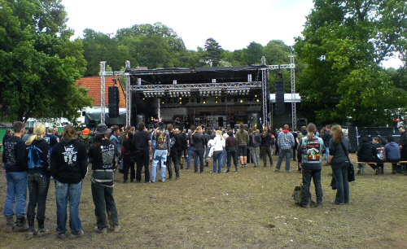

Dieses Jahr stand ein "großer" Umzug an beim [Rock-Harz-Festival](http://www.eseltreiber.de/rockharz): Von Dorste zog man 2km weiter entlang des Bächleins Söse nach Förste auf ein größeres Festivalgelände - mindestens vier Mal größer als das alte Gelände, und auch mindestens vier Mal zu groß. Doch trotz der Größe hatten es der Regen und die Besucher bis Samstag geschafft, die komplette Kuhweide in einen Morast zu verwandeln, in den man bei jedem Schritt fast bis zu den Knöcheln einsank.

Trotzdem hielt sich das Wetter halbwegs zurück; nur kurze Schauer gingen Freitag und Samstag nieder. Eine Pause wie im letzten Jahr war zum Glück nicht notwendig. Aufgrund der späten Planung war der Campingplatz diesmal viergeteilt und die Entfernungen nicht viel kürzer als in den Vorjahren - vielleicht ein Grund dafür, dass sich ziemlich schnell wilde Wege durch die trennenden Felder bildeten. Alles in allem ist das Festival aber noch angenehm klein, so dass es kaum Wartezeiten an den Eingängen und Bierständen gab. Dafür ging den Jever-Bierständen bereits am Freitag das Jever aus, so dass ich neben [Dosenbier](/2007/07/06/dosenbier/) (ich hatte bereits verdrängt, wie mies dieses schmeckt) auch noch Radeberger trinken musste...

Musikalisches Highlight aus meiner Sicht waren die durch verschiedene Umstände zum Headliner am Freitag aufgestiegenen Crossover-Urgesteine [Clawfinger](http://www.clawfinger.net/). Das hiphop-typische Gepose und der körperliche Einsatz des "Sängers" unterschieden sich angenehm von üblichen Metalkapellen. Die Stimmung brauchte dadurch nicht lange, um auf die Fans vor der Bühne überzugehen und ich habe mich bei keinem Auftritt mehr verausgabt.

Ebenso gut, wenn auch routinierter, spielten [In Extremo](http://www.inextremo.de) dann einen Abend später auf. Nach fast einer Stunde Aufbauarbeiten am Schiffsset hatten sich deutlich mehr Besucher vor der Bühne eingefunden als am Vortag - so ein Tagesticket ist einfach billiger als ein normales Konzert der Band. Mit der Pyroshow wurde auch ganz gut gegen die anziehende Kälte der Sonntagnacht angekämpft und so war dies ein verdienter Abschluss für das Festival.

Ansonsten haben mich [After Forever](http://www.afterforever.com) und [Oomph](http://www.oomph.de/) eher enttäuscht. Dafür habe ich aber auch mit [Suidakra](http://www.suidakra.com/) eine positive Überraschung aus dem Harz mitgenommen. Insgesamt also wieder ein sehr nettes Festival mit super Preis/Leistungs-Verhältnis, bei dem ich hoffentlich nächstes Jahr wieder aufschlagen werde.
