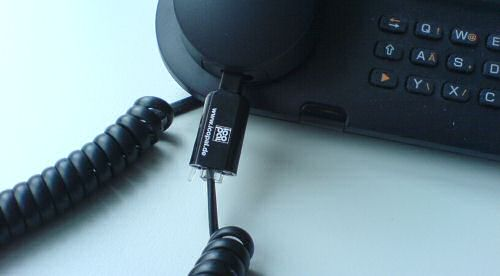

... hat mein Vater von einer Werbeveranstaltung mitgebracht: Den [Untangler](http://www.telefonkabelentwirrer.net/BASIC.719.0.html). Das kleine ~~Stück Plaste~~ Gerät wird zwischen Telefonhörer und Hörerkabel eingesetzt (ja es gibt noch DECT-freie Telefone, zum Beispiel am Arbeitsplatz) und verhindert schlicht und ergreifend, dass sich die geringelte Schnur verdreht, da es beliebig um die eigene Achse rotieren kann. Dass noch niemand vorher auf diese simple Idee gekommen ist!
