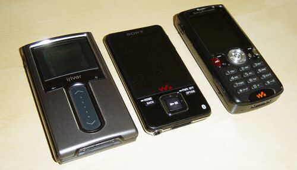

[Lange](/2007/12/20/nicht-ohne-fernbedienung/) [habe ich nun](/2008/01/21/stand-der-technik/) [um eine Entscheidung](/2008/02/05/stand-der-technik-ii/) [gerungen](/2008/02/13/stand-der-technik-iii/), [welcher MP3-Player](/2008/03/02/stand-der-technik-iv/) meinen in die Jahre gekommenen iRiver H10 ersetzen soll. Schlussendlich habe ich mich für den Sony NWZ A829B entschieden und bin damit nach drei Jahren der Untreue wieder zu meiner [Stammmarke](/2008/03/12/sackgasse-der-evolution/) zurückgekehrt.

Ausschlaggebend neben den Standardkriterien (mindestens 16GB Flash-Speicher, [USB-Wechselmedium](http://m.kausl.net/nwz-a818-review.html), keine Extra-Software für die Bibliothek nötig) war der eingebaute Bluetooth-Sender und die vernünftige Bedienoberfläche, die andere Konkurrenten nicht aufweisen können. Durch die an den iPod Touch erinnernde flache Bauform und das ultraleichte Gewicht ist es auch gar kein Problem, den Player in der Tasche zu tragen (egal ob Hose oder Jacke).

Passend zu meinem Sony-Handy habe ich die Farbe Schwarz gewählt, die silberne Version macht jedoch den edleren Eindruck (die gebürstete Optik fällt mit schwarz kaum auf) und war gefühlt auch nicht so ein Staubmagnet. Beim Händler meiner Wahl hätte die silberne Version aber einen Aufpreis von 30€ zur Folge gehabt, und das war es mir nicht wert. Ansonsten finden sich die Tasten für die Bedienung ohne Sichtkontakt (z.B. in der Tasche) wie von selbst, so dass ich die fehlende Fernbedienung gar nicht vermisse.

Leider ist der Performance bei der Datenübertragung für ein Flash-Medium unterirdisch. Bei meinen ersten Tests kam ich über 2,5 MB/s beim Schreiben und 3,5 MB/s für das Lesen nicht hinaus. Um damit die gesamten 16GB zu befüllen benötige ich fast zwei Stunden! Zum Glück übertrage ich selten große Datenmenge am Stück auf den Player, sonst wäre dies ein KO-Kriterium. Seltsamerweise dauerte der Aufbau der internen Datenbank von ca. 3GB aufgespielten MP3s keine 10s - also entweder kann der Player selber schneller vom Flash lesen als ein angeschlossener Computer oder beim Aufspielen werden die Daten bereits analysiert und danach nur noch aggregiert.

Meine MP3s mit eingepflegten Album-Covern hat der Player allesamt geschluckt. Sony bietet zwar kein [Coverflow](http://en.wikipedia.org/wiki/Coverflow) an, man kann jedoch durch die Albumbilder wie durch JPEGs browsen und beim Abspielen werden sie auch angezeigt. Nur mit einem besonders langen Albumtitel hatte der Player ein Problem, als dieser zusammen mit einen extrem langen Titel-Tag auftrat. Scheinbar ist in dieser Kombination die maximale Länge begrenzt, einen genauen Grenzwert konnte ich jedoch nicht ermitteln (einige Titel enthielten ebenfalls Umlaute, also spielt vielleicht die Kodierung noch mit hinein).

Von aufgespielten Fotos verwendet der Player die enthaltenen EXIF-Vorschaubilder für die Übersicht und die Schnellansicht, bevor das Bild komplett geladen wurde. Sind jedoch keine EXIF-Daten vorhanden, gibt es auch keine Vorschau. Für solche Bilder muss man dann die Darstellungsform auf Liste umstellen, damit zumindest die Namen angezeigt werden. Dies geht über das Kontextmenü recht schnell; bei den meisten Konkurrenten muss man dafür erst im Hauptmenü diese Option suchen.

Neben einem Ausdruck der [GPL](http://de.wikipedia.org/wiki/GNU_General_Public_License) und Kurzanleitungen in fünf Sprachen lagen dem kleinen Paket nur ein USB-Kabel (ein explizites Ladekabel fehlt) und [In-Ear-Kopfhörer](http://www.sony.de/view/ShowProduct.action?product=MDR-EX85LP&site=odw_de_DE&imageType=Main&category=HDO+Performance+In-ear) bei. Letztere haben zwar einen Wert von über 40€, aber mittlerweile bin ich wieder auf meine Sennheiser umgestiegen. Zum Einen empfand ich die Abschirmung der Umwelt durch die Abschottung des Ohrgangs als zu stark (ich habe im Pausenmodus meine eigene Stimme kaum noch vernommen), zum Anderen passte mir der Sound ganz und gar nicht. Volumige Bässe sind zwar nett, aber wenn die hohen Töne dabei untergehen (z.B. Pianos oder hohe Stimmen), dann habe ich nichts gewonnen. Anderthalb Tage habe ich mit dem guten Equalizer des Sony herumprobiert, konnte jedoch keine durchgängig überzeugende Lösung finden. Schade, denn die Kopfhörer habe ich ja mitbezahlt...

Fazit: Der perfekt Player ist der Sony NWZ A829 bestimmt nicht, dazu ist er zu langsam, zu unflexibel und eigentlich auch zu teuer. Aber für meine Ansprüche ist er der beste Kompromiss und die Soundqualität ist sogar noch besser als bei meinem alten iRiver H10. Jetzt muss ich mir nur noch Bluetooth-Kopfhörer zulegen!
