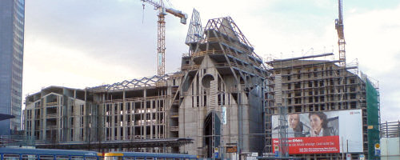

Eigentlich wollte ich mir nur den schon sehr weit fortgeschrittenen Rohbau des Uni-Komplexes am Augustusplatz in Leipzig ansehen. Schließlich habe ich an selber Stelle noch hinter der Thälmann-Plastik fünfeinhalb Jahre lang studiert. Doch zwei Tage vor Weihnachten ist eindeutig der falsche Termin, um einmal schnell mit dem Auto in die Leipziger Innenstadt zu fahren und dann auch noch einen Parkplatz zu ergattern. Sogar die Parkhäuser rund um den Ring waren allesamt belegt. Im Nachhinein muss man realistisch feststellen: Olympia 2012 wäre eine Nummer zu groß gewesen für Leipzig; die Stadt wäre aus allen Nähten geplatzt.

Doch dann stand ich endlich vor der Oper und konnte die Front des Universitäts-Neubaus bewundern. Nach langem Streit hatte man sich in Leipzig entschieden, die dem Vorgängerbau aus politischen Gründen gewichene Universitätskirche St. Pauli nicht wieder aufzubauen, aber deren Umrisse in die Linien des neuen Campus einfließen zu lassen und dahinter eine Aula zu errichten. Das Ergebnis in der jetztigen Form ist schon sehr beeindruckend; das Foto gibt die Größe nur ungenügend wieder.

Das gesamte Universitätsgelände um die sanierten Hörsaal- und Seminargebäude hat deutlich an Volumen zugelegt. Zur Moritzbastei hin schließt der Mensaneubau das Areal ab und auch die Grimmasche Straße musste abspecken um Platz für die vielen neuen Räume zu schaffen. Etwas ungewöhnlich finde ich, dass dort ein Universitätsgebäude ganz normale Geschäfte im Erdgeschoss beherbergt. Zwischen allen Gebäuden, Alt- wie Neubauten, gibt es nun direkte Übergänge, was den Charakter eines zusammenhängenden Campus unterstreicht. Dazu passt auch die einheitliche Farbgebung, wenngleich die vielen roten Elemente nicht so mein Fall sind. Ich bin aber gespannt, wie der neue Innenhof gestaltet wird. Momentan versperren noch Bauzäune den Blick nach innen.

Noch zu Beginn meines Studiums gab es auf dem Leipziger Boulevard das herrlich altmodische [Capitol-Kino](http://www.allekinos.com/LEIPZIGCapitol.htm). Dieses musste einem Konsumtempel der Kette Sinn und Leffers weichen, die außer der Front nicht viel übrig ließen von diesem Stück Geschichte. Nun ist der Laden selber Geschichte, denn die Filiale schließt ihre Pforten. Was nun aus dem Gebäude wird weiß ich nicht, doch irgendwie ist es traurig zu sehen, wie kurzlebige Interessen das Bild einer Innenstadt prägen können.

Aber zumindest habe ich auf dem Leipziger Weihnachtsmarkt noch warme und zugleich preiswerte geröstete Mandeln bekommen, die die Verkäuferin vor meinen Augen auf einer Waage mit echten 100g-Gewichten in die Tüte gefüllt hat. So etwas gibt es in Berlin scheinbar nicht mehr...
