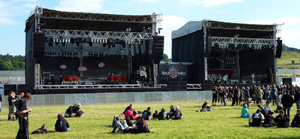

Da unternehmen die Veranstalter des [Rock Harz](http://www.rockharz.com/) schon ihr Möglichstes, um endlich besseres Festivalwetter zu bekommen, und verlegen ihr Event auf [die andere Harzseite](http://www.flugplatz-ballenstedt.de/) und zwei Wochen nach vorne - doch genützt hat es nichts. Die Temperaturen hatten mit Sommer nichts gemein, der Regen trat bevorzugt während der Spielzeiten auf und die gesamte Zeit wehte ein unangenehm heftiger Wind über das Gelände, [dem schließlich mein Zelt zum Opfer fiel](/2009/07/12/rest-in-pieces/). Aber gut, das bin ich mittlerweile gewöhnt, und entgegen den Vorjahren hielten Festivalgelände und Campingground den Strapazen stand.

Generell war der Zeltplatz mit seiner Lage direkt neben den Bühnen einfach genial. Wir hatten zwanzig Meter bis zum Einlass und theoretisch konnte man die Auftritte (zumindest akustisch) auch vom Grill aus verfolgen. Die Lage direkt unterhalb der [Teufelsmauer](http://de.wikipedia.org/wiki/Teufelsmauer_(Harz)) (viele Besucher nutzten die Chance, die Gegensteine zu besichtigen) und nebem einem kleinen Flughafen ist landschaftlich wirklich beeindruckend, hat aber auch ihre Schattenseiten. Die Kanalisation ist nämlich nicht für ein Festival ausgelegt und so musste man komplett auf gespülte Toiletten verzichten. Da gibt es noch Ausbaumöglichkeiten für die nächsten Auflagen, aber ingesamt gefiel mir das neue Gelände sehr gut.

Musikalisch wurde dagegen mein Geschmack etwas verfehlt. Der Partydonnerstag - diesmal ohne Mambo Kurt - war noch das Highlight mit **Fiddler's Green**, den großartigen **Schröders** auf ihrer Abschiedstour und schließlich **J.B.O.**. Wer sich vorher gefragt hatte, was die **E.A.V.** auf einem Festival der härteren Gangart zu suchen haben, der wurde mit ihrem Auftritt eines besseren belehrt. Die Band rockte das Publikum mit ihren doch eher poppigen Songs und einer tollen Bühnenshow; als Fan des [Wiener Schmäh](http://de.wikipedia.org/wiki/Wiener_Schmäh) war ich aber auch ein leichtes Opfer der vielen, oft politischen Ansprachen.

Der Freitag mit seiner Gothic-/Mittelaltermischung fing mit den Hardcore-Bands **Isolated** und **D.T.A.** noch gut an, doch dann sorgte das schlechte Wetter dafür, dass ich mich öfters zum Zelt bzw. Pavillion zurückzog. **Moonspell** waren so mein einziges Highlight, auch wenn sie mit dem Soundcheck von **Unheilig** auf der parallelen Bühne zu kämpfen hatten und leider nicht für eine Zugabe zurückkamen. Vom Samstag schließlich sind mir nur **Arch Enemy** hängengeblieben, deren deutsche Frontgrölerin Angela Gossow die Massen mitriss.

Als Fazit kann ich also festhalten, dass die neue Location großartig ist, aber noch an ein modernes Abwassersystem angeschlossen werden könnte. Die parallelen Bühnen sorgen für weniger Rennereien zwischen zwei Bands, die Soundchecks sollten jedoch bitte nicht die spielenden Bands beeinflussen. Und schließlich wünsche ich mir noch ein besseres Lineup und endlich gutes Wetter für 2010. Trotzdem dankeschön *Rock Harz* für ein tolles Festival 2009!

(die Berichte aus den Vorjahren [2008](/2008/07/22/rock-harz-2008/) & [2007](/2007/07/15/rock-harz-2007/) und [ein Artikel aus der lokalen MZ](http://www.mz-web.de/servlet/ContentServer?pagename=ksta/page&atype=ksArtikel&aid=1246046509883))
