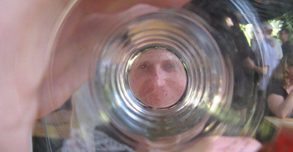

Die Stationen dieses Jahr (Qualität vor Quantität):

<ol>
<li>[Flensburger Pilsener](http://www.flens.de/) (ein optimaler Start) und dazu passend ein Fischbrötchen</li>
<li>[Andechser Klosterbier](http://www.andechs.de/) (hell)</li>
<li>[Gambrinus](http://www.gambrinus.cz/) Pilsner (mein Favorit aus Tschechien)</li>
<li>[Krusovice Pils](http://www.krusovice.de/) und lecker Prager Schinken im Roggenbrötchen</li>
<li>[Rothaus Tannenzäpfle](http://www.rothaus.de/html/02biere/020_biere_fs.htm) (leider aus der Flasche)</li>
<li>[Glückauf](http://www.glueckaufbiere.de/) (vermutlich das Pils)</li>
<li>[Ur-Krostitzer](http://www.ur-krostitzer.de/) als krönender Abschluss und dazu ein Nackensteak</li>
</ol>

Auch im vierten Jahr in Folge hat sich der Besuch gelohnt, nicht zuletzt auch aufgrund des genialen Biergartenwetters am Samstag. See you next year, [Berliner Bierfestival](http://www.bierfestival-berlin.de/)! (Or maybe in [Prag](http://www.ceskypivnifestival.cz/de/index.shtml)?)
