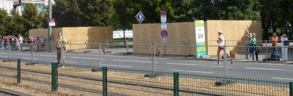

Von der aktuell in Berlin stattfindenden Leichtathletik-Weltmeisterschaft habe ich mich bis jetzt fern gehalten, da mir für diese Sportarten das Interesse fehlt. Da aber seit anderthalb Wochen am Alexanderplatz die Marathonstrecke abgesteckt war wollte ich mir das Spektakel einmal von nahen ansehen und bin heute an die Strecke gefahren. Dort hatten sich bereits viele Touristen und Sportbegeisterte breit gemacht und so kam ich auf der Suche nach einem Platz mit Blickkontakt zur Strecke schließlich in der Karl-Liebknecht-Straße an.

Dort befindet sich eine Unterführung, über die man theoretisch das Innere der Schleife um den Fernsehturm herum hätte erreichen können. Aber diese Unterführung war seltsamerweise von Holzverschlägen ummantelt, und da es keine weiteren Tunnel oder andere Überquerungen der Strecke gab, blieb die rechte Bande der Laufstrecke (fast) frei von Zuschauern, die sich auf der linken Seite dafür stapelten. Zu allem Überdruss grenzte in der Liebknechtstraße die Bande direkt an die Straßenbahnschienen, die von der BVG auch weiter fleißig befahren und von der Polizei von Zuschauern freigehalten wurden, so dass unnötigerweise zweihundert Meter Strecke ohne Publikum blieb.

Geschadet hat es dem Sport nicht, aber von den routinierten Veranstaltern des Berlin Marathon hätte ich schon erwartet, auf der Extraschleife dieselbe Atmosphäre wie auf dem Rest der Strecke zu erzeugen. Vor dem Dom jedenfalls standen die Menschenmassen in fünf Reihen auf jeder Seite und die Stimmung war ohrenbetäubend. Denn wenn die Berliner eins sind, dann begeisterungsfähig!
