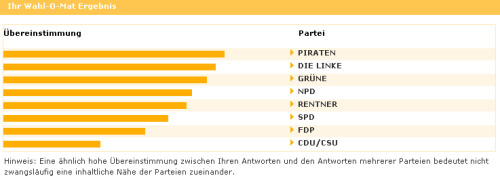

Derzeit sind die Server dank der medialen Werbung noch ausgelastet, aber [wie bei jeder Wahl](/2006/02/26/wahlkampf-in-sachsen-anhalt/) habe ich auch diesmal den [Wahl-o-maten](http://www12.bpb.de/methodik/XQJYR3,0,WahlOMat_Bundestagswahl.html) ausprobiert. Nicht, um mir meine Meinung zu bilden, sondern um einen Überblick über einige Kernaussagen der Wahlprogramme der Parteien zu bekommen.

Dabei ist diesmal ein interessantes Ergebnis herausgekommen. Die geringe Übereinstimmung mit CDU/FDP kenne ich bereits und ebenfalls die schlechte Auswahl an Fragen des Wahl-o-maten, aber dass die NPD sich so gut platzieren kann zeigt deutlich, wie stark sich die Parteiprogramme einander genähert haben.

In vielen Punkten möchten sich die Parteien anscheinend gar nicht differenzieren (abgesehen vom bürgerlichen Lager) und suchen ihr Wohl in der Mitte, um ihre ganze Kraft dann in wenige Kernaussagen zu stecken. Dies trifft gerade auf die Extreme *Die Linke* und *NPD* zu, die in ihren Stammwählern allein wohl zu wenig Potential sehen. Wenn man dann die eigenen Schwerpunkte nicht genau auf die Fragen legt, bei denen man von ihnen abweicht, tauchen sie automatisch weit oben in der Ergebnisliste auf.

Dies ist ein ganz natürliches Verhalten. Der Wahl-o-mat ist etabliert und - die aktuelle Nachfrage beweist es - wird von vielen internet-affinen Wählern als Entscheidungshilfe genutzt. Damit ist er wie andere Angebote im Netz auch das Ziel von Manipulationen, die äußerst subtil zumindest die Aufmerksamkeit auf sonst wenig beachtete Parteien lenken.

Ob diese Taktik erfolgreich ist, wird erst die Zukunft zeigen. Schön ist es jedenfalls nicht, wenn man das eigene Programm so hinbiegt, dass es niemandem weh tut. Da muss ich ausnahmsweise den Mut von FDP und CDU loben, die sich trauen, eine eigene Position zu beziehen, auch wenn sie von mir nicht geteilt wird.
