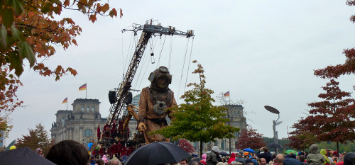
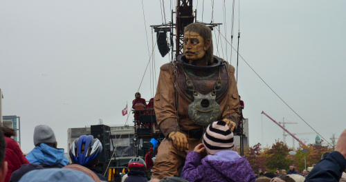

Heute finden sie sich endlich, die kleine Riesin und ihr Onkel, der Taucher. Lange haben sie sich gesucht, und am Brandenburger Tor findet diese Suche ein Ende und damit eine schöne Parabel auf die ehemals getrennten deutschen Staaten, deren Wiedervereinigung heute gefeiert wird.

Passend dazu hat sich der Riese im Westteil der Stadt bewegt, während die Riesin im Osten suchte. Beide gleichzeitig konnte man nicht verfolgen, so wie auch die Deutschen sich zwischen DDR und BRD entscheiden mussten. Erst die Wende im November 1989 riss die Grenze innerhalb Deutschlands ein, und an dem historischen Ort der Maueröffnung gibt es heute die sinnbildliche Vereinigung von Riesin und Riese.

Passend zu der Schiffsreise der kleinen Riesin (es wurde sogar ein Geysir vor dem Lustgarten angelegt) und dem Taucheroutfit ihres Onkels präsentiert sich das Berliner Wetter, sowohl gestern als auch heute bin ich ordentlich nass geworden. Doch es hat sich gelohnt, die Vermischung aus Puppen- und Straßentheater hat mich begeistert. Da ist zum Einen die Technik, mit der beiden zwischen sieben und zehn Meter großen "Puppen" bewegt werden: Die beteiligten Darsteller müssen sowohl Kraft als auch Timing besitzen, um die Bewegungen realistisch erscheinen zu lassen. An jeder Figur sind dabei bis zu zwanzig Künstler direkt an den Seilen und dem Kran beteiligt; nicht eingerechnet die Helfer rund um die Riesen und die auf einem Wagen hinterher fahrende Band.

Diese begleitet die Aufführung mit passender Live-Musik, während sich der Korso durch Berlin bewegt. Das Publikum zieht dabei immer mit; die Polizei hatte keine Probleme, den Weg direkt vor den Figuren frei zu machen. Ich stand mehrere Male direkt unterhalb der vorbeiziehenden Riesen - ein beeindruckender Anblick. Sind die Puppen vorbeigezogen, kann man sich als Zuschauer entscheiden, ihnen zu folgen oder sie zu überholen und erneut vorbei ziehen zu lassen. Auf ihren Wegen gibt es genügend Pausen, an denen die Suche aufgelockert wird. So wurde gestern das Schiff der Riesin vor dem Opernpalais geputzt und heute dem Riesen der Taucherhelm abgenommen.

Diese kreative Vereinigung so vieler Elemente und der freie Zugang dazu haben mich beeindruckt. Wer die Aufführung in Berlin nicht sehen konnte, hat heute abend auf [Arte](http://www.arte.tv/royaldeluxe/?lang=de) noch die Chance, eine Reportage über das Event ansehen. Da sehe ich dann hoffentlich auch die Teile der Suche, die ich verpasst habe.

