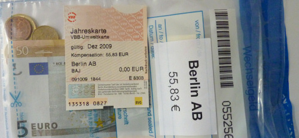

Seit einer Woche kann man sich als Stammkunde der Berliner S-Bahn oder BVG die [Entschädigung](http://www.s-bahn-berlin.de/aboundtickets/abo_freimonat.htm) für "die erheblichen Einschränkungen im S-Bahnverkehr der letzten Wochen" abholen. Für mich als Jahreskarten-am-Schalter-Käufer bedeutet dies, dass ich mein Dezember-Ticket gegen eines mit 0€ Wert eintausche und dafür den Gegenwert dieses Monats ausgezahlt bzw in einem formschönen Plastikbeutel überreicht bekommen habe. Ob die 55,83€ nun gerechtfertigt sind als Ausgleich oder nicht (ich hatte so gut wie keine Unannehmlichkeiten), die Bahn als Betreiberin der Berliner S-Bahn muss für das entstandene Chaos haften.

Doch wie das so ist bei einem Monopolunternehmen, die Bahn braucht sich keine Sorgen um die Refanzierung machen. Sie [erhöht einfach die Preise]( http://www.tagesspiegel.de/wirtschaft/Deutsche-Bahn-Preiserhoehung;art271,2917520) in einem anderen Teil des Konzerns und kompensiert damit gleich noch die hohen Verluste im Güterverkehr. Und nicht alle Politiker haben aus dem extremen Sparplan der Berliner S-Bahn, der im schlimmstmöglichen Fall sogar zu menschlichen Opfern hätte führen können, etwas gelernt. Denn [die neue Regierung wird wohl die Privatisierung der Bahn wieder aufnehmen](http://www.tagesspiegel.de/wirtschaft/Deutsche-Bahn-Privatisierung-CDU-FDP-S-Bahn;art271,2911189).

Stehen Deutschland also [englische Verhältnisse](http://www.bahn-unterm-hammer.de/index.php?option=com_content&task=view&id=10&Itemid=42) bevor, solange sich das Unternehmen mit staatlicher Duldung für potentielle Investoren attraktiv macht? Schon jetzt sind die Bahnpreise auf den Fernverkehrstrassen verglichen mit einer Autofahrt oder einem Flug unverhältnismäßig teuer; ich glaube nicht dass sich dies ändert, wenn jedes Jahr ein Gewinn erwirtschaftet werden muss und Aktionäre mitverdienen wollen. Ich bin jedenfalls gespannt, wie sich die Lage weiter entwickelt, und werde dies als Beobachter verfolgen - ab November werde ich die Fahrten zwischen Halle und Berlin wohl öfter mit dem Auto als mit der Bahn unternehmen, damit ich die 55,83€ nicht gleich wieder an den Konzern zurückgebe.
