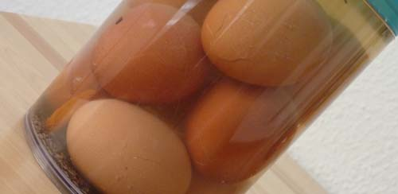

Ich kenne Soleier von klein auf. Seit ich denken kann gab es bei meinen Eltern zu Ostern die in einer Salzlake eingelegten Eier und mittlerweile habe ich diese Tradition übernommen. Doch dann musste ich heute bei einer nicht repräsentativen Umfrage unter meinen Kollegen in Berlin (Spreewälder, Lausitzer, Magdeburger, aber auch Berliner) feststellen, dass niemand - wirklich **niemand** - diesen Osterbrauch kennt. Dabei behauptet die Wikipedia, dass Soleier [ein traditionelles Gericht der Berliner Küche](http://de.wikipedia.org/wiki/Soleier) sind.

[Andere Quellen](http://www.gcb.de/DEU/staedte/stadt_54.htm) wissen zu berichten, dass die [Halloren](http://www.halloren.com/), die Salzwirkerbruderschaft aus meiner Heimatstadt Halle, das Solei erfunden haben - was durchaus einen Sinn ergibt und auch mein Umfrageergebnis erklären würde. Vielleicht sollte ich ja [eines der vielen bebilderten Rezepte](http://www.brigitte.de/kochen/kuechen-basics/soleier-1023228/) auf Arbeit verteilen oder gleich die fertigen Eier, um dieses Kulturgut weiter zu verbreiten. Denn Soleier sind einfach zu lecker!
