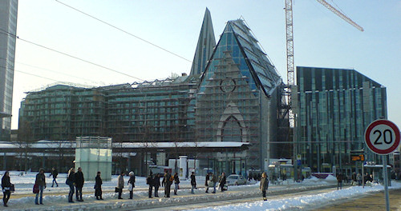

[Vor zwei Jahren](/2008/12/22/leipzig-weihnachten-2008/) stand bereits der Rohbau, und vor einem Jahr fanden die [Feierlichkeiten zum 600jährigen Bestehen der Universität Leipzig](http://www.zv.uni-leipzig.de/service/presse/pressemeldungen.html?ifab_modus=detail&ifab_id=3587) schon in der neuen Aula statt. Und doch ist ein Jahr später das Neubauprojekt des Campus am Augustusplatz immer noch nicht vollendet.

Zumindest ist das Leibnitz-Forum, der kleine Platz zwischen Paulinum und Seminargebäude mit dem Leibnitz-Denkmal, inzwischen für die Öffentlichkeit zugänglich. Mit der durchgängigen Schneedecke habe ich glatt übersehen, dass auch der neue Innenhof [komplett gepflastert](http://www.zv.uni-leipzig.de/fileadmin/user_upload/UniStadt/allgemein/bilder/Baugeschehen/historie/gallerie_neu/campus_forum_komplett_800.JPG) ist (zum Vergleich: Das alte ["Schmuckstück"](http://www.zv.uni-leipzig.de/fileadmin/user_upload/UniStadt/allgemein/bilder/Baugeschehen/historie/gallerie_neu/innenhof_ddr_800.jpg), wie ich es aus meiner Studienzeit noch kenne). Ein [Vorschlag des StuRas](http://www.stura.uni-leipzig.de/news-einzel/datum/2010/08/04/campus-augustusplatz-bleibt-graue-betonwueste/), mit mobilen Pflanzenkübeln für etwas mehr Flair und Atmosphäre zu sorgen, wurde leider nicht angenommen.

Wenn die Bauarbeiten in dieser Geschwindigkeit weitergehen, werde ich wohl noch ein paar Jahre lang Baustellenbilder erstellen können ;)
