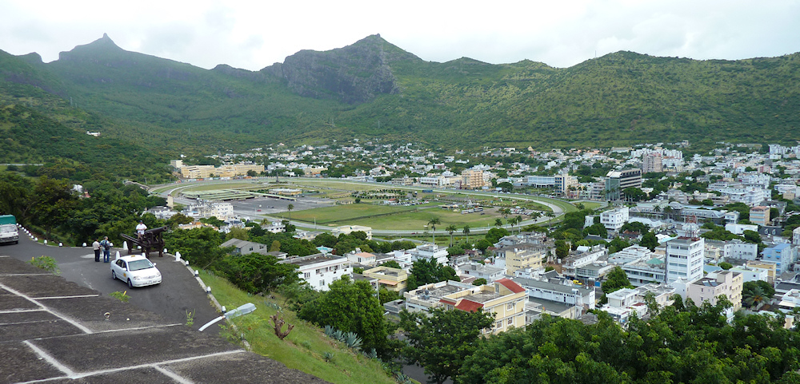
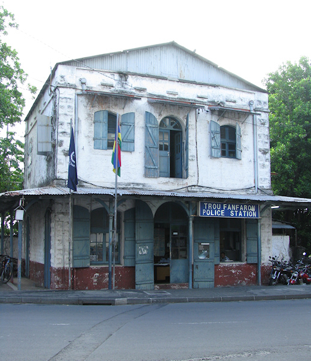

Port Louis ist die Haupt- und gleichzeitig größte Stadt von Mauritius - und doch hat sie nicht viel zu bieten. Aus Kolonialzeiten steht so gut wie kein Gebäude mehr, und wenn doch dann ist es heruntergekommen und ungepflegt. Die einzige Ausnahme stellt das Regierungsgebäude dar, an dem jedoch bei meinem Besuch gerade gebaut wurde. Statt geschichtsträchtiger Bauten dominieren moderne Bürohochhäuser und eine in die von Industrie und Marine geprägte Bucht hineingebaute Shoppingmall das Stadtbild. Das geschäftstüchtige Leben spielt sich trotzdem hauptsächlich auf den Straßen rund um das Zentrum ab, wo neben Nahrungsmitteln und Gewürzen auch Bekleidung verkauft wird.

Für eine gute Aussicht über die Stadt und den Champs de Mars (die älteste Pferderennbann der Südhalbkugel) sei der Aufstieg zum Fort Adélaide empfohlen. Diese von den Engländern erbaute Zitadelle ist zwar eine Ausgeburt an Hässlichkeit, jedoch kostet das Betreten der Mauern keinen Eintritt und bietet eine gute Übersicht über die Stadt (was aber nichts am Eindruck ändert, dass sie keine Schönheit ist).

Interessanter an Port Louis ist dann schon der Mix aus Religionen, die hier friedlich nebeneinander coexistieren. So findet sich oft nur wenige Straßen neben einer christlichen Kathedrale eine Moschee oder ein Hindutempel. Genauso offen, wie die Menschen gegenüber anderen Religionen sind, begegnen sie auch Fremden auf der Straße. Als ich erst einmal den aufdringlichen Verkäufern des Zentrums entkommen war, wurden die Gespräche schnell freundlicher. Ich wurde höflich gegrüßt und immer wieder in Gespräche verwickelt, und wenn es nur um das Wetter ging - als blonder, hellhäutiger Nordeuropäer bin ich eben schnell als Tourist auszumachen.

Die verbreiteste (Fremd-)Sprache unter den Einheimischen ist dabei das Französische. Obwohl Mauritius von 1810 bis 1968 britische Kolonie war und Englisch auch die Amtssprache ist, scheint Französisch doch zu dominieren (diese Mehrsprachigkeit ist einer der Gründe, warum hier die Callcenter so boomen). Sind Schilder zum Beispiel nicht mehrsprachig gehalten, dann sind zu 90% auf Französisch. Sind sie dagegen mehrsprachig, dann steht die französische Version meist oben in groß und fett. Offiziell nicht anerkannt, aber die wohl am Häufigsten gesprochene Sprache von Mauritius ist trotz allem jedoch Kreolisch. Da dieses in weiten Teilen auf dem Französischen basiert, ist die Präferenz der Einheimischen zu ihrer ersten Fremdsprache schnell erklärt - und auch die Präferenz der Franzosen zu Mauritius als Urlaubsziel (wenngleich sie nebenan auf La Réunion sogar mit dem Euro zahlen können, da Frankreich seine Kolonie im Gegensatz zu den Briten behalten hat).

Die Schaffner in den uns genutzten öffentlichen Bussen, die zwar einer festgelegten Strecke, aber scheinbar keinem festen Fahrplan folgten, konnten ebenfalls nur Französisch und Kreolisch. Da die Busse, die das einzige öffentliche Verkehrsmittel auf Mauritius darstellen, nicht immer Liniennummern besitzen und die drei (!) riesigen Busbahnhöfe von Port Louis während des gesamten Tages von Menschenmassen und einer schier unüberblickbaren Anzahl von Bussen überquellen, war es keine triviale Aufgabe, wieder zum Hotel zurück zu finden. Wir wurden von einer Haltestelle zur nächsten auf dem Bahnhof geschickt, während um uns herum sekündlich vollbesetzte Busse abfuhren. Am Ende standen wir zusammen mit 20 Anderen mitten auf einem Platz, auf dem viel rangiert wurde, und stiegen schließlich in einen Bus, auf dem einfach nur Express stand. Und landeten tatsächlich wieder da, wo wir am Morgen gestartet waren - obwohl uns eine Reiseführerin am nächsten Tag erklärte, dass dies der falsche Bus gewesen sei...

