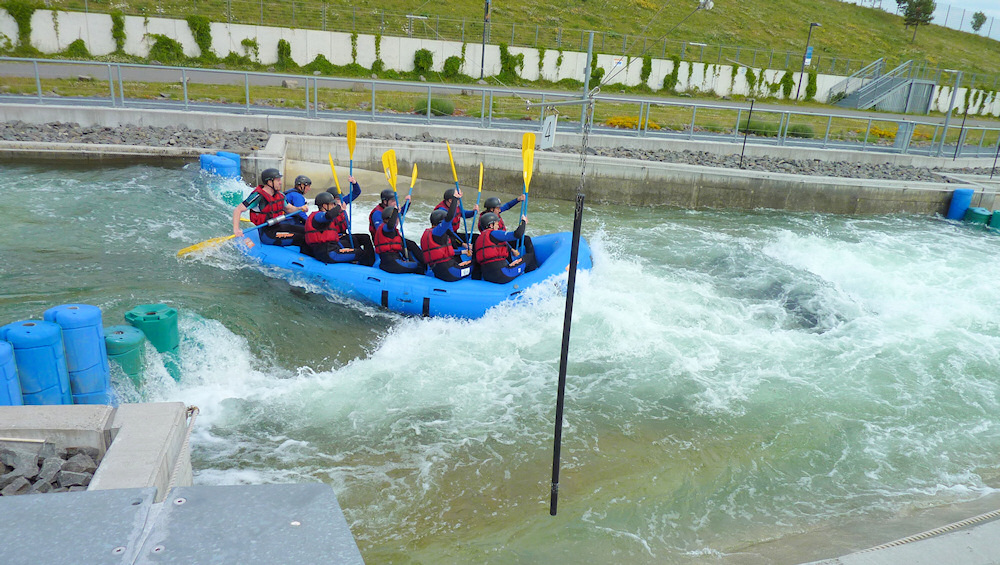
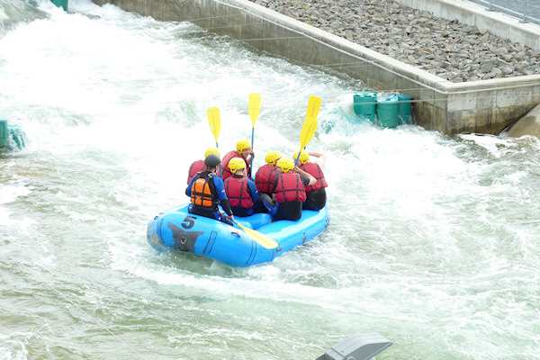

Als Überbleibsel der gescheiterten Leipziger Olympiabewerbung wurde 2007 am Markkleeberger See, einem der gefluteten Tagebauten im [Leipziger Neuseenland](http://www.leipzigerneuseenland.de/), eine künstliche Wildwasserstrecke für Kanuten eröffnet. Neben dem Training und Wettbewerben kann dieser [Wildwasserkanal](http://www.kanupark-markkleeberg.com/) auch zum Raften von jedermann gebucht werden, und genau das habe ich zusammen mit fünf Freunden getan.

Für eine Stunde Rafting auf dem Kurs muss eine weitere Stunde für die Vorbereitung eingeplant werden. Dazu gehören neben der Einkleidung (Neoprenanzug, Helm und Schwimmwesten werden gestellt) auch 20 Minuten trockene und weitere 15 Minuten feuchte Einweisung in das Verhalten und die Regeln an Bord eines Raftingbootes. Immer mit fährt ein Guide, der das Schlauchboot steuert, indem er mit seinem Paddel lenkt und - der wichtigere Part - Anweisungen an die Insassen des Bootes gibt, wie diese zu paddeln haben.

Nachdem dies und der Sturz aus und der Wiedereinstieg in das Boot kurz trainiert wurden, durften wir endlich los auf die Wildwasserstrecke. Diese ist 270m lang und der Höhenunterschied zwischen Start und Ziel wird über ein Förderband überwunden. Dort hatten wir auch die Gelegenheit, die Positionen im Boot zu wechseln. Dies ist sonst schwierig, da die Füße während des Raftens in Schlaufen am Boden stecken - ansonsten würde es schwer fallen, sich auf dem Rand zu halten, wo die beste Position zum Paddeln ist.

Die Guides variieren während der geschätzt 10 Fahrten die Art und Weise, wie sich das Boot die Strecke hinabbewegt. Ein einfaches Geradeausfahren haben wir nur einmal gemacht, danach sollten wir ständig drehen und rotieren. Teilweise wurde das Boot so an Hindernisse manövriert, dass das Wasser mehr durch das Boot als darunter hindurch strömte. Ein Versuch, dass Boot sich überschlagen zu lassen, indem alle Insassen sich mit ihrem ganzen Gewicht nach hinten setzen und sich dann gleichzeitig ins Wasser stürzen, scheiterte jedoch. Ein anderes Mal spülte es mich aus dem Boot, als wir uns alle in dessen Mitte setzen sollten (ohne die Füße in den Schlaufen) und der Mitfahrer neben mir allen Platz für sich beanspruchte. Nach dem Schwimmen zum Rand der nur 8,70m breiten Strecke wurde ich jedoch gleich wieder aufgelesen und hatte danach den Spaß, die restliche Runde nicht mitpaddeln zu müssen, da mein Paddel mit über Bord gegangen war.

Wir hatten mit dem Wetter richtig Glück; es war nicht zu warm und das Wasser mit knapp 19°C noch angenehm. Bei höheren Temperaturen kann es unter dem Helm sicherlich mächtig heiß werden, trotz der ständigen Abkühlung durch das Wasser. Dieses strömt übrigens nur während der Fahrten wildwasserartig den Kanal hinunter; den Rest der Zeit wird die [Anlage](http://de.wikipedia.org/wiki/Kanupark_Markkleeberg#Technische_Daten) abgestellt und wir konnten schön begutachten, wie die Stromschnellen aufgebaut sind. Auf Terrassen unter der Wasseroberfläche können verschiedene Hindernisse angebracht werden, die dann zu den Verwirbelungen des Wassers führen, während es den Kurs hinunterschießt. So kann für die Kanuten immer wieder eine andere Strecke aufgebaut werden.

Es folgen ein paar Impressionen in Bildern und Videos (in 720p), die ich vor Ort gemacht habe. Gefühlt waren mehr Zuschauer als Teilnehmer an der Strecke, wobei das Gebäude in der Mitte auch eine sehr schöne Terasse mit Blick auf den See hat und sich so Café-Trinken mit Schlendern um den See verbinden lässt. Während der Fahrt wurden von einem Fotografen ebenfalls Fotos geschossen, doch diese sind zum Einen mit 5€ das Stück recht teuer und zum Anderen sehen die Teilnehmer mit Einheitshelm, - anzug, -weste und -paddel alle fast gleich aus, so dass ich kein Bild gekauft habe.

<iframe width="560" height="349" src="http://www.youtube.com/embed/_xrCZ9ycEzY?rel=0" frameborder="0" allowfullscreen></iframe>

<iframe width="560" height="349" src="http://www.youtube.com/embed/ujPMpFIn018?rel=0" frameborder="0" allowfullscreen></iframe>
