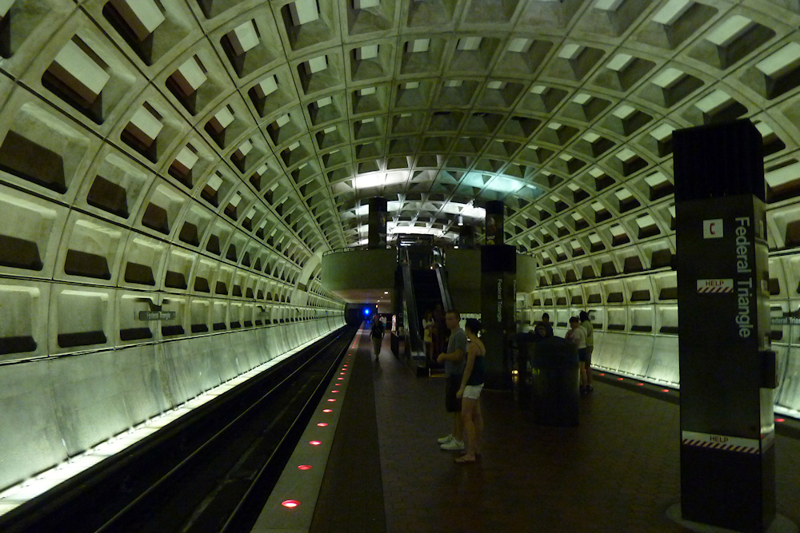

Man sollte nicht zuerst *Fallout 3* spielen, und danach Washington D.C. besuchen. Sonst schwingt in jedem Blick auf die Stadt die postapokalyptische Atmosphäre des Spiels mit, in welchem die [ortsansässigen Entwicklern](http://bitmob.com/articles/i-live-in-fallout-3) mit viel Liebe zum Detail ihre Heimat nachgebildet haben. Dies gilt vor allem für [das U-Bahn-System](http://multiplayerblog.mtv.com/2008/10/30/fallout-3-map-vs-reality/), welches in seinem einzigartigen Stil so perfekt in die *Fallout*-Welt passt, dass es für das Spiel kaum abgewandelt werden musste. Die Mischung aus schwacher, indirekter Beleuchtung und der erdrückend wirkenden [Architektur](http://www.thecoolist.com/washington-metro-the-most-iconic-subway-in-the-us/) der gewölbten Stationen mit ihrem als Eierkarton bezeichneten gleichförmigen Muster aus Betonwaben wirkt seltsam unnatürlich und ich konnte mir gut vorstellen, dass gleich ein Supermutant hinter der nächsten Ecke hervorgesprungen kommt. Zum Glück ist das heutige Washington D.C. nicht so ausgestorben wie seine *Fallout*-Variante, aber das mulmige Gefühl, dass dieses Untergrundsystem nicht für den Menschen geschaffen ist, konnten auch die vielen Fahrgäste nicht vertreiben - dazu hat das Spiel viel zu stark geprägt.
