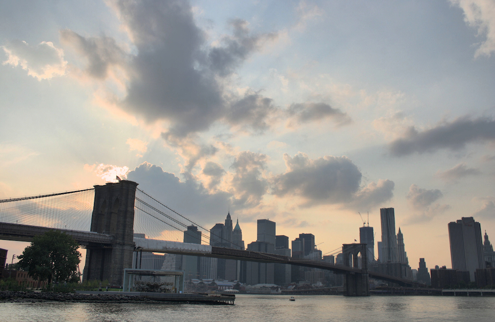
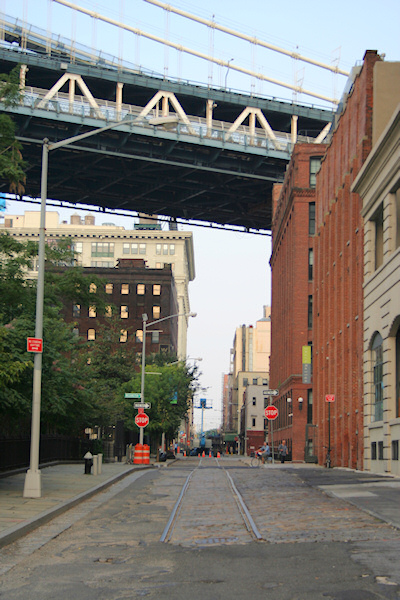
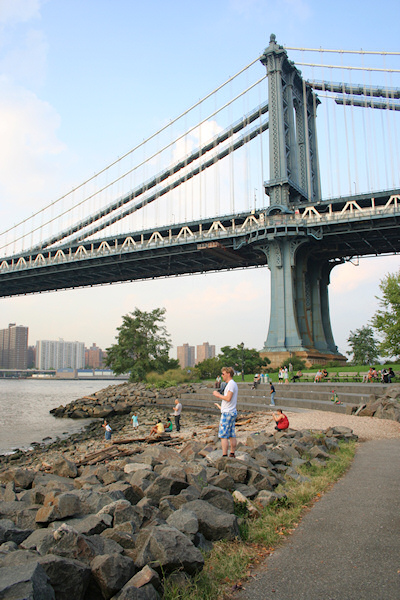
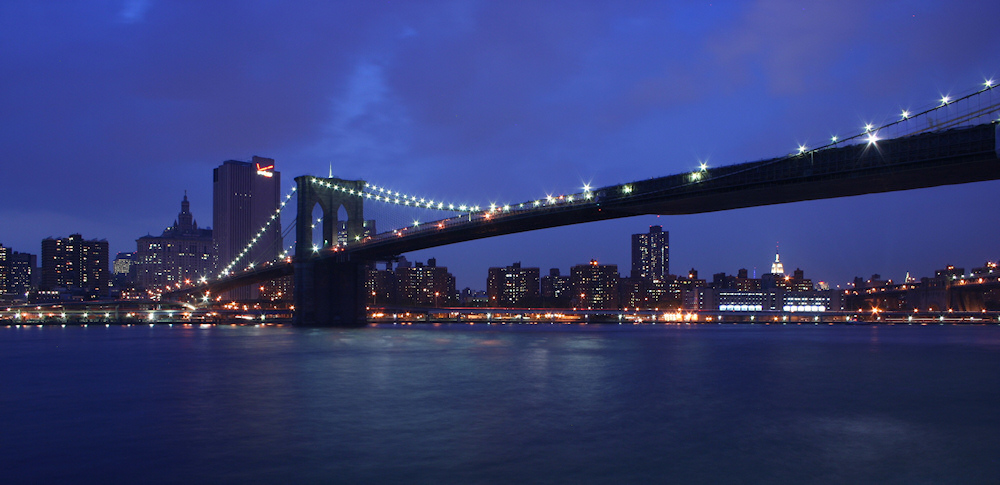
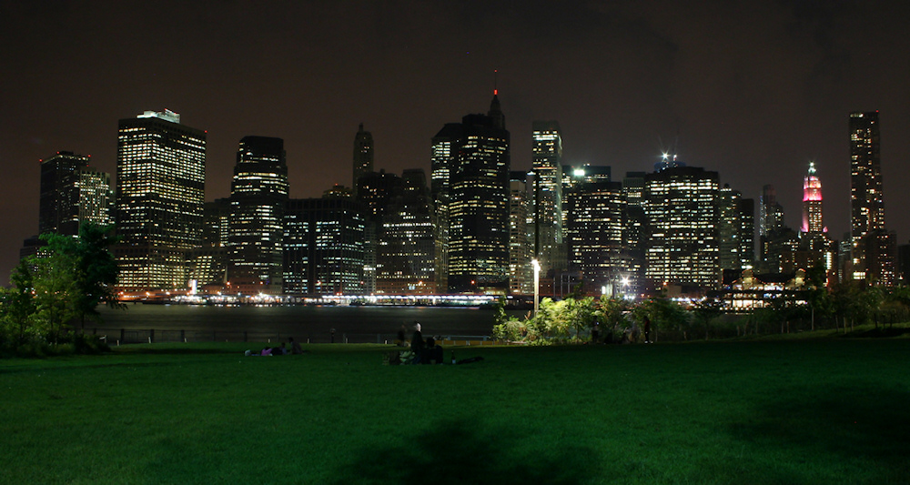
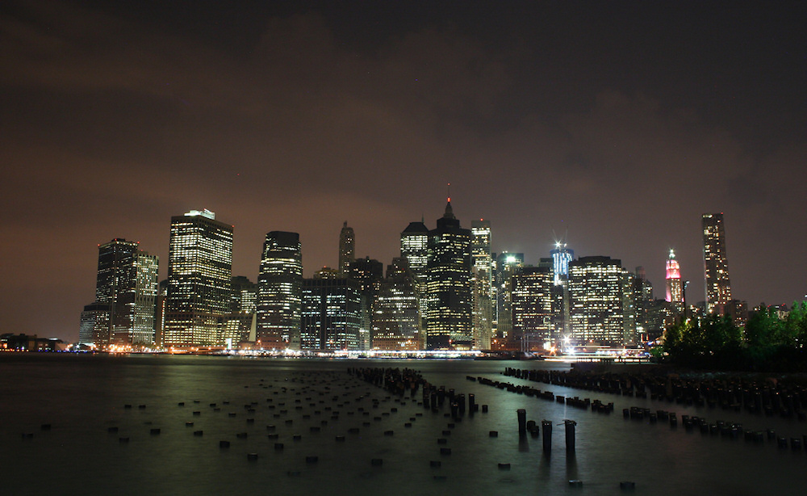

Ich denke, ich habe meinen Lieblingsort in New York gefunden - der Platz, an dem mir die Stadt am Besten gefällt. Und dies ist nicht etwa ein Touristenmekka wie der Times Square, sondern der [Brooklyn Bridge Park](http://www.brooklynbridgeparknyc.org/). Dieser zieht sich am Brooklyner Ufer des East River von der Manhattan Bridge über 2km bis zum Pier 6. Und es ist einfach unbeschreiblich, von dort die Sonne hinter Downtown Manhattan untergehen zu sehen und danach das langsame Erwachen der Wolkenkratzer zu beobachten, bis deren Lichter die Nacht erleuchten.

An der Manhattan Bridge ist leider die Lärmkulisse durch den Auto- und Metroverkehr auf der Brücke enorm, aber südlich der beeindruckenden Pfeiler der Brooklyn Bridge lässt es sich auf den Bänken gut aushalten. Ich habe dort mein Abendbrot zu mir genommen und ein wenig gelesen - am Ufer des East Rivers ist auch das smoggetränkte, schwüle Klima der Großstadt ertragbar. Im Hochsommer wird auf der dortigen Liegewiese ein [Freiluftkino](http://www.brooklynbridgepark.org/go/programs-/-events/syfy-movies-with-a-view) angeboten, welches dieses Jahr mit *Manhattan* von Woody Allen in die Saison startete. Diese Liebeserklärung des Regisseurs an seine Heimatstadt vor deren eigener Kulisse im Hintergrund - da wäre ich gern dabei gewesen.

Der Park ist, genau wie das umliegende Viertel, noch [im Wandel begriffen](http://de.wikipedia.org/wiki/Brooklyn_Bridge_Park). Die von Lagerhallen und Fabriken geprägte einstige Hafengegend mit dem schönen Namen [DUMBO (Down Under the Manhattan Bridge Overpass)](http://en.wikipedia.org/wiki/Dumbo,_Brooklyn) zieht aber schon jetzt trotz der schlechten Verkehrsanbindung viele Menschen an, die den Park zur Erholung oder zum Sport nutzen. Die Stadt New York soll mir aber bitte erklären, wieso sie [Volleyballfelder auf Sand](http://www.brooklynbridgeparknyc.org/events/sports/volleyball) anlegt und keine Beachvolleyballfelder...

