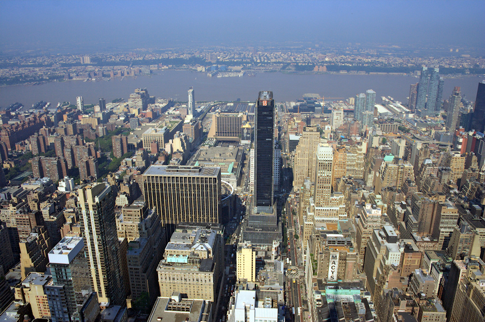
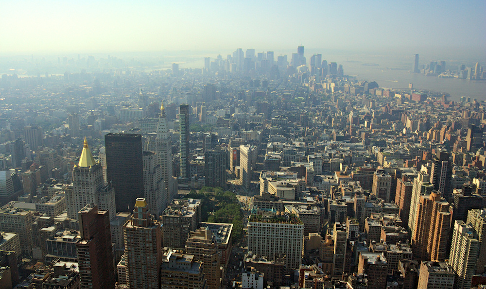
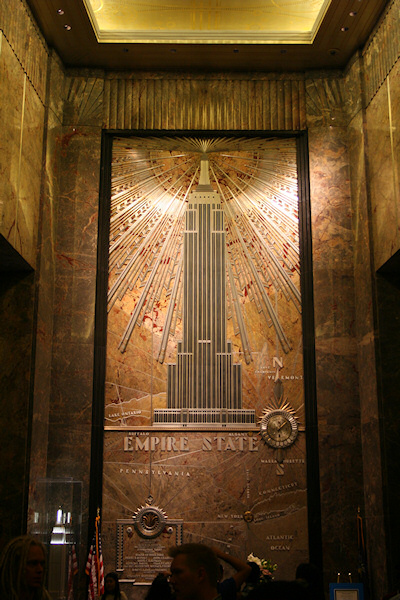
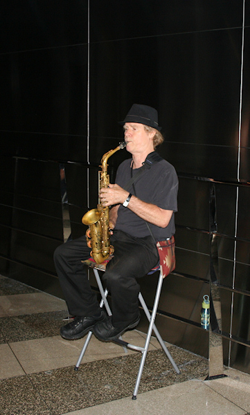
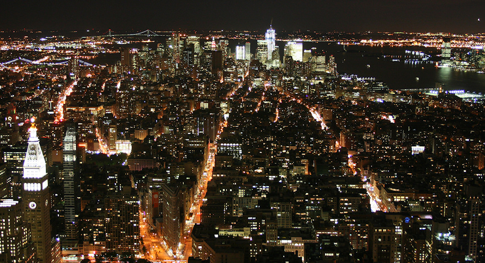
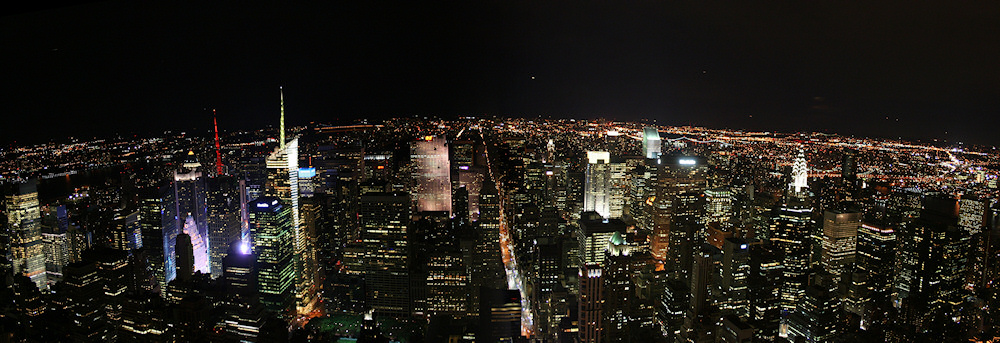

Die USA haben anscheinend etwas gegen meine Angewohnheit, jeden öffentlich begehbaren Turm zu ersteigen, der meinen Weg kreuzt. Anders kann ich mir die magere Ausbeute meines Ostküstentrips nicht erklären, der doch so viele Möglichkeiten bot.

Die erste Enttäuschung war der Turm des [Rathauses von Philadelphia](http://www.visitphilly.com/history/philadelphia/city-hall/), seines Zeichens das höchste gemauerte Gebäude der Welt. Da dieser sich den Öffnungszeiten des Rathauses anschloss und ich ausgerechnet am verlängerten Labor-Day-Wochenende in der Stadt weilte, war an einen Aufstieg nicht zu denken. Viel verpasst habe ich wahrscheinlich nicht, da die umliegenden Gebäude allesamt an die Höhe des Turms heranreichen, aber dieser Fehlschlag war nur der Anfang.

Weiter ging es in Washington D.C., wo das [Washington Monument](http://www.nps.gov/wamo/index.htm) als Zentrum der [National Mall](http://www.nationalmall.org/) einen Rundumblick vom Weißen Haus über das Capitol, das Jefferson-Memorial mit dem Pentagon im Hintergrund bis hin zum Lincoln-Memorial bieten sollte. Leider hatte sich vor ein paar Monaten ein Erdbeben ereignet, und dessen Schäden führten zu einer temporären Schließung des Denkmals - natürlich genau dann, wenn ich die Stadt besuche.

Der Turm des alten [Post Office](http://www.oldpostofficedc.com/) war aus mehreren Gründen nur ein schlechter Ersatz. Zum Einen liegt der Turm etwas abseits der National Mall und ist kaum höher als die umliegenden Museen und Regierungsgebäude, so dass nur wenig mehr von der Stadt zu sehen ist als Dächer. Zudem ist die per Fahrstuhl zu erreichende Aussichtsplattform auf der Westseite mit einem Glasfenster und auf allen anderen Seiten durch starke Drahtseile gesichert, die das Fotografieren erschweren. Zumindest war die Besichtigung des Turms wie so vieles in Washington D.C. kostenlos; nur am Eingang zum alten Postgebäude, welches heute als Food Court und Veranstaltungszentrum genutzt wird, musste ich eine Flughafen-ähnliche Sicherheitskontrolle über mich ergehen lassen.

Der nächste Reinfall war der [Prudential Tower](http://www.prudentialcenter.com/shop/shop_detail.php?id=64) in Boston. Dieser hat zwar jeden Tag der Woche geöffnet. Am 11.09., dem Schicksalstag der Amerikaner, gab es nachmittags jedoch eine private Veranstaltung, so dass ich nicht hinauf durfte.

Zum Glück gibt es aber noch das [Empire State Building](http://www.esbnyc.com/) in New York. Wenn dort [Novak Djokovic](http://www.3news.co.nz/Novak-Djokovic-conquers-the-Empire-State-Building/tabid/415/articleID/225703/Default.aspx) seinen bei den [US-Open](http://www.usopen.org/en_US/index.html) errungenen Siegerpokal präsentiert, dann dürfen die Touristen weiterhin die Aussichtsterrasse nutzen (leider konnte ich keinen Blick auf ihn erhaschen). Und die Aussicht von dort oben, immerhin 86 Etagen und 320 Meter über dem Boden, ist wirklich gigantisch. Da das Gebäude weitgehend frei steht stört nichts (bis auf den Smog) den Rundumblick über Manhattan.

Ist der Anblick der Wolkenkratzer bei Tag schon beeindruckend, wenn auch aufgrund der Höhe sehr distanziert, so wirkt die Stadt bei Nacht viel lebendiger. Überall leuchten die Fenster der Wolkenkratzer, spiegeln sich die bunten Lichter im Hudson und East River und winden sich die schachbrettartig angeordneten Straßenzüge mit ihren winzigen Autos wie lebendige gelbe Schlangen duch die Häuserschluchten. Kaum ein Geräusch dringt hoch bis zu der Aussichtsplattform, der immer geschäftige Times Square war nur aufgrund seines Lichtkaleidoskops auszumachen. Aber ich war sofort gewillt zu glauben, dass diese Stadt niemals schläft oder vielmehr nachts erst richtig erwacht, wenn das geschäftige Tageswerk hinter den Bewohnern liegt.

Das Empire State Building ist bis zwei Uhr in der Nacht für derartige Erfahrungen geöffnet. Von Donnerstag bis Sonntag sorgt ein Saxofonistin in der 86. Etage für eine jazzige Atmosphäre, jedoch sind dann die Schlangen am Eingang entsprechend lang. Wer jedoch gleich früh am Morgen vor 10Uhr dort ist, kann wie ich vollkommen ohne Anstehen durch Ticketverkauf, Security und die zwei Fahrstuhlabschnitte gelangen. Nur oben auf der Terrasse ist es wohl immer so voll, dass man für gute Plätze direkt an den weitmaschigen Gittern etwas Geduld mitbringen sollte. Ich habe die \$22 Eintritt gleich zweimal investiert und kann einen Besuch jedem nur empfehlen - es lohnt sich!

