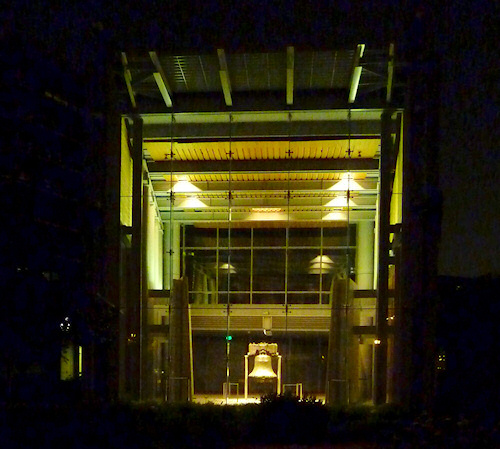
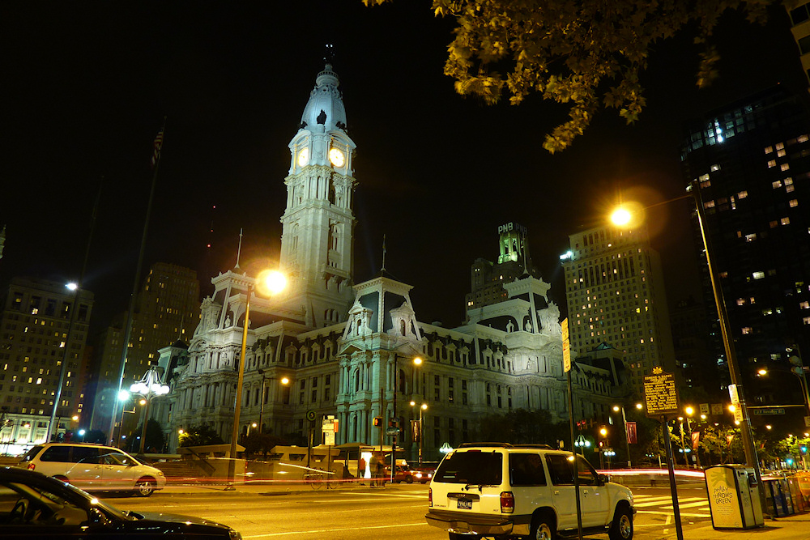
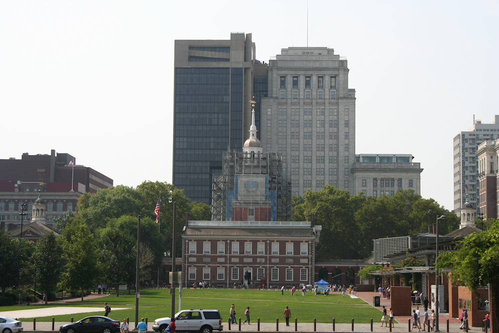
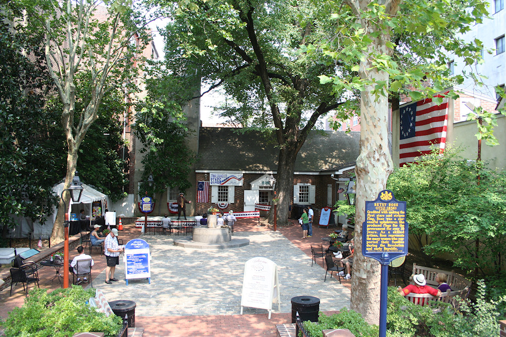
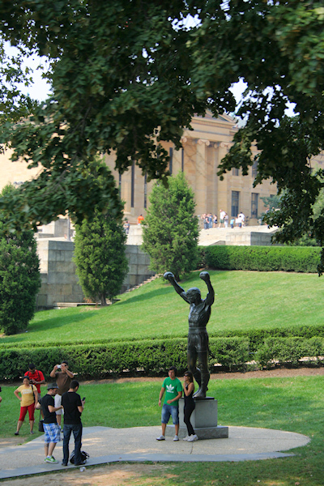

Philadelphia ist eine Stadt mit vielen verschiedenen Seiten. Wie wenige andere amerikanische Städte ist sie eine interessante Kombination aus Geschichte und Moderne, eine Stadt am Übergang von der Industrie- zur Dienstleistungsgesellschaft. Dadurch hat sie einen schlechten Ruf als sozialer Brennpunkt, ist jedoch gleichzeitig ein [Zentrum der Kunst](http://muralarts.org/) und [Kultur](http://en.wikipedia.org/wiki/Avenue_of_the_Arts,_Philadelphia) und aufgrund vieler Studenten und einer entsprechend bunten Kneipenszene gefühlt eine sehr junge, lebendige Stadt. Dies ist vermutlich auch der Grund, warum es ein so gut ausgebautes [Netz an Fahrradwegen](http://phillymap.com/interactive-map/) gibt, das von den Bewohnern gut angenommen wird.

Philadelphia, griechisch für brüderliche Liebe, wurde 1681 von dem [Quäker](https://de.wikipedia.org/wiki/Quäkertum) [William Penn](http://de.wikipedia.org/wiki/William_Penn) gegründet. Dieser erhielt das Gebiet des heutigen Pennsylvania (benannt nach William Penns Vater) als Ausgleich für eine Geldschuld vom englischen König und machte die Kolonie zu einer Zufluchtsstätte für religiöse Minderheiten (dazu später mehr in Plymouth), das sogenannte [Heilige Experiment](http://www.visitpa.de/index.php/infos/geschichte). Die dadurch verstärke Zuwanderung machte Philadelphia schnell zur größten Stadt Nordamerikas und sie war von 1790–1800 sogar Hauptstadt der neugegründeten USA. Zudem wurde hier die Unabhängigkeitserklärung verkündet (dazu später mehr in Boston) und die Verfassung der Vereinigten Staaten beschlossen.

Diese Geschichte prägt die Stadt bis heute. Fast alle Sehenswürdigkeiten tragen ein *Independence* oder *Liberty* im Namen. Als Startpunkt für die gut zu Fuß zu erkundende Innenstadt sollte das [Independence Visitor Center](http://www.visitphilly.com/history/philadelphia/independence-visitor-center/) aufgesucht werden. Dort gibt es (kostenlose) Eintrittskarten für eine Führung durch die [Independence Hall](http://www.visitphilly.com/history/philadelphia/independence-hall/) (früher Pennsylvania State House), in der 1776 die Unabhängigkeitserklärung unterzeichnet und 1787 die Verfassung beschlossen wurde. Desweiteren kann (ebenfalls kostenlos) das [Liberty Bell Center](http://www.visitphilly.com/history/philadelphia/the-liberty-bell-center/) besucht werden, in welchem die Glocke ausgestellt wird, die während der Erklärung der Unabhängigkeit geläutet haben soll. Zuerst nur für die Religionsfreiheit von Pennsylvania stehend entwickelte sich die Glocke im 19. Jahrhundert zu einem Symbol für die Unabhängigkeit der Vereinigten Staaten. Sie ging deshalb viel auf Reisen und Ausstellungen im ganzen Land und wird inzwischen - sichtbar beschädigt - wieder in Philadelphia ausgestellt.

Ein ebenso wichtiges Symbol für die Amerikaner, die nationale Flagge, entstand ebenfalls in Philadelphia. [Betsy Ross](http://de.wikipedia.org/wiki/Betsy_Ross), eine Tochter der Stadt, soll die erste Version der *Stars and Stripes* genäht oder zumindest entworfen und hergestellt haben. [Ihr Haus](http://www.visitphilly.com/history/philadelphia/the-betsy-ross-house/), gleichzeitig Lebens- wie Arbeitsmittelpunkt, kann zusammen mit ihrem Grab direkt daneben besichtigt werden. Ein weiterer berühmter Kopf der Stadt, dessen Name fast überall in der Stadt zu finden ist, war [Benjamin Franklin](http://de.wikipedia.org/wiki/Benjamin_Franklin). Das Grab des Universalgelehrten und wichtigen Akteurs der Unabhängigkeitsbewegung ist auf dem [Christ Church Friedhof](http://www.visitphilly.com/history/philadelphia/christ-church-burial-ground/) zu besichtigen.

Ein weiteres interessantes Zeugnis von Philadelphias Geschichte ist [Elfreth's Alley](http://www.visitphilly.com/history/philadelphia/elfreths-alley/), die am längsten durchgängig bewohnte Straße Nordamerikas. Für europäische Verhältnisse sind 300 Jahre natürlich nicht viel, aber in den USA finden sich nur wenige so alte Gebäude. Dies liegt aber weniger an einem fehlenden Geschichtsbewusstsein der Amerikaner, sondern vielmehr an deren [Hausbautradition](http://usaerklaert.wordpress.com/2009/01/08/amerikanische-hauser-und-die-liebe-zum-holzmas-two-by-four/). Holzhäuser sind einfach keine gute Basis für eine langlebige Bebauung, auch wenn der von Franklin erfundene Blitzableiter sicherlich eine Menge Brände verhindert hat. So ist es keine Überraschung, dass nur aus Stein erbaute Häuser aus der Anfangszeit der Vereinigten Staaten erhalten sind.

Wie zum Beispiel das Rathaus von Philadelphia, das "höchste gemauerte Gebäude der Welt", [das ich leider nicht besteigen konnte](/blog/2011/09/25/usa-von-oben/). Es steht genau im Mittelpunkt des wie in so vielen amerikanischen Städten im Schachbrettmuster angelegten Straßensystems. Östlich davon bis zum Delaware River liegt der Old City genannte Stadtteil mit den historischen Sehenswürdigkeiten, im Westen bis zum Schuylkill River folgen die moderneren Stadtteile, deren Wolkenkratzer die Skyline der Stadt prägen. Hier finden sich auch Museen wie das Rodin Museum und das berühmte Philadelphia Museum of Art, dessen [Treppe](http://en.wikipedia.org/wiki/Rocky_Steps) sicherlich der Eine oder Andere aus den *Rocky*-Filmen kennt. Und die [Love Statue](http://en.wikipedia.org/wiki/Love_(sculpture)), von der eine Kopie auf dem Kennedy Plaza steht, ist ebenfalls weltberühmt.

Wir hatten unser Hotel zentral in der Walnut Street, deren nähere Umgebung von Krankenhäusern und dem Universitätklinikum geprägt ist, so dass Tag und Nacht etwas auf den Straßen und in den Kneipen los war. Von hier aus konnten wir bequem die Innenstadt erlaufen, hatten es nicht weit bis zum [Reading Terminal Market](http://www.readingterminalmarket.org/) (einer riesigen Markthalle die früher ein Bahnhof war) mit [Bassets Eisdiele](http://www.bassettsicecream.com/) und bis Chinatown ("dem viertgrößten in Amerika"). Wir waren in der South Street mit ihren Kneipen und Restaurants essen (das "berühmte" [Philadelphia Cheesesteak](http://de.wikipedia.org/wiki/Cheesesteak) ist einfach nur ein Sandwich) und sind durch die Backsteinviertel südlich der City Hall geschlendert, die mit ihrer niedrigen Bebauung, viel Grün und teilweise engen Straßen mehr den Eindruck einer Vorstadt als des Zentrums einer der größten Metropolen der USA machten.

Weiter nördlich um das Messezentrum herum zeigt die Stadt schon eher ihren im Umbruch befindlichen Charakter. Hier stehen neue Hochhäuser neben großen Baulücken (die Platz für die vielen Wandmalereien lassen), alten Bürogebäuden und Industrieruinen. Hier liegen auch noch die Gleise der inzwischen eingestellten [Straßenbahn](http://www.phillytrolley.org/) in den Straßen und führt der Highway wie in den USA üblich mitten durch die Stadt. Ingesamt hat Philadelphia aber einen bunten Eindruck auf mich gemacht und im Zentrum hatte ich nicht das Gefühl, dass um mich herum fast sechs Millionen Einwohner leben. Und deshalb wird mir mein Besuch positiv in Erinnerung bleiben.

