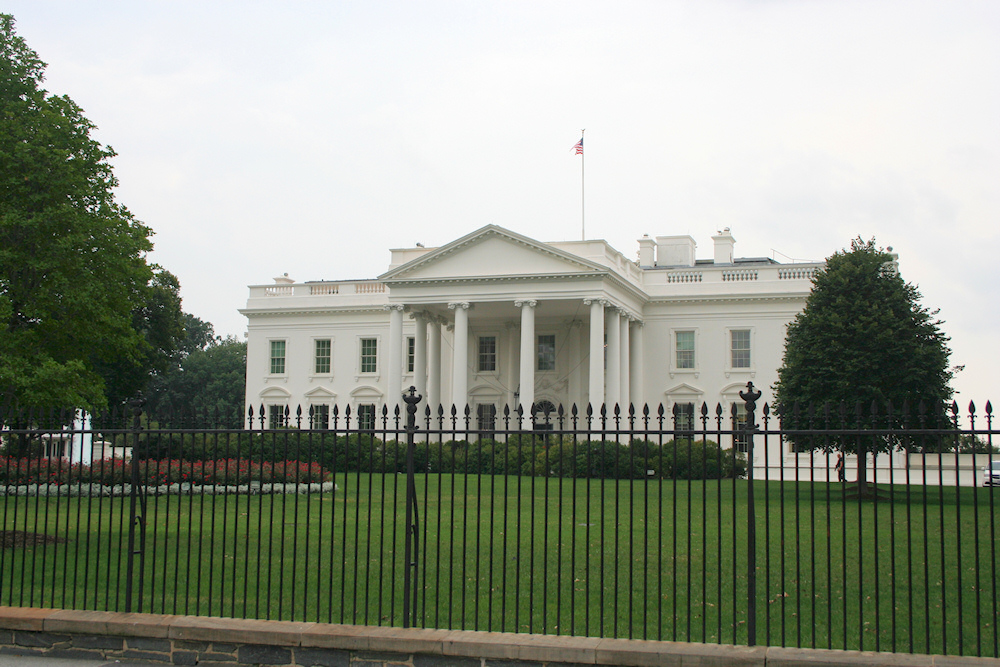
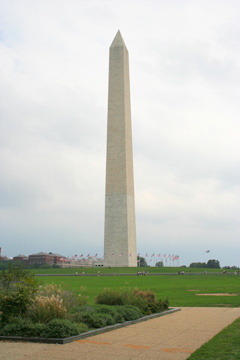
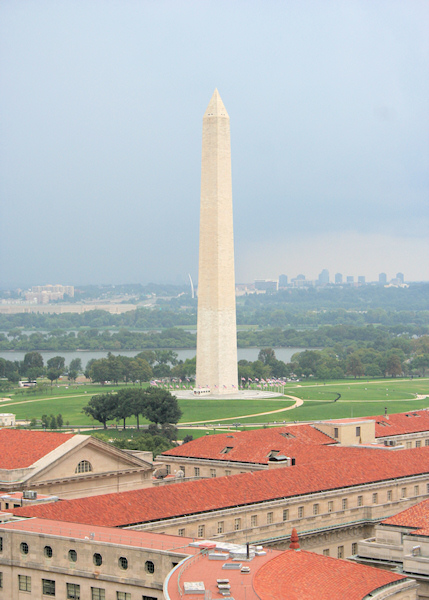
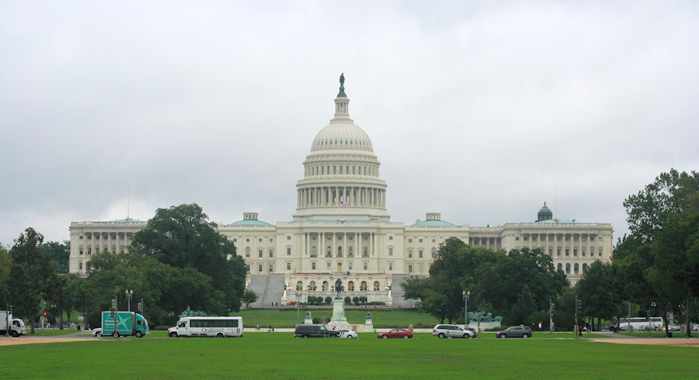
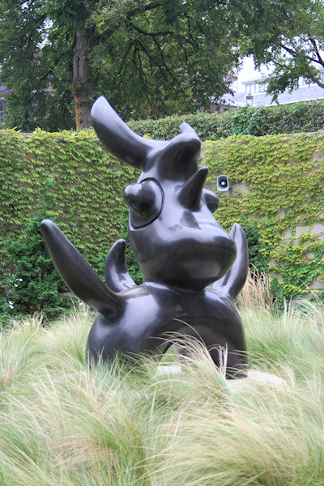
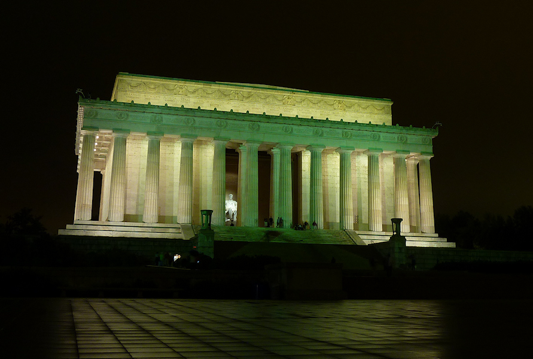
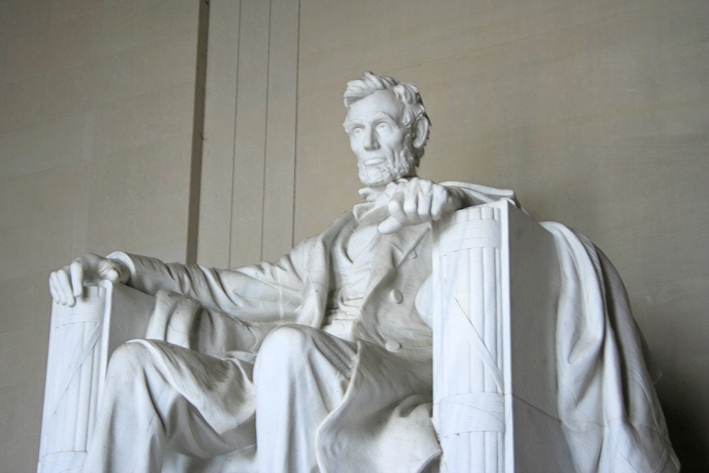
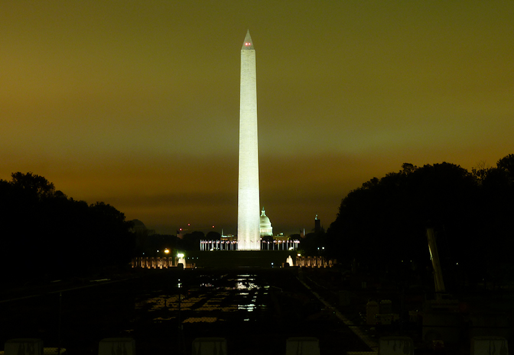

Eine Hauptstadt für die neugegründeten Vereinigten Staaten von Amerika zu finden war keine leichte Aufgabe. Der erste Präsident der USA und spätere Namensgeber der Stadt, George Washington, wurde noch in New York vereidigt; danach tagte der Kongress in [Philadelphia](/2011/10/09/philadelphia/) bis zur sogenannten [Pennsylvania-Meuterei](http://en.wikipedia.org/wiki/Pennsylvania_Mutiny_of_1783), die den Kongress zur Flucht nötigte. Auf der Suche nach einer Stadt mit eigener Hoheit und außerhalb des direkten Einflusses der Bundesstaaten wurde schließlich ein sumpfiges Gebiet am Potomac River symbolisch von Maryland und Virginia an den Kongress abgetreten. Dort begann 1792 mit der Grundsteinlegung für das Weiße Haus der Bau der Hauptstadt im gerade modernen Schachbrettmuster. Als Name wurde District of Columbia (D.C.) gewählt um zu zeigen, dass diese Stadt den gesamten Vereinigten Staaten und nicht einem einzelnen Staat untersteht - Columbia ist eine aus der Mode gekommene Personifizierung der USA.

Viel Glück war der neuen Hauptstadt am Anfang nicht beschieden, denn schon 1812 - gerade einmal 12 Jahre nach dem Einzug der Regierung - griffen die Engländer die Stadt an und [brannten sie nieder](http://en.wikipedia.org/wiki/Burning_of_Washington). Das Weiße Haus und das Capitol mussten aufwendig repariert werden und die [Bilder von damals](http://visualizingdc.com/) machen es schwer, sich dort das moderne Washington D.C. vorzustellen. Viele wichtige Bauwerke, die heute die Stadt prägen, gab es damals noch nicht und das Ufer des Potomac River wurde in den letzten zwei Jahrhunderten mehrmals umgestaltet. Vor kurzem erst wurde mit dem [Martin Luther King Memorial](http://de.wikipedia.org/wiki/Martin_Luther_King,_Jr._National_Memorial) ein weiteres Denkmal der beeindruckenden Sammlung von Gedenkstätten und Museen hinzugefügt, die das Zentrum von D.C. ausmachen.

Das erste Ziel bei meinem Besuch der Stadt war das Weiße Haus, das wie kein anderes Gebäude zum Symbol für das Machtzentrum des kapitalistischen Westens geworden ist. Von Norden her kam ich sehr nah, nämlich bis an den Zaun, an das neoklassizistische Sandsteingebäude heran (dies ist auch die Seite, die bei Fernsehübertragungen zu sehen ist). Die spannende Seite ist jedoch die südliche. Dort liegt nicht nur das Oval Office im Westflügel, sondern es finden auch Empfänge statt und die Hubschrauber landen dort (am Labor Day konnte ich abends Obamas Ankunft beobachten). Deshalb ist das Gelände auf dieser Seite weiträumiger abgesperrt und das Sicherheitspersonal allgegenwärtig.

Weiter südlich vom Weißen Haus befinden sich dann all die Wahrzeichen, deren Zerstörung ich in Katastrophenfilmen von *Independence Day* bis *Mars Attacks!* bestaunt habe. Das Capitol (Sitz von Senat und Repräsentantenhaus), das Washington Monument (der Obelisk) und das Lincoln Memorial liegen auf einer Achse eines lang gezogenen Parks, der National Mall, dessen Fläche über die Jahre hinweg den sumpfigen Ufern des Potomac River abgetrotzt wurde. Zwischen Capitol und Washington Monument reiht sich auf beiden Seiten des Parks ein Museum an das nächste, die allesamt kostenfrei besucht werden können. Zwischen Washington Monument und Lincoln Memorial sind dagegen die Gedenkstätten angesiedelt, vom Jefferson Memorial auf einer Insel im Potomac über Memorials für jeden größeren Krieg des letzten Jahrhunderts bis hin zum Reflecting Pool, welcher je nach Blickwinkel die umgebenden Gedenkstätten reflektiert und durch den schon [Forrest Gump](http://www.youtube.com/watch?v=tPji0Mizhqc) watete.

Leider hatte ich in mehrerer Hinsicht Pech bei meinem Besuch von Washington D.C.. Zum Einen hat es fast pausenlos geregnet, da Sturm Lee über die Stadt hinwegzog, zum Anderen war sowohl das Washington Monument aufgrund von Erdbebenschäden geschlossen als auch der Reflecting Pool aufgrund von Umbaumaßnahmen gerade eine einzige Baustelle, in welcher höchstens die Pfützen reflektierten.

Doch ich habe eine Regenpause gefunden, um mir den Skulpturengarten des [Hirshhorn Museums](http://hirshhorn.si.edu/) anzusehen - eine Erfahrung, die ich unbedingt weiterempfehlen kann. Die trotz ihrer Exquisität recht umfangreiche Sammlung des auf moderne Kunst spezialisierten Museums enthält neben den in den angehängten Fotos zu sehenden Werken von Miró und Yoko Ono auch mehrere Installationen und hat mir durch die Bank weg gefallen. Da ich bisher Skulpturen nur in ihrer klassischen Form wahrgenommen hatte war ich erstaunt, welche Bandbreite an Formen moderne Exemplare dieser Kunstrichtung einnehmen. Verglichen damit ist der Garten des MOMA (dazu später mehr) geradezu ein Witz.

Für den Besuch von mehr Museen fehlte mir leider die Zeit, da ich auch einen Ausflug auf die andere Seite des Potomac Rivers unternommen habe, um mir das Pentagon von Nahem anzusehen. Mit der [U-Bahn](/2011/09/06/washington-d-c-und-die-fallout-brille/) konnte ich direkt bis an das Gebäude fahren, um dort aber festzustellen, dass es sich nicht gelohnt hat. Denn das Pentagon ist einfach nur ein hässlicher Bürobunker mit so unglaublichen Ausmaßen, dass von ebener Erde aus nie mehr als zwei Seiten gleichzeitig zu sehen sind und so der fünfeckige Grundriss nicht erlebbar wird. Zudem sind die Sicherheitsmaßnahmen rund um das wie ein Militärstützpunkt abgeriegelte Gebäude nervig ("No photos allowed"), wobei sie die Gefahr von Flugzeugabstürzen gar nicht senken können - die Einflugsschneise des Washingtoner Flughafens liegt genau über dem Pentagon und die Flugzeuge haben beim Landeanflug eine so geringe Höhe, dass der Lärm unbeschreiblich ist.

Zum Schluss möchte ich noch einen Tipp für die Hotelsuche geben: Umgeben von Büro- und Verwaltungsgebäuden, ist im Zentrum der Hauptstadt außerhalb der Arbeitszeiten (also abends und an Wochenenden/Feiertagen) nicht viel los. Erst im Bereich der George-Washington-Universität werden die Straßen belebter und finden sich mehr Bars & Kneipen; in Georgetown schließlich wandelt sich Washington zu einer normalen Stadt mit Supermärkten, Wohnungen und einem Nachtleben. Durch die U-Bahn erreicht man das Zentrum problemlos, so dass man dort nicht auch übernachten muss.

