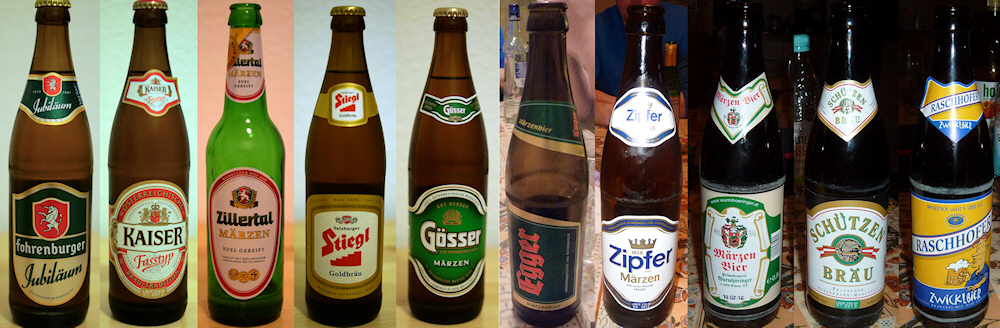

Auch in Österreich wird Bier gebraut, selbst wenn die Alpenregion nicht mit ihren tschechischen Nachbarn mithalten kann. Ein kurzer Besuch im SPAR während meines Wochenendtrips in das Zillertal hat mir eine Auswahl von zehn Bieren beschehrt, unter denen sich erstaunlich viele Märzen befanden. Doch bis auf die Variante von [Egger](http://www.egger-bier.at/) konnten die anderen Märzen nicht überzeugen; bei der [Zillertal](http://www.zillertal-bier.at/)-Brauerei ist das Pils aus Flasche wie Fass die bessere Alternative - und die [Gläser](http://www.markenglas.de/products/de/GLAeSER/ZILLERTAL-BIER/ZILLERTAL-BRAUEREI-BIER-TULPE-GLAeSER.html) haben eine wirklich schöne Form.

Ein totaler Ausfall war das Schützenbräu, um das jeder Bierliebhaber einen Bogen machen sollte. Erwartungsgemäß eher im Mainstream siedelt sich das Bier von Stiegl an. Gut geschmeckt mit seiner würzigen Note hat mir dagegen das [Kaiser](http://www.kaiserbier.at) Fasstyp. Doch getoppt wurde das Bier durch das mit einem seltsamen Etikett versehene [Raschhofer Zwickl](http://www.raschhoferbier.at/produkte-biere.html#zwickl), das seiner Frische zum Ausgleich angenehm viel Alkohol (5,4 Vol. %) entgegensetzt. Unbedingt probieren!
