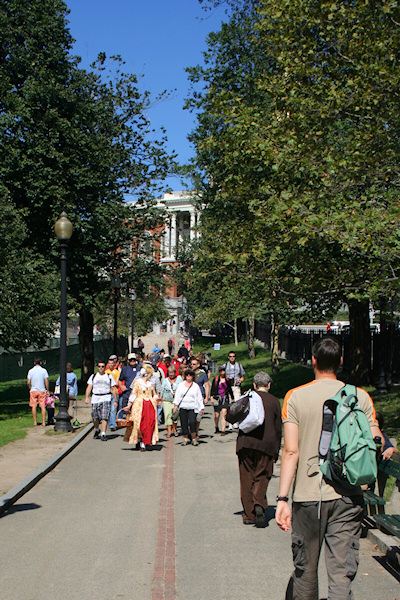
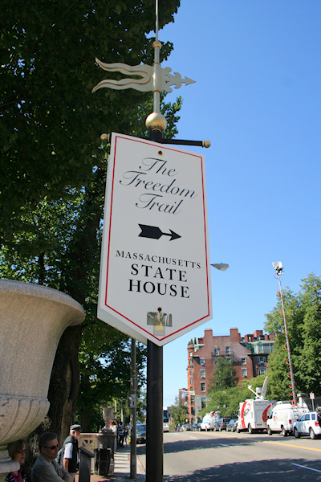
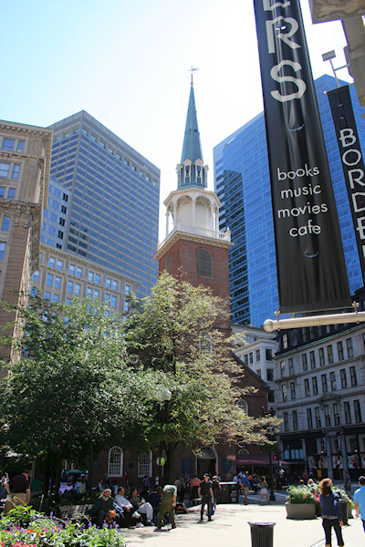
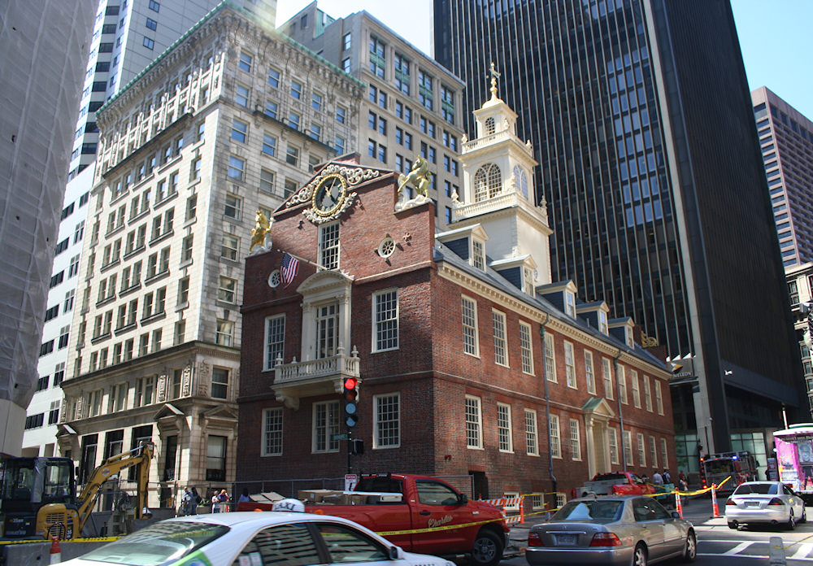
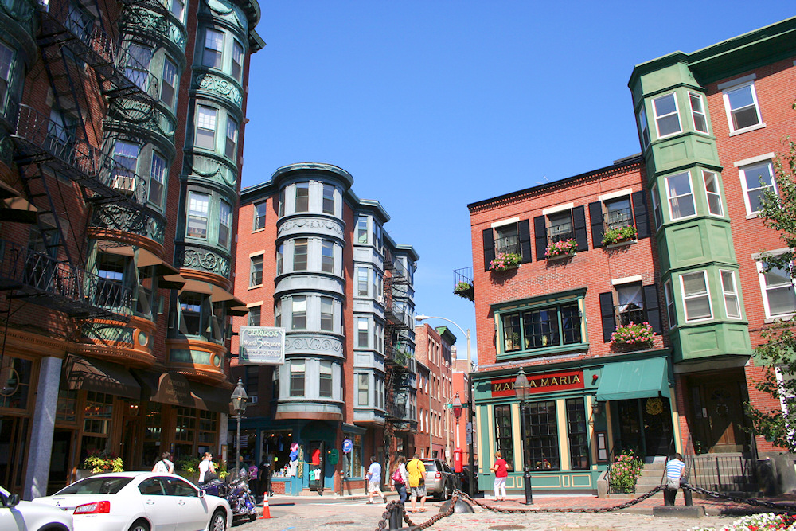
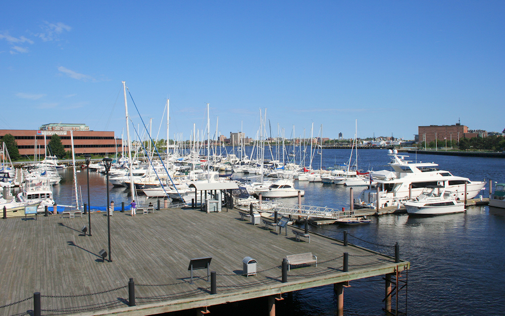
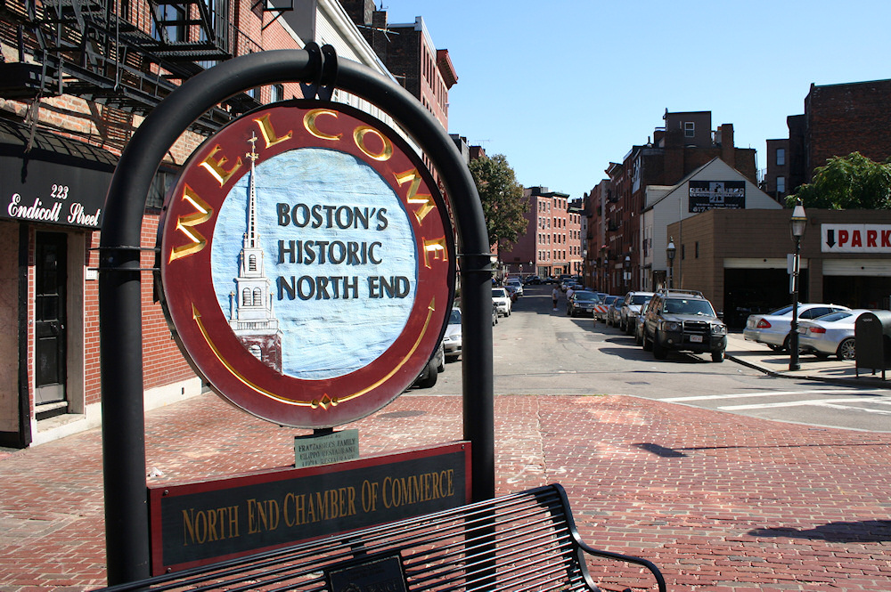
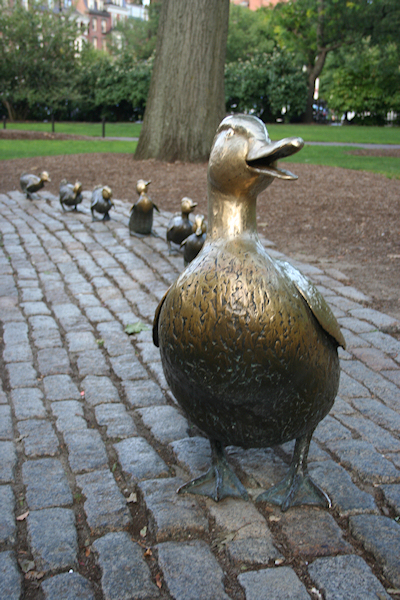
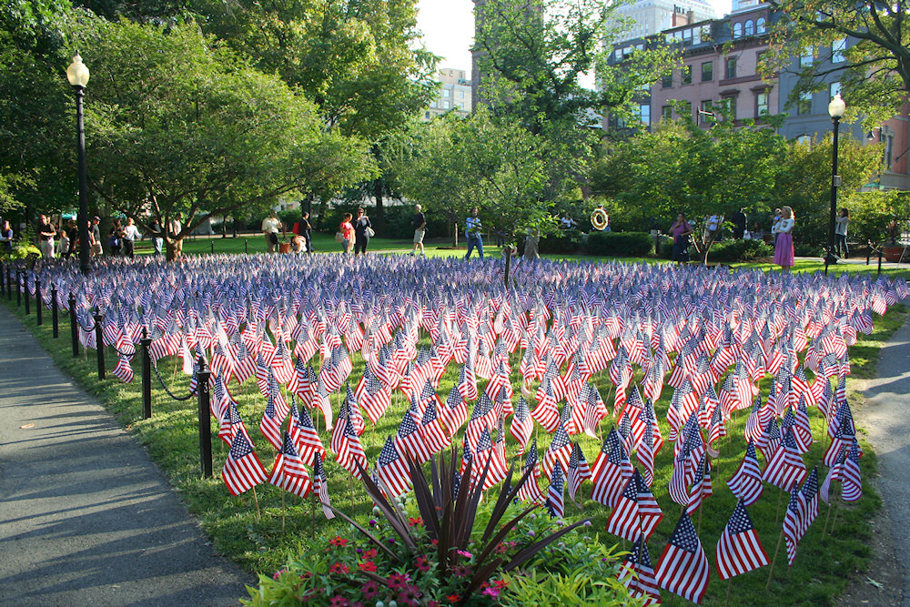
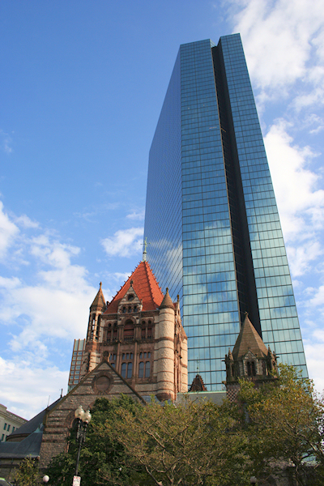

*Taxation without Representation* - dieser Spruch steht auf allen Washingtoner Autokennzeichen und bringt ironisch zum Ausdruck, dass die Bewohner von [D.C.](/2011/12/11/washington-d-c/) über ihren Sonderstatus ohne eigene Vertretung im Kongress nicht gerade erfreut sind. Denn das Original, *No Taxation without Representation*, ist einer der Grundpfeiler der amerikanischen Demokratie. Frei übersetzt geben die Bürger damit zum Ausdruck, dass sie nur bereit sind Steuern zu zahlen, wenn sie dafür auch ein politisches Mitspracherecht erhalten. Zurück geht diese Aussage auf die Zeit des Unabhängigkeitskriegs und damit auf ein Ereignis, welches die gesamte Welt mit Boston verbindet - die [Boston Tea Party](http://de.wikipedia.org/wiki/Boston_Tea_Party).

1773 wurde ein mit Tee beladener Frachter im Hafen von Bosten von als Indianer verkleideten Bürgern der Stadt gestürmt und der Tee über Bord geworfen. Dies war ein Protest gegen die von England erhobenen Steuern, mit denen das Königreich die militärischen Kosten der Kolonien decken wollte. Die Bürger der Kolonien fühlten sich jedoch im englischen Parlament nicht vertreten und verschärften mit ihrer Aktion den Ton der Auseinandersetzung, was schließlich im Unabhängigkeitskrieg und damit in der Unabhängigkeit der Vereinigten Staaten münden sollte.

Wie stolz die Bewohner der Stadt auf diese geschichtsträchtigen Ereignisse ist zeigen die gut erhaltenen Gebäude in der Innenstadt, eine Seltenheit in den USA. Die Bostoner haben dafür gesorgt, dass die Meeting Houses, in denen sich vor 240 Jahren die unzufriedenen Bürger versammelten und debattierten (die Räumlichkeiten wurden meist von reichen Händlern gestellt, die sich wohl ein Steuerparadies erhofften), bis heute erhalten wurden - auch wenn sie meist im Schatten der für amerikanische Innenstädte typischen Hochhäuser stehen.

Eine weitere Rarität ist der sogenannte [Freedom Trail](http://www.thefreedomtrail.org/). Dieser ist ein vier Kilometer langer Kurs für Fußgänger durch Boston, welcher 16 der wichtigsten Sehenswürdigkeiten hauptsächlich aus der Zeit der Unabhängigkeitsbewegung miteinander verbindet. Besucher mit einer größeren Laufbereitschaft als der amerikanische Durchschnittsbürger müssen einfach nur der in den Fußwegen eingelassenen doppelten Reihe von roten Ziegelpflastersteinen folgen - zumindest in der Theorie. Praktisch kann eine zusätzliche Karte nicht schaden, denn oft verläuft der *Freedom Trail* einfach nur durch Baustellen oder wurde nach Bauarbeiten nicht wieder in die Fußwege eingesetzt.

Ein Name taucht auf dem *Freedom Trail* besonders häufig auf: [Paul Revere](http://de.wikipedia.org/wiki/Paul_Revere_(Freiheitskämpfer)). Er ist [der große Held](http://www.theatlantic.com/magazine/archive/1861/01/paul-revere-rsquo-s-ride/8349/) der Stadt, seit er 1775 mit einem nächtlichen Ritt die einheimischen Truppen vom Vorrücken der britischen Armee unterrichtete und damit in der ersten Schlacht des Unabhängigkeitskriegs den Vorteil auf die Seite der Kolonien verlagerte.

Gut geeignet für den Start in eine Tour auf dem *Freedom Trail* ist der [Boston Common](http://www.thefreedomtrail.org/visitor/boston-common.html), ein Park mitten im Herzen von Boston, der als der älteste Stadtpark der USA gilt. Gleich nebenan, nur durch eine Straße vom Common getrennt, liegt der Boston Public Garden, in welchem ein paar bronzene Enten, die an [ein beliebtes amerikanisches Kinderbuch](http://de.wikipedia.org/wiki/Make_Way_for_Ducklings) erinnern, die Hauptattraktion bilden. Auf fast jeder Boston-Karte ist die Prozession der Entenmutter mit ihren Küken abgebildet und Touristen in jedem Alter wollen unbedingt auf den Enten sitzend fotografiert werden. Ich habe nur knappe 10 Minuten auf einer Bank neben den Enten gesessen und wurde in dieser Zeit sicherlich ein dutzend Mal gefragt, ob ich ein Foto schießen könnte (Menschen mit Spiegelreflexkameras scheinen kompetent genug auszusehen, ein iPhone zu bedienen) - darunter auch zwei Deutsche und eine östereichische Mädchengruppe.

Direkt neben den beiden Parks liegt mit Beacon Hill ein Viertel, welches sich durch seine schmalen, steilen Straßen und die roten Backsteinbauten auszeichnet. Etwas weiter im Norden der vom Charles River umschlossenen Halbinsel der Bostoner Innenstadt findet sich schließlich das North End. Dieser Stadtteil ist geprägt von den italienischen Einwanderern und ihren Lokalitäten. Wer auf der Suche nach einer Pizzeria oder einen guten Café ist, sollte sich hier umsehen; ich habe meine Pasta im herrlichen September-Sonnenschein genießen können.

Leider währte mein Aufenthalt in der Stadt  nur einen einzigen, aber schönen Tag. In dieser kurzen Zeit konnte ich nicht viel erkunden; Boston hat sicherlich noch viel mehr zu bieten (zum Beispiel einen [Ausblick von oben](/2011/09/25/usa-von-oben/)). Wer also mit einem Besuch liebäugelt, sollte sich mehr Zeit gönnen als mir blieb.

