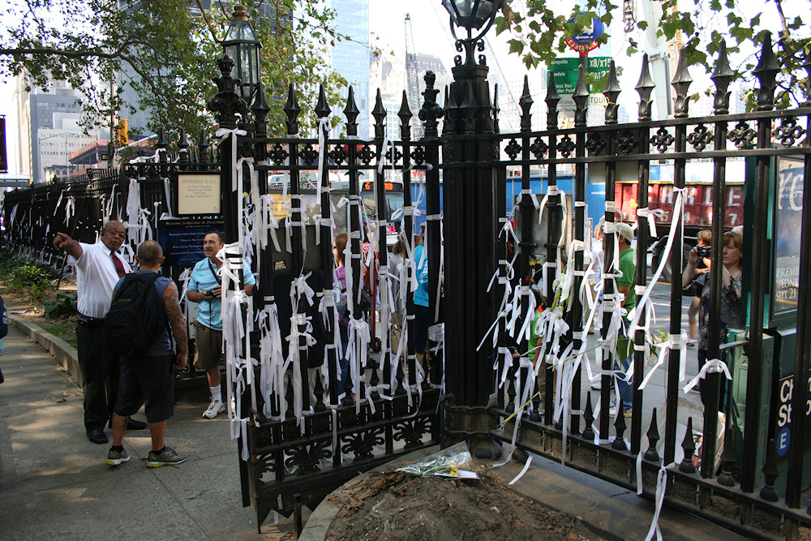
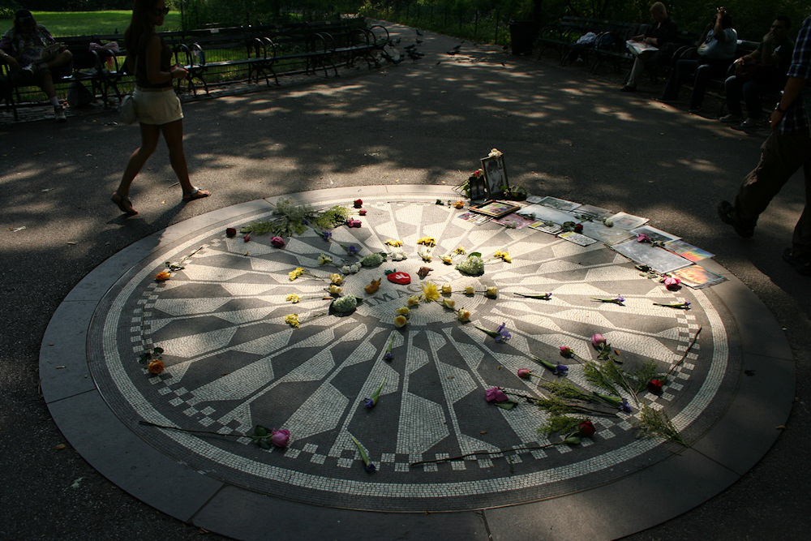
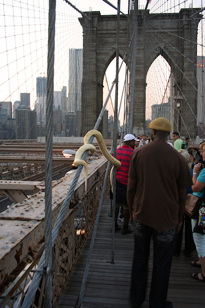
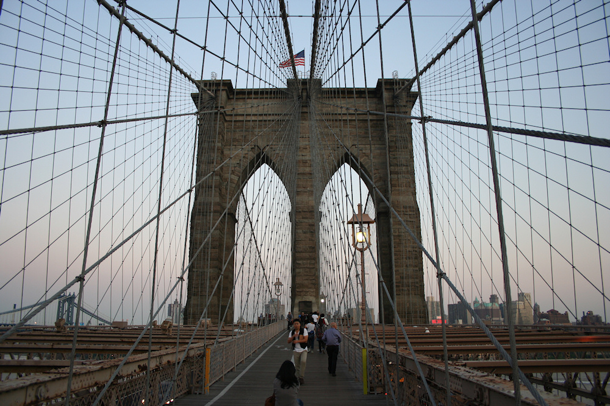
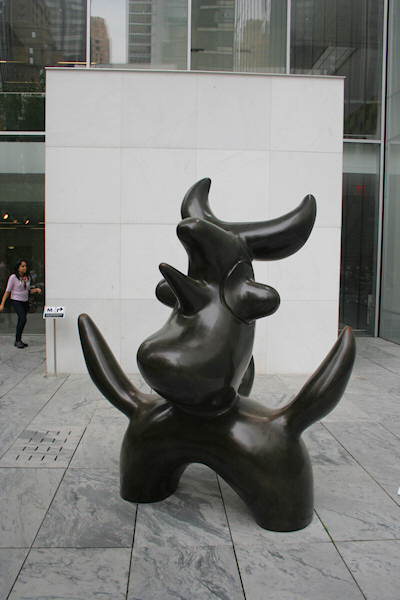
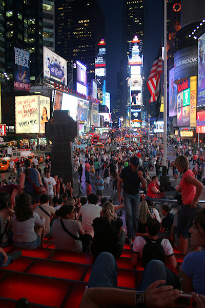
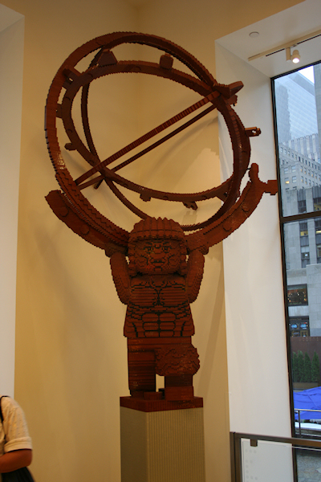
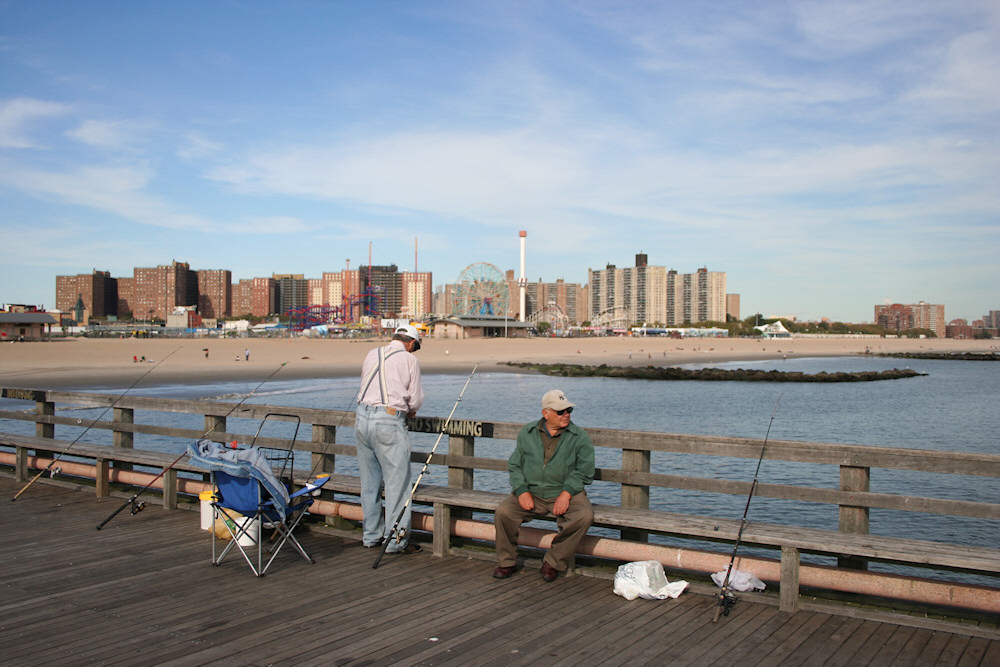

New York City ist ein Klassiker. New York City ist jung und frisch. New York City ist ein Moloch. New York City ist teuer. New York City kann so schön sein; New York City hat aber auch seine hässlichen Seiten.

Ich hatte fünf Tage für diese Stadt und bin mit einer Vielzahl an Eindrücken zurückgekehrt. Der erste Rat, den ich jedem Besucher von NYC geben kann, ist sich eine Wochenkarte für die U-Bahn zu holen. Dies ist einfach das bequemste und zuverlässigste Verkehrsmittel der Stadt, wenngleich es anfangs nicht einfach zu verstehen ist (so gibt es keine Übersicht über die genauen Abfahrtszeiten, dafür aber Expresszüge, die in ganzen Stadtteilen nicht halten) und der Ausstieg aus einer klimatisierten Bahn an einem der dreckigen, heißen und heruntergekommenen Bahnhöfe, die sich manchmal viele Stockwerke tief unter den Straßen verbergen, einem Kulturschock gleichkommt.

**Die Klassiker**

Mit der U-Bahn kann so gut wie jede Sehenswürdigkeit von NYC erreicht werden. Wie zum Beispiel die Wall Street (das Financial District ist langweilig), Little Italy, Flat Iron, das [Empire State Building](/2011/09/25/usa-von-oben/), den Times Square (laut, voll, stickig), den Central Park (wirkt so künstlich wie er ist). Für die Freiheitsstatue muss ein extra Fährticket gelöst werden, das mich aber auch gleich noch nach [Ellis Island](/2011/10/30/ellis-island/) brachte. Und ein Spaziergang über die Brooklyn Bridge, natürlich von Brooklyn nach Manhattan der Skyline entgegen, ist aus meiner Sicht ein Muss für jeden Besucher der Stadt.

**Das Museum of Modern Art**

Eine kleine Enttäuschung war für mich das berühmte [MoMA](http://www.moma.org/). Seit mein Bruder so von der Leihausstellung in der Berliner Nationalgalerie geschwärmt hatte, wollte ich unbedingt das Museum besichtigen, und habe mir dazu den einzigen verregneten Tag meines New-York-Besuchs ausgesucht. Doch trotz wirklich toller Ausstellungsstücke von van Gogh über Picasso, Edvard Munch, Magritte, Dali bis hin zu Monet ging ich etwas enttäuscht aus dem Museum. Vermutlich hatte ich einfach zu große Erwartungen, die von der unerwartet kleinen Ausstellungsfläche nicht erfüllt werden konnten - denn das MoMA hat trotz eines riesigen Fundus von über 150.000 Kunstwerken ein Platzproblem. Es fing an mit dem geradezu winzigen Skulpturengarten, in welchem [ich dem Mondvogel von Miró wiederbegegnete](/2011/12/11/washington-d-c/). Ein ähnliches Bild bot sich mir auf den fünf Etagen: Kleine Ausstellungsflächen, wenig Kunstwerke - da wird geradezu durch die Stilrichtungen gehechtet, im nächsten Raum wartet schon die nächste Epoche. Dieses Best-of des letzten Jahrhunderts mag durch die große Anzahl an Highlights seinen Reiz haben, mir fehlte jedoch ein Fokus bzw ein kuratorischer roter Faden. Mit einer größeren Ausstellungsfläche wäre dem Museum auf jeden Fall geholfen.

**Ground Zero**

Am Platz des wohl einschneidensten Ereignisses des letzten Jahrzehnts wurde einen Tag vor meiner Ankunft das [Memorial](http://www.911memorial.org/) eröffnet. Die Fundamente des alten World Trade Centers bilden zwei große Wasserbassins und werden von Tafeln der Opfer eingerahmt; ein Museum informiert über die amerikanische Sicht auf 9/11. Das Memorial ist jedoch ebenso wie die Freiheitsstatue nur nach mehrmonatiger Anmeldung zu besichtigen; hohe Zäune um das Gebiet herum verhindern einen Einblick für alle anderen Besucher. Da Ground Zero zudem noch die Baustelle für die neuen Freedem Towers des One World Trade Center ist, würde ich von einem Besuch bis zu deren Fertigstellung abraten. Allein die Saint Paul's Chapel, welche nach dem Schicksalstag der Amerikaner zu einer Art Pilgerstätte wurde, ist einen Blick wert, da die weißen Schleifen an den Bäumen und dem Zaun um den kleinen Friedhof einen angenehmen Kontrast zu dem geschäftigen Umfeld von Ground Zero bilden.

**Grand Central Terminal**

Der größte Bahnhof von NYC hat schon lange nicht mehr den Stellenwert als wichtigster Verkehrsknotenpunkt der Stadt, und das Gebäude ist von außen eingepfercht von einengenden Bürotürmen. Aber die große Haupthalle mit ihrer grünen Sternzeichendecke und den goldverzierten Schaltern ist immer noch ein Schmuckstück, im Gegensatz zu den dunklen Bahnsteigen. Der Klassiker für jeden Fotographen ist ein Foto von der Empore in die Halle hinein, um mit einer langen Belichtungszeit die Bewegungen der Passagiere verschwimmen zu lassen.

**Roosevelt Island**

Mitten im East River liegt eine kleine, schmale Insel, die zwar einen Pfeiler der Queensboro Bridge trägt, aber nur über die U-Bahn oder eine Seilbahn von Manhattan aus erreicht werden kann. Hier gab es früher nur Krankenhäuser und Haftanstalten, doch mittlerweile hat sich das Bild der Insel gewandelt. Die Bewohner Manhattans haben sie als bezahlbares, citynahes Wohnumfeld für sich entdeckt. Im Süden der Insel wird gerade ein Park um ein paar Krankenhausruinen herum eingerichtet, der einen netten Blick auf Manhattan und die Vereinten Nationen ermöglicht.

**Coney Island**

Ganz im Süden von Brooklyn liegt der New Yorker Stadtstrand. Nicht weit entfernt von der Mündung des dreckig-dunklen Hudson Rivers möchte ich zwar nicht baden, aber nicht jeder New Yorker kann es sich leisten, nach Long Island zu fahren. Hinter dem Sandstrand und dem obligatorischen Boardwalk befindet sich zudem ein Vergnügungspark, den ich bisher mit dem Name Coney Island verband. Bei meinem Besuch im September fanden sich am Strand nur noch Angler, und so war auch der Park geschlossen, der jedoch von außen und ohne Beleuchtung keinen guten Eindruck machte. Zudem steht er im Schatten von ein paar sehr hässlichen Wohnblöcken, die die Gegend verschandeln.

Auf Coney Island wurde ich [ein weiteres Mal von der amerikanischen Küche enttäuscht](/2011/10/04/portsmouth-new-hampshire/). [Nathan's Hot Dog](http://nathansfamous.com/) soll weit über die Grenzen der Stadt hinaus bekannt sein, was seinen unverschämten Preis erklärt. Den Ruhm kann ich jedoch nicht nachvollziehen, denn die knallrote Wurst hat einfach nicht geschmeckt.

**Und sonst so**

Am Ende eines schlauchenden New-York-Trips gibt es immer noch Ecken, die ich nicht gesehen habe - als Beispiel sei die [Highline](http://www.thehighline.org/) genannt, eine ehemalige oberirdische U-Bahn-Strecke, die in einen Erholungspark umgewandelt wird. Oder Pier 17, einem Einkaufszentrum mit Cafés und Restaurants in einem alten Hafenanleger. Oder der [Rooftop Garden](http://neunzehn72.de/230-5th-rooftop-garden/) mit seiner tollen Sicht auf das [Empire State Building](/2011/09/25/usa-von-oben/). Aber da ich ohnehin noch einmal zu den US Open zurückkommen ~~will~~ muss, kann ich das ja später nachholen.

