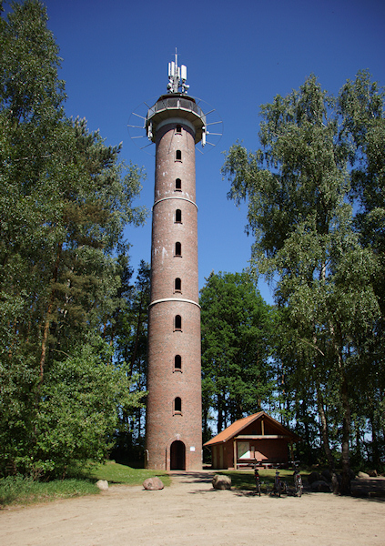
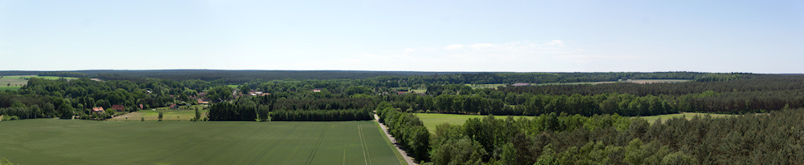
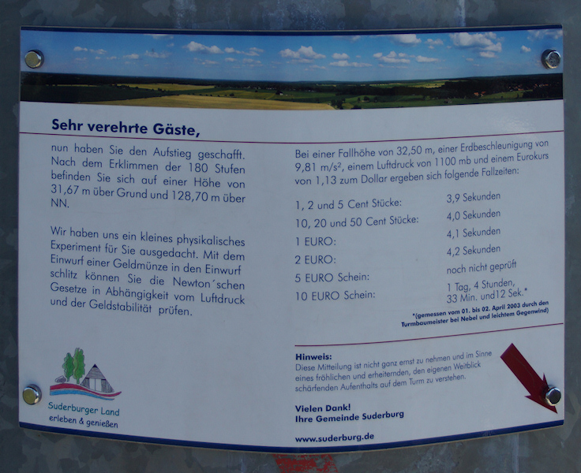

Dank einer Hochzeitsfeier hat es mich zu Pfingsten nach Hösseringen in die Lüneburger Heide verschlagen. Da das Wetter ausgezeichnet war habe ich auf dem Rückweg noch kurz an einem [Aussichtsturm](http://www.suderburg.de/tourismus/aussichtsturm.htm) gehalten, den die Gemeinde mit Unterstützung der EU als besteigbaren Handymast errichtet hat. Im Inneren des verklinkerten Rundbaus führt eine Wendeltreppe mit 180 Stufen auf eine Aussichtsplattform, die einen Rundblick über einen Teil der Heide ermöglicht.

Der Ausblick reicht ca 20km in jede Richtung; viel zu sehen gibt es jedoch nicht. Die Lüneburger Heide ist an dieser Stelle relativ flach und zudem dünn besiedelt, so dass Wälder und Felder das Bild prägen. Als Station für die verschiedenen Wanderwege im Suderburger Land ([die auch als GPX oder KML vorliegen](http://www.suderburg.de/tourismus/wandern_radeln.htm)) ist der Turm jedoch gut geeignet.

