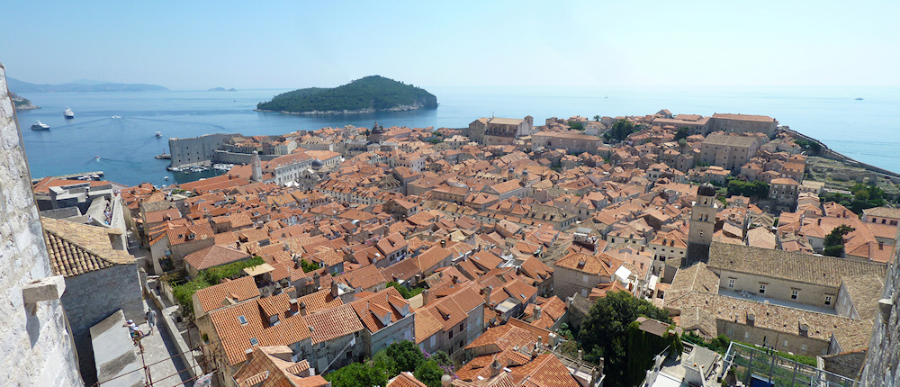

Ganz so weit ist es noch nicht, denn in der zweiten Staffel der großartigen Fantasy-Serie *Game of Thrones* muss die Khaleesi mit ihren Drachen erst noch nach Westeros übersetzen, um die Rückeroberung des Iron Thrones in Angriff zu nehmen. Doch der in King's Landing spielende Handlungsstrang bietet ausgiebig Gelegenheiten, um als Zuschauer den Drehortwechsel von Malta nach Dubrovnik zu bemerken.

Und dies weckte viele Erinnerungen an meinen schönen [Urlaub in Kroatien](/blog/2010/10/04/der-glockenturm-im-diokletianspalast-split/), zu dem auch der beeindruckende Besuch von Dubrovnik gehörte. Die Stadt war im Mittelalter unter dem Namen Ragusa fünfhundert Jahre lang ein unabhängiger Stadtstaat und eine wichtige Handelsmacht im Mittelmeerraum. Seine Unabhängigkeit von den Großmächten bewahrte Dubrovnik vor allem durch geschicktes Verhandeln, doch die Einwohner hielten ihre Stadt aus einem anderen Grund für uneinnehmbar: Eine 2km lange Mauer umschließt noch heute vollständig die auf einer felsigen Insel vor der Küste liegende historische Altstadt. Die Mauer ist drei bis sechs Meter dick, teilweise bis zu 25 Meter hoch und auf ihr kann die Innenstadt komplett umlaufen werden.

Die meisten Außenszenen in King's Landing spielen auf genau dieser Mauer. Zwar wurde die Stadt tricktechnisch vergrößert, zum Beispiel um das oft im Hintergrund zu sehende königliche Schloss, doch alles im Stile Dubrovniks, so dass das Flair der Stadt diese Szenen prägt. Als in der ersten Episode der zweiten Staffel die Stadtwache nach dem Sohn des toten Königs Robert sucht und dazu den Schmied befragt, spielt die Szene im Rundturm Minceta, der höchsten Bebauung der Mauer, aus dem ich die Fotos für das obige Panorama geschossen habe.

Doch egal ob auf den Spuren von *Game of Thrones* oder als ganz normaler Tourist: Dubrovnik ist definitiv einen Besuch wert. Nach der obligatorischen Umrundung der Innenstadt auf der Mauer, bei der mir vor allem das Meer aus rot geschindelten Dächern mit den daraus hervorragenden Türmen in Erinnerung blieb, sollte die Stadt auch auf Straßenniveau erkundet werden. Kloster, Kirchen, Paläste und Brunnen in Baustilen von Gotik, Barock bis hin zur Renaissance verstecken sich im Labyrinth der engen, Schatten spendenden Gassen. Zwischen den steinernen Fassaden lassen sich aber auch kleine Läden und Cafés entdecken und in der Straße Za Rokom stehen die Tische der italienischen Restaurants links und rechts direkt am kühlen Mauerwerk, wo ich mich gut vom drückenden Klima des Hochsommers erholen konnte.

P.S.: Ich bin ja der Meinung, dass *Game of Thrones* neben [Sherlock](/blog/?s=sherlock) die momentan beste Fernsehserie überhaupt ist. Die popkulturelle Adelung nach nur einer Staffel bestätigt auf jeden Fall deren Einfluss, denn [die Simpsons haben das Intro für einen Couch Gag aufgegriffen](http://io9.com/5890410/watch-the-simpsons-game-of-thrones-intro).
