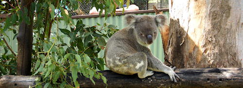

Auf dem roten Kontinent erinnert vieles an Europa, doch am anderen Ende der Welt ist auch vieles anders. Das fängt mit den Jahreszeiten an (den höchsten Bierkonsum haben die Aussies zu Weihnachten ;) und geht beim Linksverkehr und den anders herum drehenden Abflüssen weiter. Durch die Isolation des Kontinents konnte sich die Tierwelt relativ autark entwickeln: So bevölkern statt Spatzen und Tauben Ibisse und Flughunde die Bäume und die Beuteltiere (Possums, Wombats, Känguruhs und Koalas) haben die weitere Evolution hin zu höheren Säugetieren einfach verschlafen. Von den giftigen Spinnen, Schlangen und Quallen, die gerne mit Australien verbunden werden, habe ich zum Glück nichts gesehen.

Aktuell ist Australien für Europäer und Amerikaner ein teures Pflaster. Mit China als wichtigsten Handelspartner und Abnehmer für die australischen Rohstoffe ist die Wirtschaft dort zuletzt deutlich stärker gewachsen und mit ihr die [Zinsen](http://www.markt-daten.de/charts/zinsen/images/leitzinsen-0005.gif). Dadurch ist das Preisniveau höher als aus Deutschland gewohnt, vor allem bei lokalen Produkten wie Nahrungsmitteln. Als Ausgleich profitieren Touristen von den vielen kostenlosen öffentlichen Einrichtungen, die der Staat für seine Bürger bereitstellt: Museen ohne Eintrittsgelder, öffentliche Toiletten und Wasserspender, frei nutzbare Grillstationen (BBQ ist ein Volkssport) in Städten und auf Campingplätzen und sogar Strandbäder.

Der extrem teure Nahverkehr hat dagegen einen anderen Hintergrund: Jeder Australier besitzt ein Auto, um die unglaublich großen Entfernungen auf dem Kontinent zurückzulegen. Entsprechend wenig Bedarf gibt es für ein gut ausgebautes Streckennetz, das sich nur die großen Städte leisten. Außerhalb der Stadtzentren ist es dann schnell vorbei mit dem Nahverkehr. Dafür gibt es viele Überlandbusse, die günstiger als vergleichbare Flüge sind. Ich bin mit einem davon über Nacht von Melbourne nach Sydney gereist - die fast zehn Stunden Fahrzeit waren aufgrund der Straßenverhältnisse jedoch trotz bequemer Sitze wenig erholsam.

Neben der notgedrungen erlernten Eigenschaft, große Entfernungen im Auto zurückzulegen, neigen die Australier zu geführten Rundum-Glücklich-Paketen bei Ausflügen. Jedenfalls erwecken die Angebote an den Ausflugszielen diesen Eindruck. Fast immer gibt es geführte Touren, feste Zeitpläne mit An- und Abtransporten. Nur selten bleibt in solchen Paketen Zeit für eigene Erkundungen, und diese laufen oft auf das Ablaufen von Boardwalks hinaus - Individualtourismus gibt es nur mit eigenem PKW. Sehr beliebt bei den Aussies sind dabei Touren mit dem 4WD quer durch die Natur, egal ob dies Outback, Regenwald oder Sandinsel bedeutet. Ganz wichtig ist nur: Am Ende muss es ein BBQ geben, dann ist der Australier glücklich.

Meine weiteren Eindrücke und Erfahrungen werde ich wie gewohnt in kleinere Berichte verpacken, zu denen dieser Artikel den Einstieg bildet.

* [Sydney von oben](/2012/07/08/sydney-von-oben/)
* [Melbourne von oben](/2013/08/09/melbourne-von-oben/)
