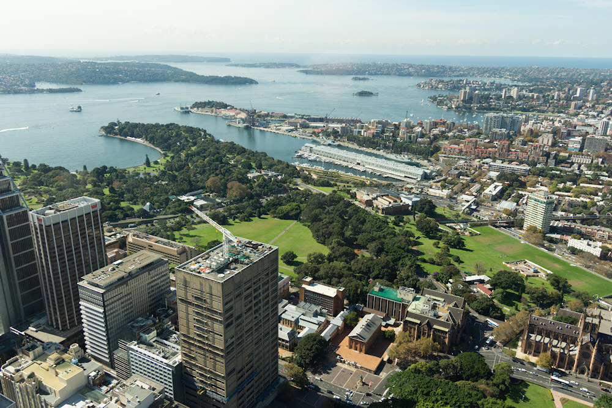
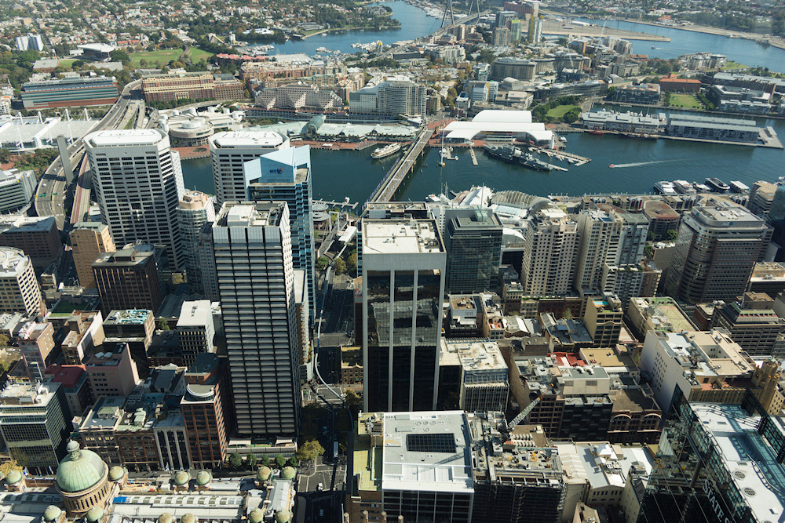
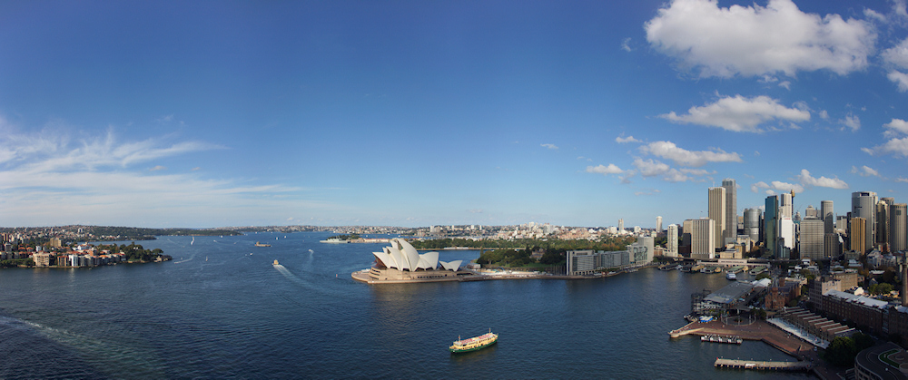
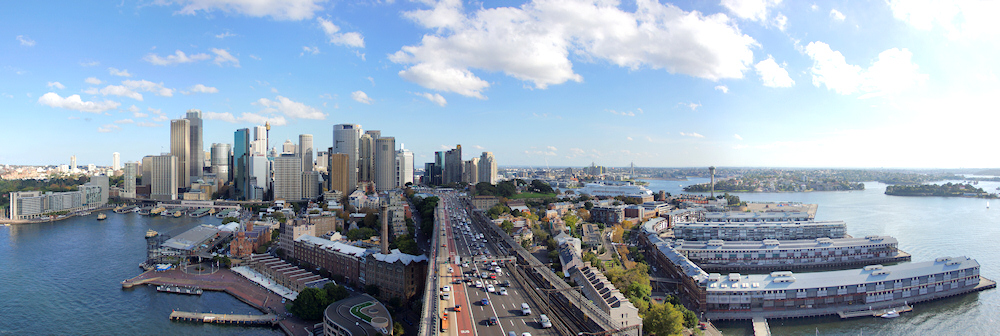
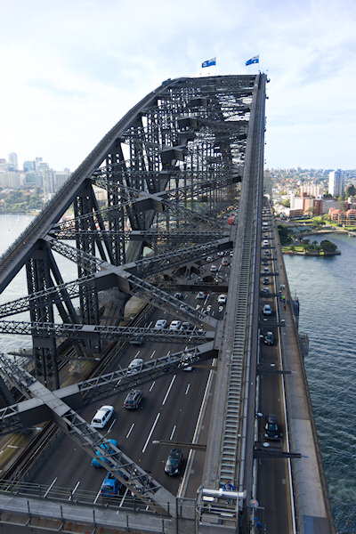
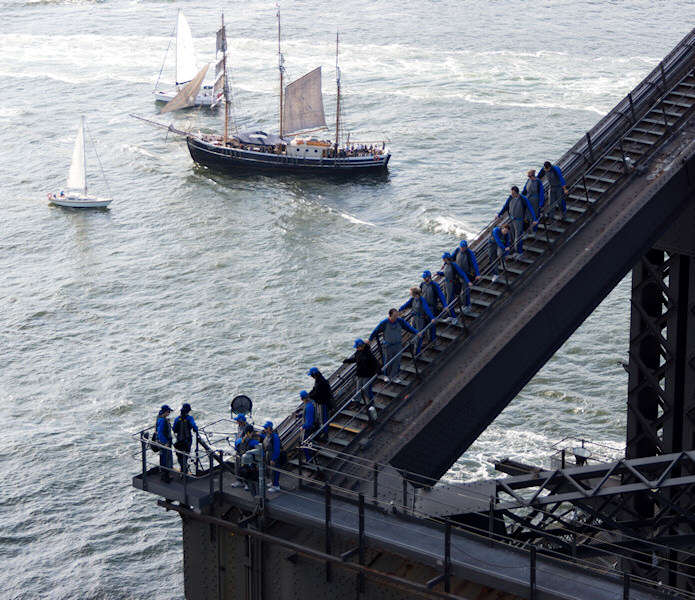
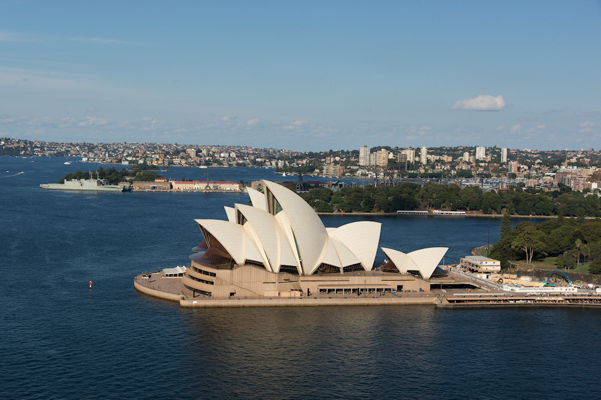
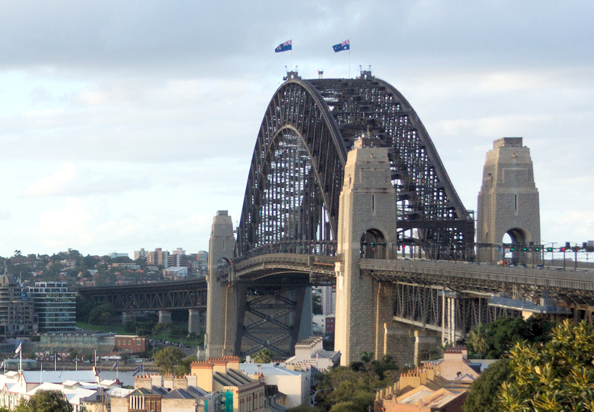
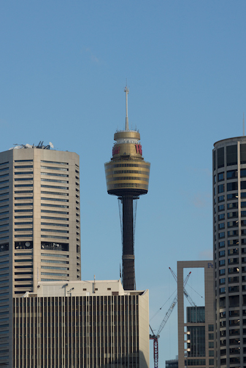

Es gibt eine offensichtliche Wahl für Besucher, die sich Sydney aus der Vogelperspektive ansehen wollen: Den Sydney Tower genannten Fernsehturm der Stadt. Dieser bietet in 251 Metern Höhe eine Aussichtsplattform ([Sydney Tower Eye](http://www.sydneytowereye.com.au/)) mit kreisrunder Grundfläche, die theoretisch einen nur durch Scheiben getrübten Ausblick in alle Richtungen ermöglicht. Wer die Aussicht ohne Sichtbehinderung erleben möchte, kann die 25 AUD Eintritt mit weiteren 40 AUD zum [Skywalk](http://www.sydneytowereye.com.au/explore/skywalk/) upgraden, der auf einer 17 Meter höher gelegenen, offenen Plattform stattfindet.

Nur einen Block von meinem Hotel entfernt gelegen war der Sydney Tower mein erstes Ziel in der Stadt. Der Eingang zu den Fahrstühlen war nicht einfach zu finden, da er sich in einem riesigen Einkaufszentrum befindet und schlecht ausgeschildert ist. An der Kasse habe ich dann gleich von dem überteuerten Skywalk Abstand genommen, da dabei ein freies Bewegen und Fotografieren nicht erlaubt ist. Der Besucher wird in einen Spezialanzug gesteckt, muss alle beweglichen Teile wie Kameras und Handys abgeben und wird danach über die Plattform geführt. Die Guides machen dabei Fotos, die später erworben werden können. Ich bezweifle, dass wirklich Sicherheitsbedenken hinter diesen Einschränkungen stecken - auf dem [Empire State Building](/2011/09/25/usa-von-oben/) war in 320 Metern Höhe schließlich auch ein freies Bewegen und Fotografieren möglich.

Aber auch die normale Aussichtsplattform war eine Enttäuschung für mich. Ich hatte ohnehin niedrige Erwartungen, da Fensterscheiben keine gute Voraussetzung für Fotos sind. Doch oben angekommen musste ich feststellen, dass die Sicht auf die wichtigsten Attraktionen der Stadt (Harbour Bridge und Oper) durch die Bürotürme des [CBD](http://en.wikipedia.org/wiki/Sydney_central_business_district) weitgehend versperrt ist (das [Panorama in der Wikimedia](http://upload.wikimedia.org/wikipedia/commons/3/3d/Sydney_Tower_Panorama.jpg) illustriert dies gut) - und das auch auf dem Skywalk. Zudem muss der Besucher vor der Fahrt mit den Fahrstühlen einen 4D-Film über sich ergehen lassen (es wird ein wenig Luft und Wasser im Raum verteilt). Ich dachte, solche "Attraktionen" finden sich nur noch auf Jahrmärkten!

Doch zum Glück hat Sydney noch eine zweite Möglichkeit, die Stadt von einer erhöhten Position aus zu betrachten: Die schon erwähnte Harbour Bridge. Für ganz Mutige mit lockerer Geldbörse empfehle ich den [Sydney Harbour Bridge Climb](http://www.bridgeclimb.com/German/), eine Klettertour über die beeindruckenden Brückenbögen des Wahrzeichens der Stadt. An der höchsten Stelle kann aus 134 Metern Höhe [über die Bucht und anliegenden Teile der Stadt](http://www.bridgeclimb.com/panoramic/panoramic.htm) geschaut werden; Fotoapparate sind aber auch hier nicht erlaubt.

Der [Preis von knapp 200 AUD](http://www.bridgeclimb.com/The-Climbs/Pricing/) und meine Höhenangst haben mich dazu bewogen, doch nur den Bridge Climb Light zu nehmen, nämlich eine Besteigung des südöstlichen [Pylon](http://www.pylonlookout.com.au/)s der Brücke. Nachdem ich vergeblich am Fuß des Pylons gesucht habe, fand ich den [Eingang](http://www.pylonlookout.com.au/HowToGetThere.htm) schließlich direkt auf der Brücke. Von dort ging es noch einmal 200 Stufen hinauf auf den 87 Meter hoch gelegenen Balkon, der einmal um den Pylon herum führt.

Die Aussicht dort ist deutlich beeindruckender als vom Sydney Tower. Dies liegt vor allem an dem tollen Blick auf die Oper; zudem kann die Harbour Bridge aus nächster Nähe bewundert werden. Auch Richtung CBD und über die Bucht ergeben sich tolle Panoramen; nur der Blick nach Westen ist durch den parallelen Pylon versperrt. Im Pylon befindet sich zudem ein kleines Museum über die Geschichte der Brücke, das im Eintrittspreis von 11 AUD inbegriffen ist. Dort habe ich erfahren, dass die Pylonen bei der Statik der Brücke gar keine Rolle spielen, vom Architekten aber aus optischen Gründen hinzugefügt wurden. Dazu sage ich Dankeschön, denn im Gegensatz zum Sydney Tower erhält der Pylon Lookout eine klare Empfehlung von mir!

