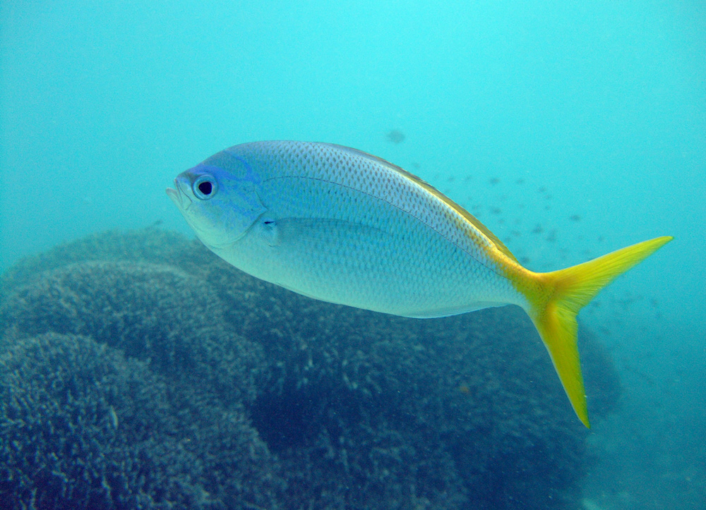
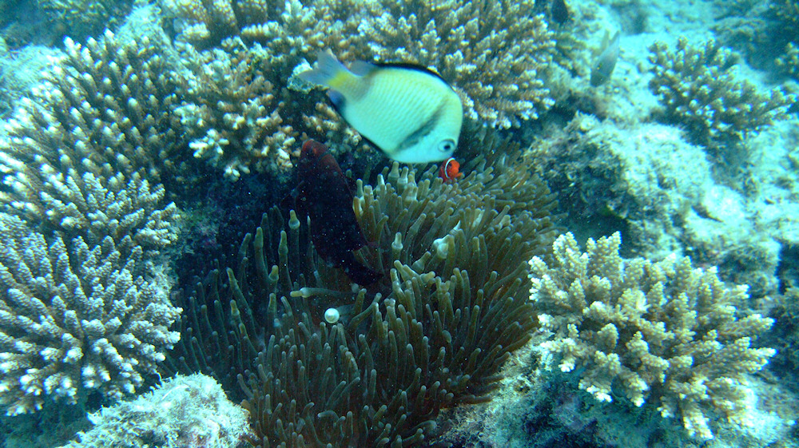
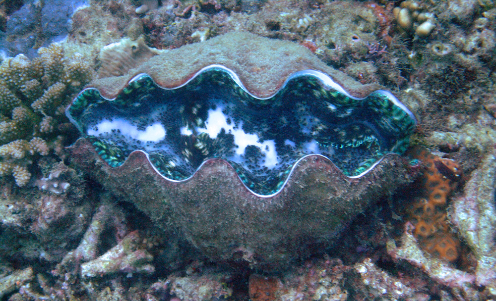
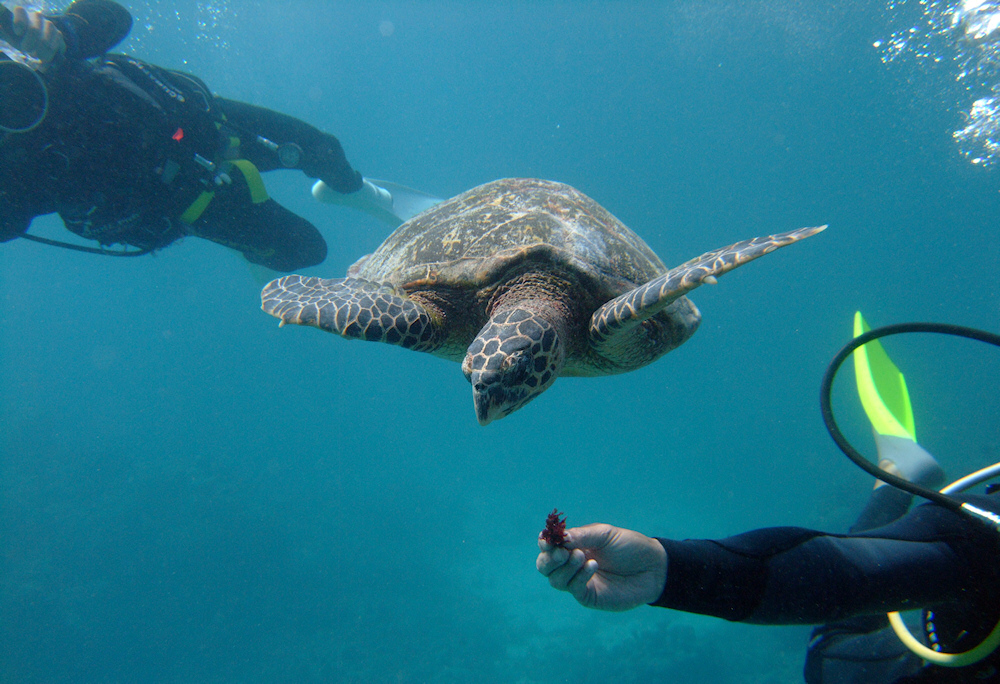
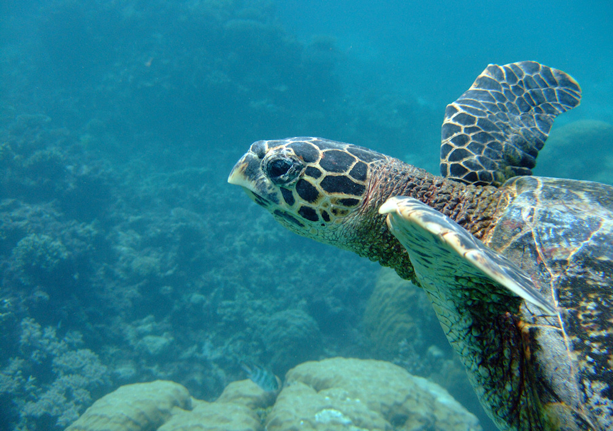

Die wohl beeindruckendste Erfahrung, die ich in zweieinhalb Wochen Australien machen durfte, war das Schnorcheln im Great Barrier Reef. Vor einem Jahr auf [Mauritius](/blog/2011/04/28/mauritius/) hatte ich noch feststellen müssen, dass mir als Schnorchler (ich bekomme Atemprobleme beim Tauchen) die besten Teile des Riffs entgingen, weil sie zu tief unter Wasser lagen.

Im Flynn Reef knapp 60km vor der Küste von Cairns war das ganz anders. Hier reicht das farbenprächtige Riff bis an die Wasseroberfläche, so dass ich direkt hindurchschwamm. Um mich herum tummelte sich die bunte Fauna - die Fische ließen sich gar nicht stören, sondern wichen nur ganz beiläufig aus, wenn ich durch einen Schwarm hindurchschwamm. Unter dem Boot suchten die großen Brummer wie die Napoleon-Lippfische, welche es in Länge und Gewicht mit mir aufnehmen können, nach Schatten und ließen sich dort füttern. Die erste Unterwasserbegegnung mit so einem enormen Fischkopf war trotz deren Friedlichkeit etwas unheimlich - obwohl ich vom Sternzeichen Fische bin, sind die echten Bewohner des Ozeans in ihrem Refugium einfach wendiger als ich.

Mit 27°C war das Wasser trotz des australischen Herbstes noch sehr angenehm zum Schnorcheln. Aufgrund der allgegenwärtigen Quallen-Gefahr wurde allen Tauchern und Schnorchlern ein Ganzkörperanzug angeboten, den ich dankbar annahm. Die Sicht im Wasser lag bei 15 Metern, so dass ich auch tieferliegende Korallen und Riesenmuscheln am Grund bewundern konnte. Die Tauch- und Schnorchelguides organisierten die selteneren Tiere wie eine Schildkröte und eine Seegurke und wiesen den Weg zu Seeanemonen, damit auch jeder einen Original-Clownfisch Marke [Nemo](/blog/2003/11/27/findet-nemo/) zu Gesicht bekam.

Ein Schiff mit fast 100 Schnorchlern und Tauchern ist leider auch eine Belastung für die Natur. So sehr sich die Tierwelt an die täglichen Besucher gewöhnt hat und so gut die Guides auf den Aspekt des Umweltschutzes eingingen - ich habe nicht wenige Kollisionen mit den Korallen beobachtet. Mit einer Taucherflosse kann dem Riff schon Schaden zugefügt werden, der mehrere Jahren zur Regenerierung benötigt. Deshalb sind nur ausgewählte Teile des Great Barrier Reef überhaupt zur öffentlichen Nutzung freigegeben. Ein fader Beigeschmack beim Anblick dieses Naturwunders bleibt trotzdem.

Wer jetzt Lust auf das Schnorcheln im Great Barrier Reef bekommen hat, dem muss ich noch vor zwei Dingen warnen. Zum Einen ist so ein Tagesausflug ins Riff mit 180AUD für Schnorchler (Taucher zahlen mehr) nicht gerade preiswert, zum Anderen fliegt das Boot mit knapp 60km/h über den Ozean. Bei solchen Geschwindigkeiten kann es natürlich keine Rücksicht auf Wellen nehmen und so gab es bei dem einen oder anderen Taucher den Griff zur Kotztüte.

Die Bilder stammen übrigens von Freunden, die im Gegensatz zu mir begeisterte Taucher sind und sich eine Unterwasserkamera angeschafft haben, um dieses Erlebnis dauerhaft festzuhalten.

