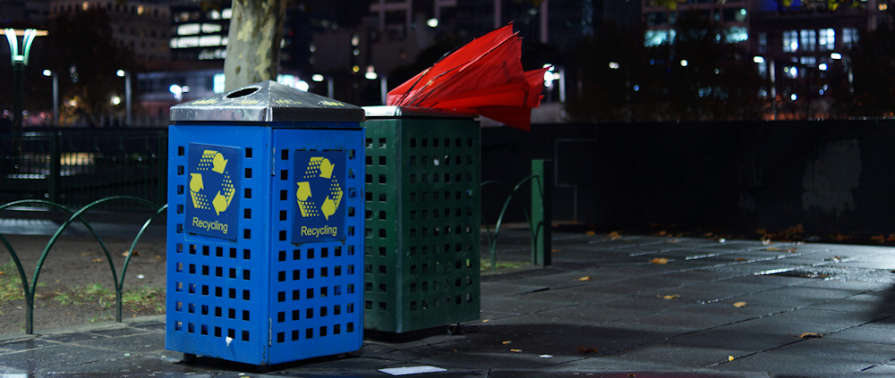

Bevor ich nach Australien kam, war meine Vorstellung vom roten Kontinent geprägt von ganzjährigem Sonnenschein und massiver Hautkrebsgefahr aufgrund des Ozonlochs. Doch dann landete ich an einem Herbstmorgen in Melbourne und wurde konfrontiert mit acht Grad ~~warmen~~ kaltem Regenwetter, dass sich zwei Tage lang nicht ändern sollte (der Busfahrer vom Airport Shuttle ließ trotzdem die Klimaanlage auf Anschlag laufen). Darauf waren ich und mein Koffer nicht eingestellt, aber zum Glück ließ ich das Tiefdruckgebiet mit der Fahrt nach Sydney hinter mir.

Doch künftig sollte sich jede Unterhaltung, die ich über Melbourne führte, zwangsläufig um dessen legendär schlechtes Wetter drehen. Im Flugzeug von Cairns nach Brisbane erzählte mir meine Sitznachbarin, dass ihre Tochter nach zehn Jahren Melbourne wieder zurück in den Norden Australiens gezogen sei, da sie das Wetter im Süden nicht mehr aushielt. Und diese Ansicht teilten auch meine Gastgeber in Sydney und Brisbane - dabei wird es in [Melbourne](http://de.wikipedia.org/wiki/Melbourne#Klima) auch im Winter selten kälter als 5°C und verglichen mit z.B. [Berlin](http://de.wikipedia.org/wiki/Berlin#Klima) liegen die Durchschnittstemperaturen drei bis vier Grad höher.

Aber es kommt eben darauf an, womit Melbourne verglichen wird. Und für Australier gelten andere Maßstäbe als für uns Deutsche. Als ich meine Gastgeber in Sydney befragte, ob ich in der Hafenbucht baden könnte, meinten diese, dass dazu das Wasser zu kalt sei - es hätte nur 22°C (zum Vergleich: Am [Great Barrier Reef](/blog/2012/10/02/schnorcheln-im-great-barrier-reef/) waren es noch 27°C). Als ich dann erzählte, dass ich mich [in Portugal bei 15°C in die Fluten des Atlantiks gestürzt](/blog/2009/12/26/portugal-algarve/) hatte, waren sie ganz entsetzt.

Die Gastgeberin in Brisbane hatte ebenso ein anderes Temperaturgefühl als ich. Im Mai gehen dort die Temperaturen nachts auf bis zu 12°C hinunter, ohne dass bei meinem Aufenthalt diese Tiefen erreicht wurden. Trotzdem hatte sie mir neben einer warmen Decke auch einen kleinen Heizstrahler in das Zimmer gestellt, da ihr Haus wie viele im Norden Australiens nur eine Klimaanlage, aber keine Heizung besaß. Dass das Haus von den molligen Temperaturen am Tag noch gut aufgewärmt war, schien sie nicht wahrzunehmen.

Aber auch im subtropischen Queensland, welches während meines Aufenthalts seinem Beinamen *Sunshine State* alle Ehre machte, gibt es kältere Ecken. Ich war mit meinen Freunden nach Toowoomba gefahren, um einen australischen Bekannten bei einem Rodeo zu treffen. Toowoomba, Geburtsort von Geoffrey Rush, liegt knapp 100km im Landesinneren und 700m hoch im Australischen Bergland. Tagsüber waren die Temperaturen vergleichbar mit Brisbane, doch als die Sonne erst einmal hinter dem roten Horizont verschwunden war, kam die Kälte sofort angekrochen. Gegen 21h verließen wir bibbernd das Rodeo, weil wir auf fünf bis sechs Grad kalte Temperaturen nicht eingestellt waren.

Ich kann also festhalten, dass ich fast alle Wettervariationen, die das große Land Australien mit seinen sechs Klimazonen zu bieten hat, in meinen zweieinhalb Wochen mitgenommen habe. Nur das Outback habe ich ausgelassen und das einzige Wintersportgebiet des Landes - aber Extreme hatte ich ja genug!
