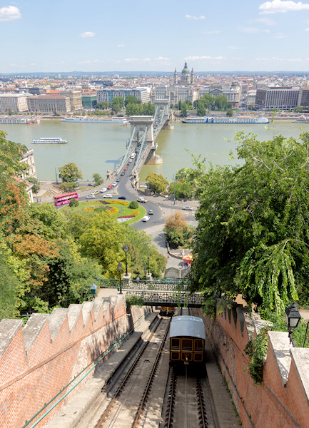
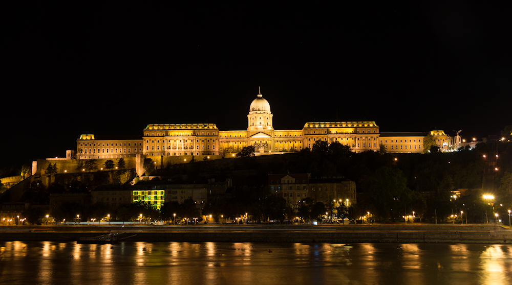
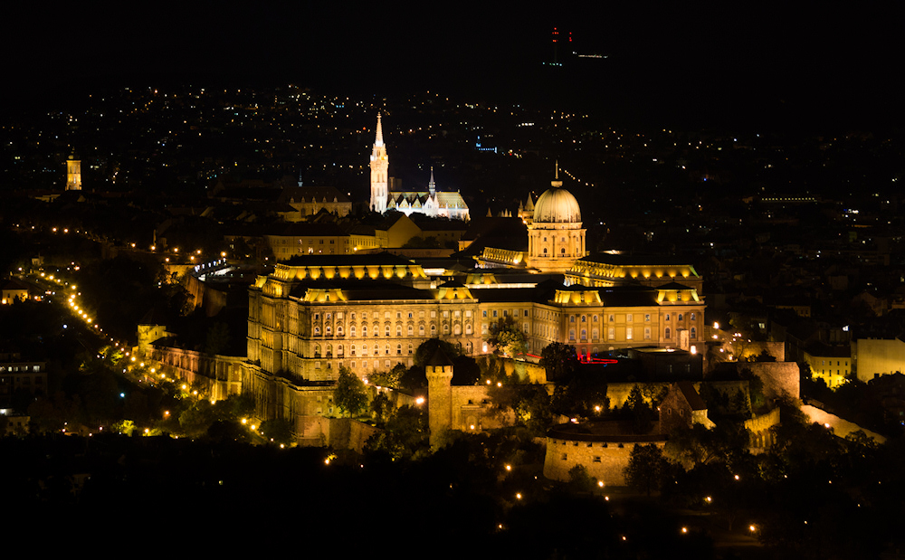

Am zweiten Tag meines Aufenthalts in Budapest habe ich die Donau über die Kettenbrücke in Richtung Buda überquert. Von dort, am Fuß des Burgberges, fährt eine Standseilbahn mit schönen alten Holzwagen (*Budavári Sikló*) hinauf zum Burgpalast, doch die lange Schlange von Touristen bewog mich dazu, den Aufstieg zu Fuß in Angriff zu nehmen - ein recht kurzer Weg von nicht einmal 10 Minuten, den niemand scheuen muss. Oben erwartete mich das weitläufige Ensemble der ehemaligen königlichen Burg, deren Palastbauten heute mehrere Museen beherbergen. Von den vorgelagerten Maueranlagen gibt es einen tollen Blick auf die Donau und die Pester Seite von Budapest. Dabei lohnt es sich, bis zum Vorsprung ganz im Süden vorzulaufen, da dort keine Bäume den Blick einschränken.

Richtung Norden folgt auf dem Burgberg mit dem Sándor-Palast der Sitz des ungarischen Staatspräsidenten, dessen Wachen ähnlich wie vorm Buckingham Palace ein gern gesehenes Fotomotiv sind. Hier beginnt auch das Burgviertel, der Stadtkern des alten Buda. Dieses ist von natürlichen Höhlen und künstlichen Kellern geradezu durchlöchert, doch [das Burgpalastlabyrinth kann leider nicht mehr betreten werden](http://www.labirintus.com/en/112/press). So musste ich mich mit den oberirdischen Schönheiten der barocken Gebäude zufrieden geben, die den angenehmen Eindruck erwecken, plötzlich aus der Millionenstadt Budapest in eine Kleinstadt gewechselt zu sein.

Doch spätestens an der Matthiaskirche wird klar, dass dem nicht so ist. Ein Tourist drängelt sich an den Nächsten, denn der wohl schönste Bau der Stadt breitet sich am Fuße der Kirche aus: Die Fischerbastei. Entgegen dem Namen war die Fischerbastei niemals ein Abwehrbollwerk, sondern soll nur an eine Befestigungsanlage erinnern. Früher stand an dieser Stelle ein Teil der Stadtmauer, die von den Fischern verteidigt wurde; der Name soll daran erinnern. Nun erheben sich an ihrer Stelle Türmchen und Terassen, die einen wunderbaren Blick auf die Donau und das gegenüberliegende Parlamentsgebäude erlauben.

Zwei Dinge trüben im Nachhinein etwas das Bild von der Fischerbastei. Da ist zum Einen das zu Ostblockzeiten direkt hinter der Bastei errichtete Hotel, dessen Architektur die Jahrzehnte nicht so gut überstanden hat. In den Fenstern im Stil des Palasts der Republik wirkt die Spiegelung des weißen Steins der Anlage seltsam verzerrt und verfremdet. Immerhin gibt es im Erdgeschoss einen Eisladen und ein Souvenirgeschäft, welches Postkarten mit atmosphärischen Fotos von Budapests Sehenswürdigkeiten verkauft.

Schade ist auch, dass weite Teile der Bastei von Restaurants belegt sind, zu denen nur begrenzt Zutritt besteht. So drängeln sich alle Touristen in zwei enge Türmchen oder bezahlen Eintritt für das Betreten eines Zinnenganges; den schönsten Ausblick gibt es aber vom nördlichsten und höchsten Turm der Anlage. Von der Fischerbastei führt ein schöner Fußweg über mehrere längere Treppen zum Batthyány-Platz hinab. Dieser liegt an der Donau, genau gegenüber dem Parlamentsgebäude und bietet sich deshalb für Fotos des beeindruckenden Bauwerks an.

Zwei Tage nach dem Burgberg habe ich noch den Gellért-Berg bestiegen. Gestartet bin ich dabei an der Freiheitsbrücke mit ihrem markanten grünen Stahlgerüst. Ihren Namen trägt die Brücke erst seit 1946, als sie als erste von den von der Wehrmacht gesprengten Donaubrücken wieder eröffnet wurde. Direkt am Ende der Brücke steht das Gellért-Hotel mit dem gleichnamigen Bad, an dem eine lange Schlange auf den Einlass wartete. Wie in so vielen anderen Städte auch haben zuerst die Römer die heißen Quellen entdeckt und genutzt ([Aquincum](http://de.wikipedia.org/wiki/Aquincum)); heute gibt es in Budapest 10 Heilbäder, von denen das Gellért-Bad eines der bekanntesten ist.

Nebem dem Gellért-Hotel erhebt sich der Gellért-Berg immerhin 235m über die Donau. So hoch hatte ich ihn gar nicht eingeschätzt, und so kam ich beim Aufstieg unerwartet ins Schwitzen. Der ganze Berg ist als große Parkanlage mit einem weit verzweigten Wegenetz angelegt, von dem allerdings nur Teile nachts von Lampen beleuchtet werden. Als ich am späten Abend zum zweiten Mal Richtung Freiheitsstatue unterwegs war, um Nachtfotos zu schießen, lief ich teilweise auf stockdusteren Pfaden. Weniger unheimlich, aber auch länger, ist der Weg über die Straße, die von Westen zum Berg hinaufführt.

Neben der Freiheitsstatue gibt es noch eine als Militärmuseum genutzte Zitadelle auf dem Berg, doch deren Besuch habe ich mir gespart. Denn von hier oben kann ein beeindruckendes Panorama von Budapest genossen werden. Der Gellért-Berg ist höher als alle umliegenden Stadtteile und so kann das Auge dem Verlauf der Donau folgen, die Ausmaße des Burgpalastes bestaunen und sogar das Riesenrad auf dem [Sziget](/2012/09/04/sziget-2012/) erblicken. Der Aufstieg lohnt sich also auf jeden Fall!

