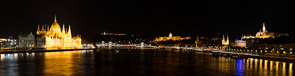

Mein erster Eindruck von der Stadt an der Donau war noch geprägt von der Suche nach der nicht ausgeschilderten U-Bahn an der Baustelle des Ostbahnhofs (*Keleti pályaudvar*). Doch am Abend, als ich auf der Margaretenbrücke (*Margit híd*) stand und sich die grandios angeleuchteten Sehenswürdigkeiten vor mir ausbreiteten, hatte die Stadt mich für sich eingenommen. Das [Panorama](http://gigapan.com/gigapans/115994) wird auf der östlichen Donauseite, dem flachen Pest, von der neogotischen Fassade des Parlamentgebäudes (*Országház*) bestimmt. Die Ketten- und die Elisabethenbrücke (*Széchenyi Lánchíd* & *Erzsébet híd*) liegen am Fuße des Gellertberges (*Gellért-hegy*) mit seiner Zitadelle und der ungarischen Freiheitsstatue (*Szabadság-szobor*). Am westlichen Buda-Ufer prägen der Burgberg (*Várnegyed*) mit dem Burgpalast (*Budavári palota*) und die Fischerbastei (*Halászbástya*) das Bild - allesamt in das warme Licht von unzähligen Scheinwerfern getaucht. Wenn die Ungarn eines können, dann ihre Bauwerke effektiv in Szene zu setzen.

Doch auch am Tag zeigte sich Budapest von seiner besten Seite. Das trocken-warme Kontinentalklima tat das Seine, um mir das Schlendern durch die Stadt in der wenigen Zeit, die mir neben dem [Sziget](/blog/2012/09/04/sziget-2012/) blieb, angenehm zu machen. So habe ich Ungarns Hauptstadt an fünf Vormittagen erkundet und dabei einiges gesehen. Da ich beim Schreiben über das Gesehene feststellte, dass der Artikel immer länger und länger wurde, habe ich ihn nun so geteilt, wie es die Stadt vor 1873 war - nämlich in [Buda](/blog/2012/11/04/buda/) und [Pest](/blog/2012/11/04/pest/).
