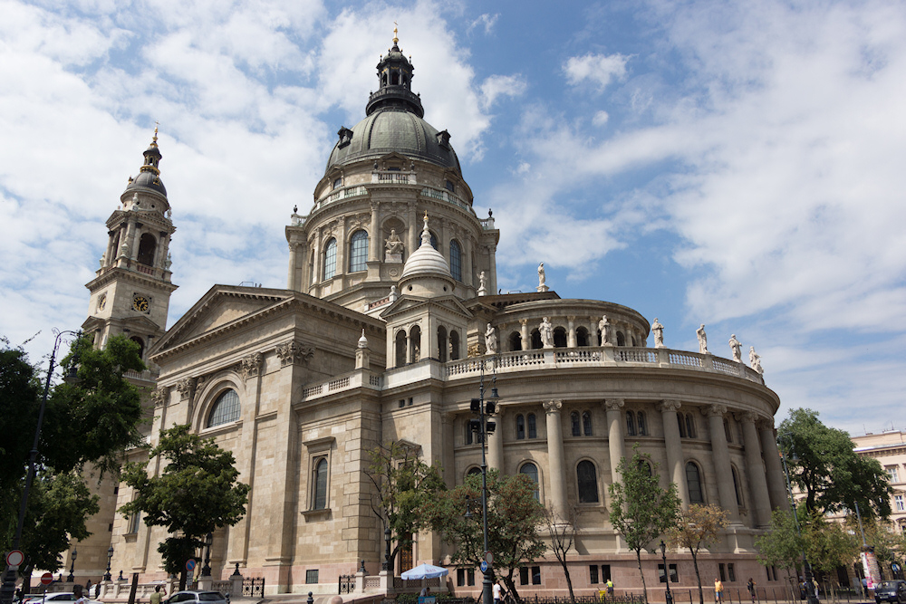
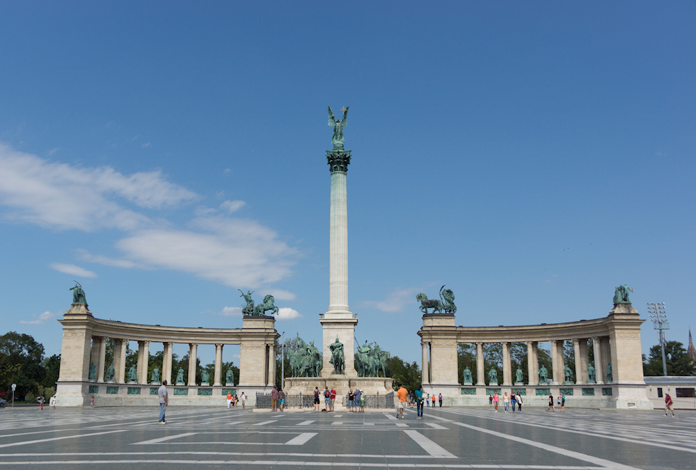
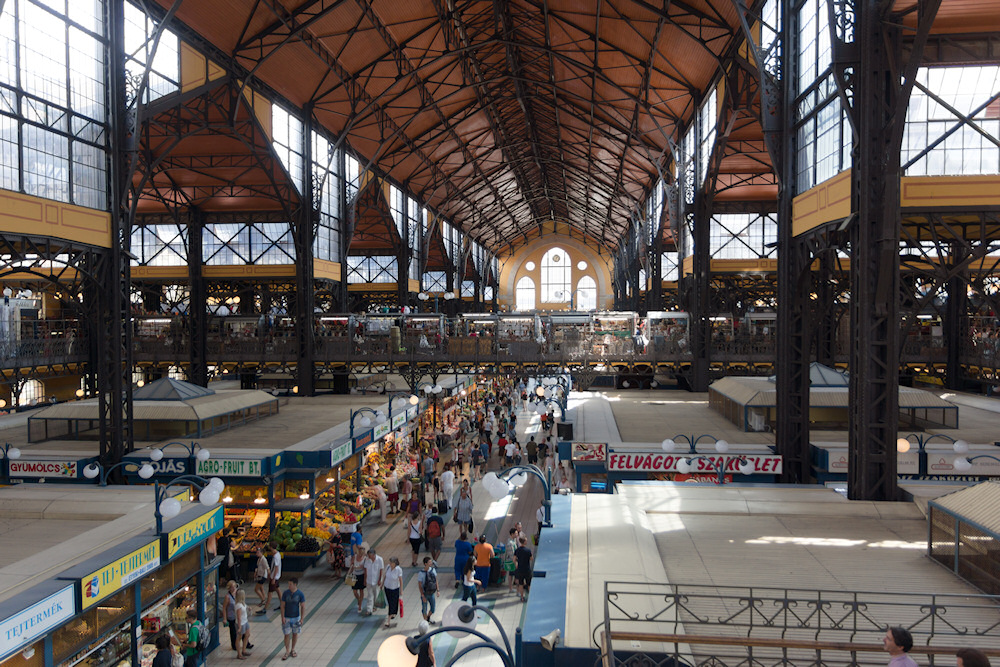

Mein Budapester Hotel lag auf der Pester Seite der Stadt im XIII. Bezirk. Dies hatte den Vorteil, dass die Fähre zum [Sziget](/2012/09/04/sziget-2012/) ganz in der Nähe abfuhr, doch im Gegenzug war das Viertel touristisch wenig erschlossen - in den Cafés kam ich mit Englisch und Deutsch nicht weit.

So zog ich los, andere Bezirke auf der östlichen Donauseite zu erkunden. Mit der U-Bahn fuhr ich bis zur Station Deák Ferenc tér, die das Umsteigen zwischen allen drei Linien erlaubt und dank der zentralen Lage im Mittelpunkt vom kleinen und großen Straßenring ein idealer Startpunkt für die Erkundung von Budapest ist. Von da aus machte ich einen kurzen Abstecher zur Donau, schaute mir kurz die Kettenbrücke an (die älteste ihrer Art in Budapest) und schlenderte dann direkt zur St.-Stephans-Basilika, denn diese kann bestiegen werden. Und das habe ich mir natürlich nicht entgehen lassen.

Im Gegensatz zu vielen anderen Kirchen hat der Besucher hier die Wahl, ob er die knapp 300 Stufen bis zur Aussichtsplattform zu Fuß erklimmt oder den Fahrstuhl nutzt - ich habe natürlich ersteres getan. Oben angekommen erwartete mich ein rund um die Kuppel verlaufender Balkon, der in jede Richtung einen guten Blick ermöglicht, da Budapest ähnlich wie Berlin noch weitgehend frei von sichtbehindernden Hochhäusern ist und die St.-Stephans-Basilika alle umliegenden Gebäude überragt.

Gleich hinter der Basilika beginnt mit dem Andrássy út der Prachtboulevard von Budapest, der über fast drei Kilometer bis zum Stadtwäldchen mit Stadtschloss und Heldenplatz führt. An ihm liegen u.a. die Oper und das Haus des Terrors, an denen ich aber nur vorbei gelaufen bin. Direkt unter der als Allee ausgelegten Straße verläuft mit der Földalatti die nach London zweitälteste U-Bahn der Welt. Die Wagen der U-Bahn wurden in den 70er Jahren im typischen Tatra-Stil neu angeschafft, doch die Stationen der Földalatti haben sich seit der Eröffnung 1896 kaum verändert und so ihren Charme erhalten können, der auch darin besteht, dass im Gegensatz zu den neueren Linien keine langen Rolltreppen überwunden werden müssen, um auf den Bahnsteig zu gelangen - es fällt sogar Tageslicht in die Bahnhöfe!

Gegen Ende der Andrássy út wird die Straße breiter und weitläufiger, die Häuser und Wohnblöcke immer kleiner, bis ich kurz vor dem Heldenplatz nur noch zwischen Stadtvillen flanierte. Der Heldenplatz selber ist ein riesiger gepflasterter Platz, der links und rechts von der Kunsthalle und dem Museum der Bildenden Künste eingerahmt wird. Markant ist das Millenniumsdenkmal in der Mitte des Platzes, von dessen hoher Säule der Erzengel Gabriel herabschaut.

Gleich hinter dem Heldenplatz beginnt das Stadtwäldchen, ein Naherholungsgebiet für die Budapester Bürger. Entspannen können diese sich u.a. im Széchenyi-Bad (dazu später mehr), in einem Zoologisch-Botanischen Garten, einem fest installiertem Zirkus oder im Vergnügungspark Vidámpark. Ich bin kurz durch die Burg Vajdahunyad geschlendert, eine Ende des 19. Jahrhunderts als Zusammenstellung verschiedener ungarischer Baustile erbaute Schlossanlage, auf deren Burggraben im Sommer Boot gefahren und im Winter Schlittschuh gelaufen werden kann.

Meinen dritten Tag begann ich mit einem Besuch der großen Markthalle. In Budapest gibt es einige Markthallen, die abseits der Touristenpfade auch von dem Einheimischen frequentiert werden. In direkter Hotelnähe am Lehel tér gab es so eine geschäftige Halle, die im krassen Gegensatz zur großen Markthalle steht, die sich in jedem Touristenführer findet und ihren Ruf vor allem durch ihre Architektur verdient. Auf der oberen Etage bietet sie eine Mischung von Imbissbuden und Souvenirläden, während im Untergeschoss ein Supermarkt auf den Besucher wartet. Das Erdgeschoss ist komplett den Lebensmitteln gewidmet, wobei die ungarischen Spezialitäten zu Touristen-Preisen angeboten wurden, so dass ich nur ein Glas des einheimischen Honigs gekauft habe und die Markthalle in Richtung Freiheitsbrücke verließ.

Direkt an der großen Markthalle beginnt die Váci utca, die Haupteinkaufstraße von Budapest, die anfangs nur aus Restaurants besteht, dessen Kellner aufdringlich lautstark um die Touristen buhlen. Im Zweifel würde ich aber das Universitätsviertel für ein gutes Essen vorziehen.

Da ich neben dem Festival jede freie Minute mit Sightseeing verbringen wollte und es leicht zu regnen begann, schnappte ich mir eine Straßenbahn und fuhr entlang der Donau vorbei am Parlamentsgebäude in Richtung Nordbahnhof. Dieser ist nach den Plänen des Architekturbüros von Gustav Eiffel enstanden, was sich vor allem in der markanten Fassade äußert. In einem wunderbar saniertem Seitenflügel des Gebäudes findet sich das wohl untypischste McDonals, das ich je gesehen habe. Südlich des Bahnhofsgebäudes schließlich ist ein Einkaufstempel entstanden, wie er inzwischen in jeder europäischen Metropole üblich ist; mit Boutiquen der immer gleichen Ketten.

Für die Fahrten von und zum Sziget hatte ich mir den Budapest City Pass geholt. Dieser bot neben einer Flatrate für die Nutzung des ÖPNV einen freien Eintritt in ein Budapester Heilbad meiner Wahl. Ich habe mich für das weiter oben erwähnte Széchenyi-Bad entschieden. Das Bad besteht aus mehreren von warmen Quellen gespeisten Heilbädern und einem Freibad im Hof des [beeindruckenden barocken Ensembles](https://de.wikipedia.org/wiki/Széchenyi-Heilbad#/media/Datei:Szechenyifurdo.jpg), an dem leider an der einen oder anderen Stelle der Putz bröckelt. Das stört die vor allem älteren, wärmesuchenden Besucher aber nicht, die sogar im Wasser Schach spielen.

