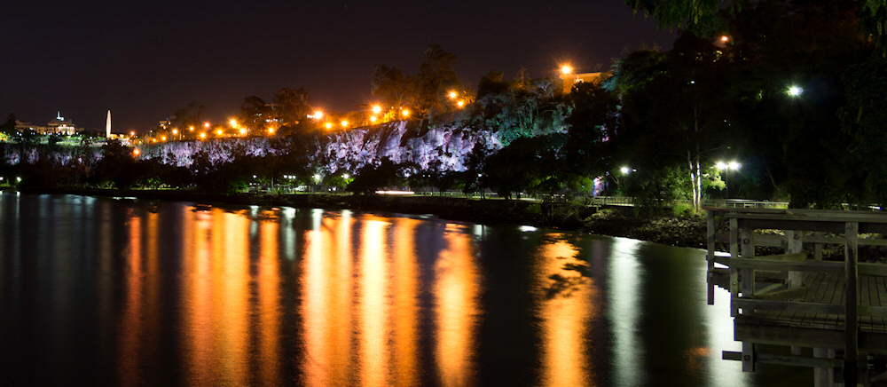
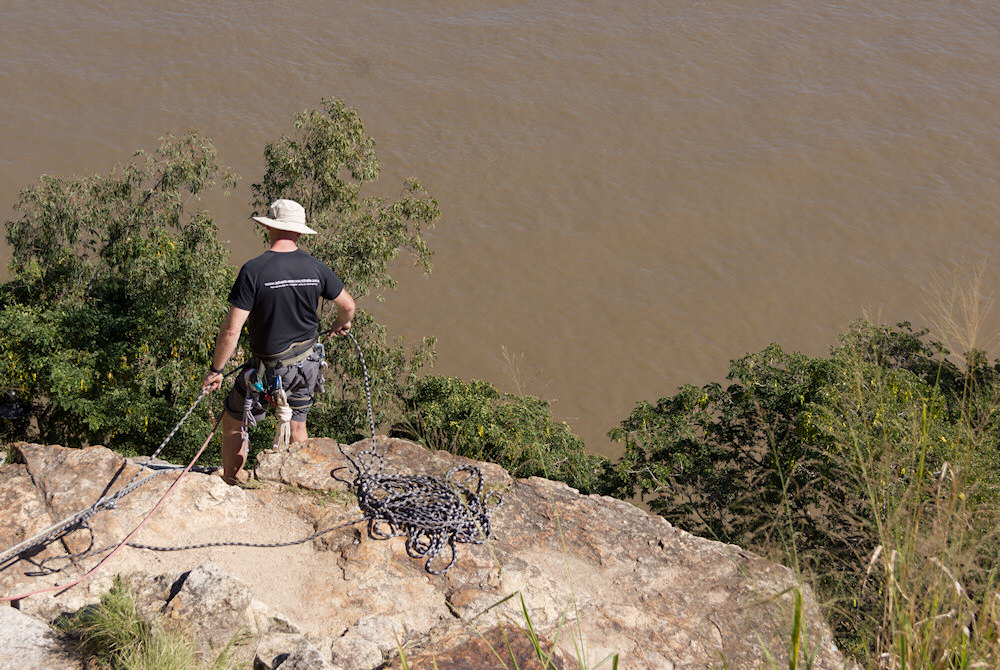
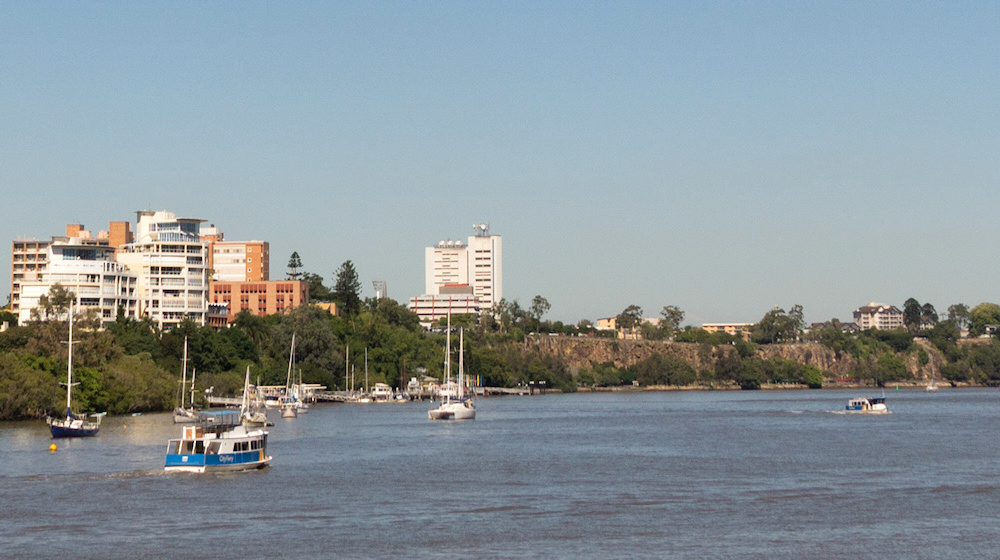

Als ich heute in der [Zeitung las](http://www.mz-web.de/halle-saalekreis/deutscher-alpenverein-wackelige-kletterpartie-am-riveufer,20640778,22781592.html), dass in Halle die Porphyrfelsen am Riveufer für Klettertouren entlang zweier Routen freigegeben werden, da wurde ich spontan an meinen Australienurlaub vor einem Jahr erinnert. In Brisbane gibt es entlang des Brisbane River nämlich nicht nur ein Freibad, einen Botanischen Garten und schöne Parkanlagen, sondern auch Kletterfelsen direkt in der Innenstadt, die nachts besonders schön angeleuchtet werden:

Ich war überrascht, wie stark das Angebot selbst in der glühenden Mittagshitze angenommen wurde. Eine Stadt, die solch ein Angebot für ihre Bewohner und Touristen bereithält, ist in meiner Wahrnehmung gleich ein Stück lebenswerter. Deshalb freut es mich, dass so etwas nun in Halle möglich ist und hoffe auf weitere positive Impulse dieser Art.
