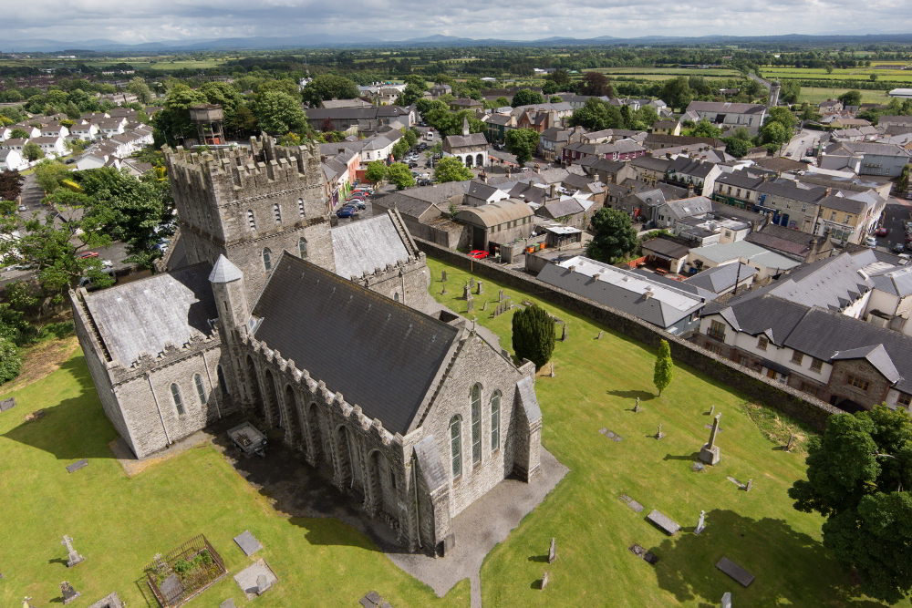
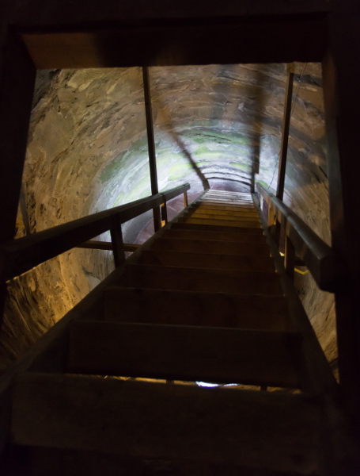
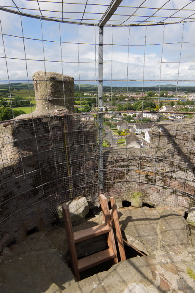
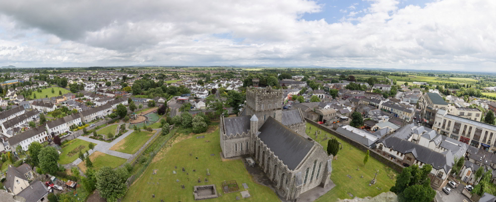

Die abgeschiedene Lage von Irland als Insel am Ende der damals bekannten Welt hat sicherlich ihren Anteil am Fehlen von repräsentativen Kirchengebäuden, wie sie z.B. [Deutschland](/2005/09/09/koln-im-september/) [aufweisen](/2005/10/05/in-ulm-um-ulm-und-um-ulm-herum/) [kann](/2011/04/27/backsteingotik-mit-turmbefahrung/). Keine wichtige Handelsstraße führt über die Insel, keine Mäzene drückten ihren Reichtum und Einfluss mit der Förderung von Künstlern umd Architekten aus. Hinzu kommt, dass die Iren, anfangs wichtige Exporteure des katholischen Glaubens, über viele Jahrhunderte von Besatzern in ihrer Religion unterdrückt wurden. Dabei sind sie ein kleines Volk geblieben, welches keinen Bedarf an riesigen Gotteshäusern hat - eine schlechte Voraussetzung für einen Turmkletterer wie mich.

Doch aus der Blütezeit der irischen Kirche, als deren Mönche die gesamte christianisierte Welt beeinflussten und ihr Verständnis der Religion bis nach Italien trugen, ist Irland ein Unikum der frühromanischen Baukunst erhalten geblieben: Die Rundtürme. Zu finden ausschließlich auf der irischen Insel, in Schottland und der Isle of Man, zeugen heute nur noch 69 teilweise erhaltene Exemplare von diesem im elften Jahrhundert in Mode gekommenen Bauschema.

Die freistehenden Türme mit kreisförmiger Grundfläche haben alle ein markantes Merkmal, welches heute noch über ihren Zweck rätseln lässt: Ihr einziger Eingang ist eine drei Meter über dem Boden befindliche Türöffnung. Weit verbreitet ist die Interpretation, dass die Mönche diese Türme zum Schutz vor den Wikingern bauten. Wurde ihre Siedlung angegriffen, so versteckten sie sich darin und zogen die Leitern, welche hoch zum Eingang führten, einfach nach innen. Wie aber ein [Blogger](http://gotireland.com/2012/09/04/round-towers-the-medieval-mysterious-marvels-of-ireland/) überzeugend argumentiert, wäre dies kein wirklicher Schutz gewesen. Mit einem Brandpfeil oder einer eigenen Leiter sind drei Meter schnell überwunden, und ausgeräuchert werden wollten die Mönche bestimmt nicht. Weit überzeugender ist die Vermutung, dass die vormittelalterliche Statik keine hohen Türme ohne entsprechendes Fundament erlaubte. So entstand die erste Öffnung erst oberhalb der sicheren Grundmauern in 3 Metern Höhe.

Von den 65 noch erhaltenen Türmen Irlands sind genau zwei auch besteigbar. Ich habe mir die Gelegenheit nicht entgehen lassen, und den näher an Dublin gelegenen [Kildare Round Tower](http://www.voicesfromthedawn.com/kildare-round-tower/) erklommen. Die massiven Mauern lassen im Inneren der Türme keinen Platz für Treppen, so dass Leitern die einzelnen Zwischenböden miteinander verbinden. Wer den Aufstieg wagt, sollte deshalb Taschen und Rucksäcke am Boden lassen, sie behindern nur das Klettern in dem engen Zwischenraum zwischen Mauer und Leiter. Aus demselben Grund dürfen sich maximal sechs Personen gleichzeitig im Turm befinden - ein Ausweichen und Aneinandervorbeigehen ist schlicht nicht möglich. Auf der Turmspitze steht eine Art Käfig, um ein Herabstürzen aufgrund der starken Winde und dem teilweise fehlenden Mauerwerk zu verhindern.

Die Aussicht vom Turm, der die nebenan stehende St. Brigid’s Cathedral mühelos überragt, ist typisch irisch: Kildare hat eine Hauptstraße mit Geschäften, Wohngebiete mit schmalen Einfamilienhäusern und liegt inmitten von grünen Hügeln. Stellt sich also immer noch die Frage, weshalb hier vor über tausend Jahren ein Turm hingebaut wurde. Ich vermute eine Mischung aus weithin sichtbarem Statussymbol (sieh' her, wozu die Kirche in der Lage ist!) und dem Wunsch, dem eigenen Gott so nah wie möglich zu sein - die Gründe für den Bau fast jedes kirchlichen Glockenturms. Beeindruckend ist auf jeden Fall, dass die Türme die Zeiten überstanden haben und ich mir diese Fragen von deren Spitze aus stellen kann!

