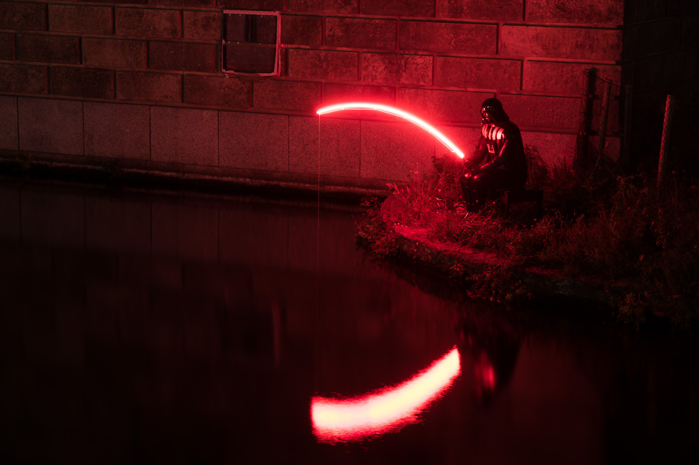
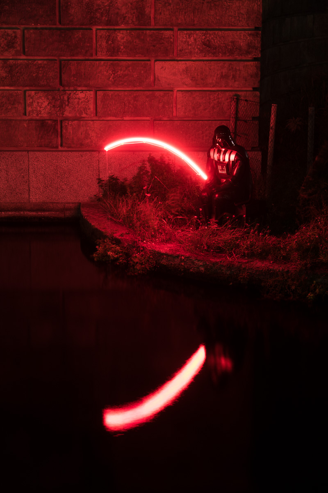
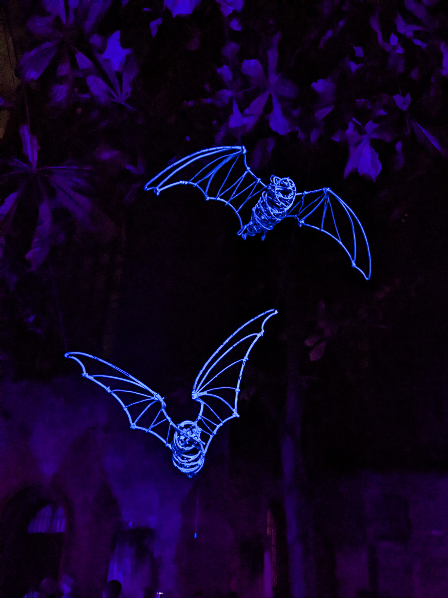
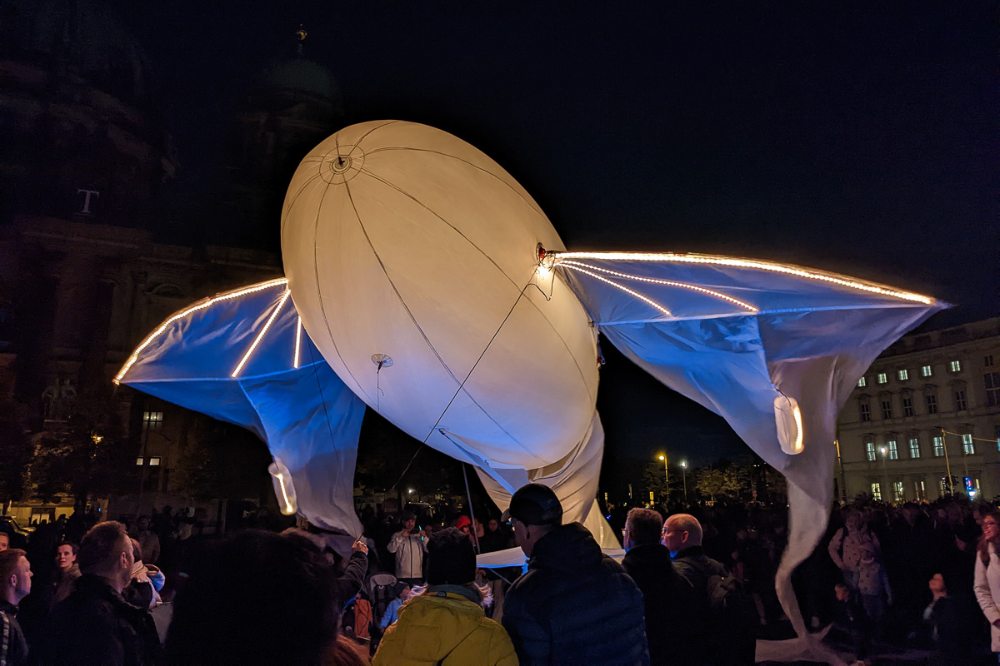
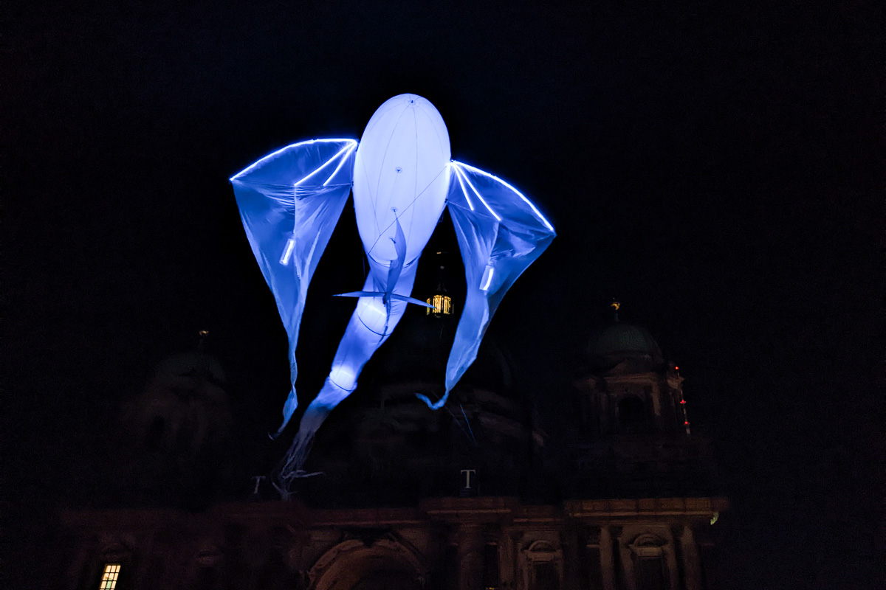

Ich bin ja schon seit über einem Jahrzehnt mit der Kamera auf dem  [Festival of Lights](/2012/10/23/festival-of-lights/) unterwegs. Zuletzt mit deutlichen Ermüdungserscheinungen, da sich gefühlt alles wiederholte und die für Fotografen suboptimalen Videomappings von Gebäuden alles dominierten.

Dieses Jahr ist, der Energiekrise zum Dank, alles etwas kleiner beim Festival. Weniger Locations, weniger Gebäude, dafür mehr Lichtskulpturen. Diese haben den Vorteil, weniger Strom zu verbrauchen - und lassen sich einfach besser fotografieren. Ich erinnere mich noch gerne an die [Wächter der Zeit](https://guardian-of-time.com/de/) und die [Hasen von parerstudio](https://parerstudio.com/).

Leider ist die Anzahl der Besucher nicht kleiner geworden, so dass z.B. das Nikolaiviertel total überlaufen ist. Etwas ruhiger war es dafür bei [Darth Fisher](http://2022.festival-of-lights.de/2022/09/21/darth-fisher/) und [Les Luminéoles](http://2022.festival-of-lights.de/2022/09/21/les-lumineoles/). Gerade letztere überzeugen als Gesamtkunstwerk, da sie den Wind nutzen, um organische Bewegungen zu erzeugen, und dabei von einer mystischen Soundkulisse unterstützt werden.

