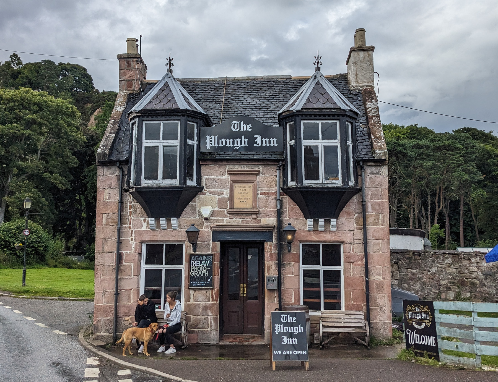
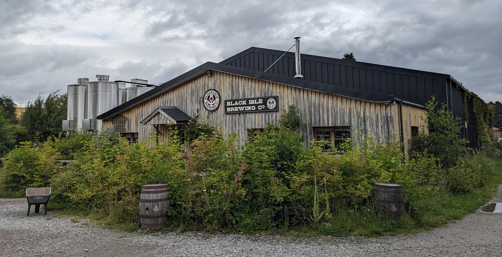
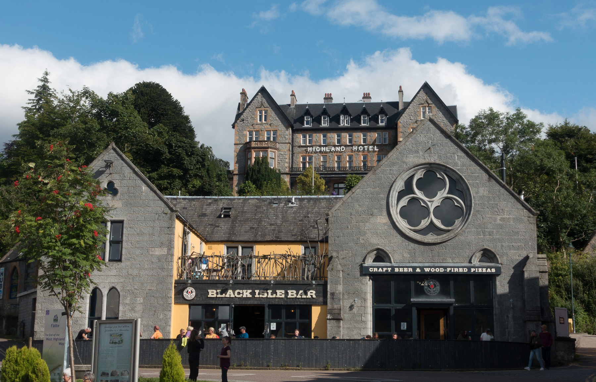

Wer durch Schottland reist, der besucht normalerweise mindestens eine Whisky-Destillerie - dafür sind die Schotten ja berühmt. Doch als Hobby-Bierbrauer liegt mein Interesse naturgemäß woanders. Und wie alle Länder der britischen Inseln hat auch Schottland eine ausgeprägte Pubkultur - jedes noch so kleine Kaff hat einen eigenen Pub mit mehreren, meist lokalen Bieren am Zapfhahn. Diese idealen Abnahmebedingungen haben dazu geführt, dass es für ein dünnbesiedeltes Land mit gerade einmal 5,5 Millionen Einwohnern [erstaunliche viele Craft Breweries](https://brewedinscotland.co.uk/map/) gibt.

Die engen Verknüpfungen entstanden auch durch eine Besonderheit der britischen Kneipen: Dem [Cask Ale](https://www.falstaff.com/de/news/das-echte-ale). Dieses ist früher in den Fässern im Keller des Pubs fertig gereift und wurde mit markant großen Handpumpen ins Glas befördert, wobei die charakteristische, feinperlig weiche Kohlensäure entsteht. Da noch gärende Biere sich schlecht transportieren lassen, waren lokale Brauereien im Vorteil bei der Belieferung.

Aber auch die Briten kamen irgendwann auf den Geschmack von gut gekühltem und prickelndem Bier, so dass die Cask Ales fast ausstarben. Inzwischen werden sie - auch durch Innovationen von Brewdog - als fertige Biere in die Pubs geliefert und unterscheiden sich nur noch durch die Kohlensäure von normalem Fassbier. Von der Kombination mit den häufig leichten Session Ales war ich persönlich aber nicht überzeugt.

Wobei wir schon beim schottischen Platzhirsch wären: Brewdog ist der größte Craft Brewer Europas und hat seit der Gründung 2007 eine aggressive Expansionspolitik verfolgt. Von den USA bis Australien gibt es inzwischen [über 100 Bars und Hotels von Brewdog](https://drink.brewdog.com/uk/bar-locator#ALL). So cool und hip wie am Anfang sind sie aber nicht mehr; die Zeiten als sie wie [2016 ihre Rezepte frei verfügbar machten](https://brewdogrecipes.com/) sind leider vorbei (sagt der Heimbrauer in mir).

In etwas kleinerem Rahmen scheint [Black Isle Brewing](https://www.blackislebrewery.com/) ihnen nachzueifern. Die Brauerei selber liegt verträumt inmitten von Kuhweiden auf der namensgebenden Black Isle (die weder schwarz noch eine Insel ist) und hat einen gut sortierten kleinen Laden direkt vor Ort. Doch ihre Biere gibt es in vielen (auch weit entfernten) Pubs und sie selber betreiben zwei größere Pubs in Inverness und Fort William inklusive Unterkünften.

Doch nicht alle Brauereien haben eigene Pubs oder günstig auf der Reiseroute gelegene Brauereishops. Deshalb habe ich meinen Koffer in zwei spezialisierten Läden aufgefüllt: [Great Grog](https://www.greatgrog.co.uk/) liegt günstig in Edinburghs Studentenviertel und hat fast alles auf Lager, was in und um die schottische Hauptstadt gebraut wird. In Oban dagegen hat [Karen](https://obanbeerseller.com/) (gefühlt) ihr Wohnzimmer zum Shop umgebaut und bietet fast alles an, was im Westen Schottlands abgefüllt wird. Man findet sie ganz einfach: Wenn man vor dem Eingang zur überlaufenen Oban Distillery steht, muss man sich nur einmal umdrehen und steht vor ihrer Tür.

Zum Schluss möchte ich noch ein paar Empfehlungen für Brauereien aussprechen, deren Biere mir besonders gut geschmeckt haben:

- In Edinburgh hat sich [Vault City](https://vaultcity.co.uk/) voll und ganz auf Sauerbiere spezialisiert.
- [Barney's Beer](https://www.barneysbeer.co.uk/) gibt es nur in der Edinburgher [Summerhall](https://www.summerhall.co.uk/), einer ehemaligen Tierklinik, die jetzt Kunstzentrum ist und neben der Brauerei auch einen Pub namens _The Royal Dick_ beherbergt.
- [Dog Falls](https://dogfallsbrewing.com/) sind Pioniere der fruchtigen IPAs.
- [Overtone Brewing](https://www.overtonebrewing.com/) fallen mit ihrem reduziert futuristischen Dosendesign sofort auf, überzeugen aber auch mit den fruchtbetonten Bieren.
- [Brewtoon](https://www.brewtoon.com/) wissen, wie man ein Bier ausbalanciert. Ich empfehle das [Juicy Belter](https://www.brewtoon.com/beers/seasonal/juicy-belter).
