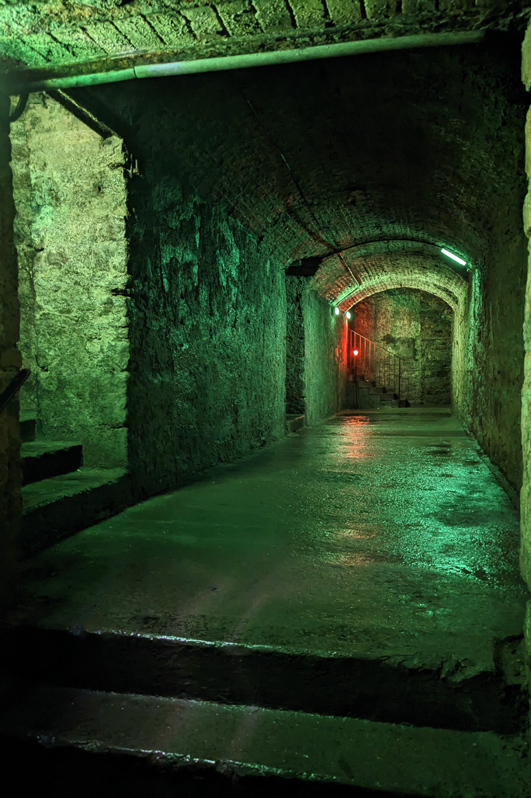
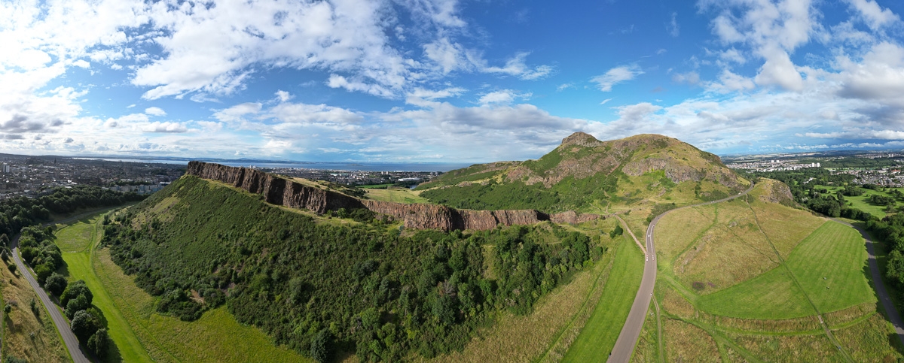

Stadt aus Stein - das beschreibt den *Old town* von Edinburgh für mich am Besten. Weil im Spätmittelalter die Anzahl der Einwohner ständig zunahm, die Fläche innerhalb der Stadtmauern aber begrenzt war, wurde jeder freie Platz zu- und zudem in die Höhe gebaut. Was in ähnlicher Konstellation in [Dubrovnik](/2012/06/16/drachen-uber-dubrovnik/) mit den hübschen roten Dächern und dem immerblauen Hintergrund aus Meer und Himmel wunderbar anzuschauen ist, hat mich in Edinburgh deprimiert.

Zum Einen ist wirklich kaum Grün zu sehen, dafür überall der dank des feuchten Klimas dunkel angelaufene Kalkstein. Zum Anderen ist nur ein kleiner Teil der Straßen verkehrsberuhigt, so dass ich nicht entspannt über die *Royal Mile* flanieren konnte sondern als Fußgänger auf engen Fußwegen balancieren musste, während Reisebusse neben mir langrauschten.

Spannend an diesem mittelalterlichen Hochhausbau fand ich aber, dass die Schotten auf die Idee kamen, Brücken durch die Häuserschluchten zu bauen. Dadurch bildeten sich abgeschlossene Räume unter den Brückenbögen, die als [Vaults](https://en.wikipedia.org/wiki/Edinburgh_Vaults) eine unrühmliche Bekanntheit erlangten, da sich neben Obdachlosen auch die verschiedensten Schmuggler und Verbrecher in den Kellern ohne Tageslicht tummelten - und heute Touristen auf Gruseltouren.

Generell hat sich die Stadt voll auf Tourismus eingestellt, so dass sich in der Innenstadt ein Giftshop an den anderen reiht und auch die Pubs deutlich machen, dass hier kein Einheimischer vorbeischaut. Diese sind vollkommen aus der Innenstadt vertrieben worden, so dass die steinernen Mauern das einzig verbliebene authentische sind. Hier lebt Schottland nicht, hier wird es ausgestellt und vor allem verkauft, und besteht nur aus Whisky, Tweed, Highland Cows und Nessie.

Wer Edinburgh von einer besseren Seite erleben will, kann beruhigt einen Bogen um die *Royal Mile* machen und sich gleich den Parks widmen - z.B. *The Meadows* mit den schön integrierten Neubauten in der Nähe der Universität oder *Calton Hill* mit seiner seltsamen Ansammlung von teilweise nicht fertiggestellten Monumenten.

Am besten gefallen hat mir jedoch der *Holyrood Park* mit seinen steilen Anstiegen zum *Arthur's Seat* und den tollen Aussichten über die Stadt. Hier werden tagsüber sogar die Autos auf den umliegenden Straßen verboten, alte [Bahntunnel in Fahrradwege umgewidmet](https://blog.historicenvironment.scot/2021/02/innocent-railway/), weht am Morgen der [Duft der Maische](https://holyrooddistillery.co.uk) durch die Straßen und pendeln die Studenten mit dem Rad zwischen Wohnheim und einer [zum Kunstzentrum umgewidmeten Brauerei/Tierklinik](https://www.summerhall.co.uk/).

