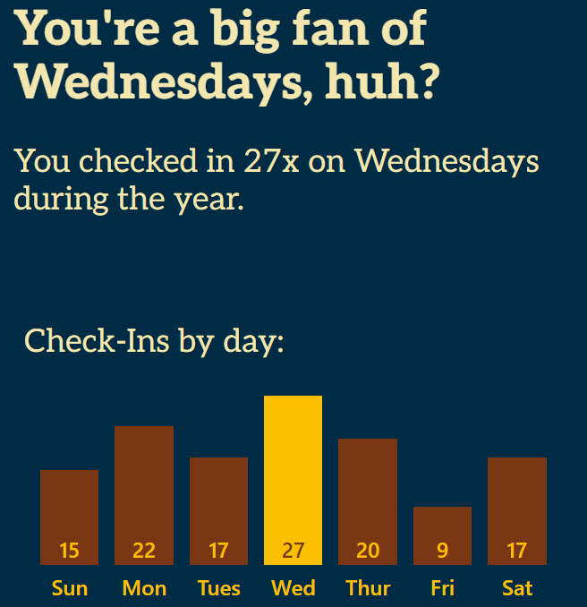

### ... in Filmen

Ich gehe inzwischen ja nur noch mit meiner Tochter ins Kino, weshalb ich dieses Jahr leider [sehr viele Fortsetzungen](/2023/12/29/ich-bin-das-problem/) gesehen habe. Deshalb kann ich abgesehen von [Der Junge und der Reiher](/2024/01/05/der-junge-und-der-reiher/) keine Empfehlung aussprechen, möchte aber gerne etwas zu im Netz gelobten Filmen sagen, die mich nicht überzeugt haben:

#### Overrated movies

* _The Substance_: Wichtiges Thema, das aber grell scheitert da der Film immer in-your-face gehen muss.
* [_Challengers_](/2024/09/05/challengers/): Toller Regisseur, tolle Schauspieler, toller Soundtrack, und dann auch noch im Tennis-Milieu - aber leider kann die banale Story nicht mithalten und wird durch die verschachtelte Erzählstruktur nur notdürftig kaschiert und durch das übertriebene Ende konterkariert.
* _The zone of interest_: Noch so ein Fall von wichtigem Thema künstlerisch verfehlt: Beim anstrengenden Tonkonzept fängt die Misere an, geht weiter über die fast fehlende Handlung bis hin zu den Schnitten in die Gegenwart und eine Nebenhandlung in Wärmebildkameraoptik. Schade um die Leistungen von Sandra Hüller und Christian Friedel.

### ... in Serien

Besser gefallen als viele Filme haben mir dieses Jahr einige Serien. Wer also noch nach Futter für die nächste Binge-Session sucht, dem empfehle ich

* _Severance_: Anfang 2025 startet die zweite Staffel dieser sehr interessanten Serie, die Ben Stiller als Produzent und Regisseur mitgestaltet hat. Die Idee: Mark arbeitet in einer Firma, wo aufgrund eines Eingriffs in sein Gehirn sein Privat- und Arbeitsleben komplett voneinander getrennt wurden. Doch nicht nur das Innere der Firma ist sehr seltsam, auch scheinen nicht alle Mitarbeiter den gleichen Eingriff erfahren zu haben - was also geht hier vor?
* _The Dropout_: Wie kann eine Firma, die auch nach Jahren niemals das versprochene Produkt liefern kann, über all die Zeit von wichtigen Geldgebern ünterstützt worden sein? Die Serie legt offen, wie sich Schein verkaufen lässt und ist vor allem auf der sprachlichen Ebene sehr spannend, da es das Vokabular der Startup-Welt als bloße Fassade entlarvt. 
* [_Fallout Staffel 1_](/2024/04/20/fallout/): Ich mag die Spiele, ich mag die retrofuturistische Welt und ich mag den Humor - das alles hat sich in die Serie hinübergerettet und sieht dazu auch noch sehr realistisch aus, wodurch _Fallout_ positiv aus der Menge der vielen schlechten Videospielverfilmungen vorsticht.

### ... in Büchern

Mit 18 Büchern habe ich dieses Jahr so viel gelesen wie seit 2008 nicht mehr. Und selbst wenn ich die meist kürzeren Comics und die Hörbücher herausnehme, stehen immer noch zehn Bücher auf der Habenseite. Mehr Details gibt es wie immer bei [Goodreads](https://www.goodreads.com/user/year_in_books/2024/44097851).

### ... in Bier

