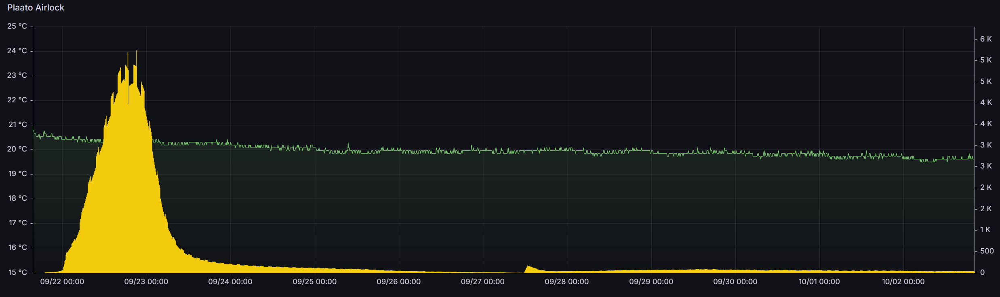

In meinem [England-Urlaub im Juli](/2025/08/03/walking-the-hadrians-wall/) habe ich natürlich auch das eine oder andere lokale Bier probiert. Am Besten hat mir dabei das [Wylam "Hickey The Rake"](https://beerstore.wylambrewery.co.uk/products/Hickey-The-Rake-Limonata-Pale-ABV-4-2-p180785446) geschmeckt, welches im schönen Biergarten [SUMMER ON THE SOUTHSIDE](https://www.instagram.com/bytheriverbrewco/) in Newcastle aus dem Zapfhahn floss. Die Brauer beschreiben es als _Ultra Pale Ale_, bei Untappd wird es unter _XPA (Extra Pale Ale)_ geführt - am Ende ist es ein leichtes, süffiges und sehr hopfiges Bier.

Zeit also, mal wieder ein Pale Ale selber zu brauen - die letzten vier Jahre habe ich mich vor allem IPAs und Sour Bieren gewidmet. Da das _Extra_ in _XPA_ von jeder Brauerei etwas anders interpretiert wird, habe ich ebenfalls meinen eigenen Zugang gesucht: Ausgehend vom Namensgag sollte es geschmacklich in Richtung Orangenmarmelade gehen (nicht zu viel natürlich; wer außer den Engländern mag schon Orangenmarmelade?). Der englische Hopfen _First Gold_ verspricht genau dieses Zitrusaroma, während die British-Ale-Hefe "Whitebread" die Hopfennote betonen soll (was nicht viele englische Hefen tun).

Da ich meine Biere gerne hazy und weich mag, habe ich ein XPA-Rezept mit Haferflocken abgewandelt und bin damit fast bei meiner klassischen NEIPA-Schüttung herausgekommen - nur eben mit etwas weniger Malz, um irgendwo bei 5% Alkohol zu landen.

### Maische

| Malz | Menge |
| ----- | ----- |
| Pale Ale Malz | 1.444g |
| Weizenmalz hell | 300g |
| Cara Pils | 75g |
| Haferflocken | 75g |

### Maischverlauf

- Einmaischen bei 71°C, 5 Minuten Rast.
- bei 68°C 60 Minuten Rast
- Abmaischen bei 78°C 

### Kochen

| Zutat | Menge | Kochzeit |
| ----- | ----- | -------- |
| First Gold | 5g | 60min |
| First Gold | 5g | 10min |
| First Gold | 50g | Whirlpool |
| First Gold | 40g | 1 Tag Stopfen |

### Gärung

*  GOZDAWA Original British Ale Yeast 04 'Whitebread' (OBAY04) 

### Das Ergebnis

Die Gärung lief erstaunlich zügig an und kam nach fünf Tagen zur Ruhe, so dass ich mit dem Hopfenstopfen startete. Allerdings wurde dadurch die Gärung wieder aktiviert und es brauchte fünf weitere Tage, bis ich abfüllen konnte - viel zu lange für den Stopfhopfen. Entsprechend deutlich sind die grasigen Noten im Bier vorhanden, die das Gesamtbild etwas stören. Der _First Gold_ Hopfen hat aber wie versprochen abgeliefert und die gewünschten Orangennoten entwickelt.
