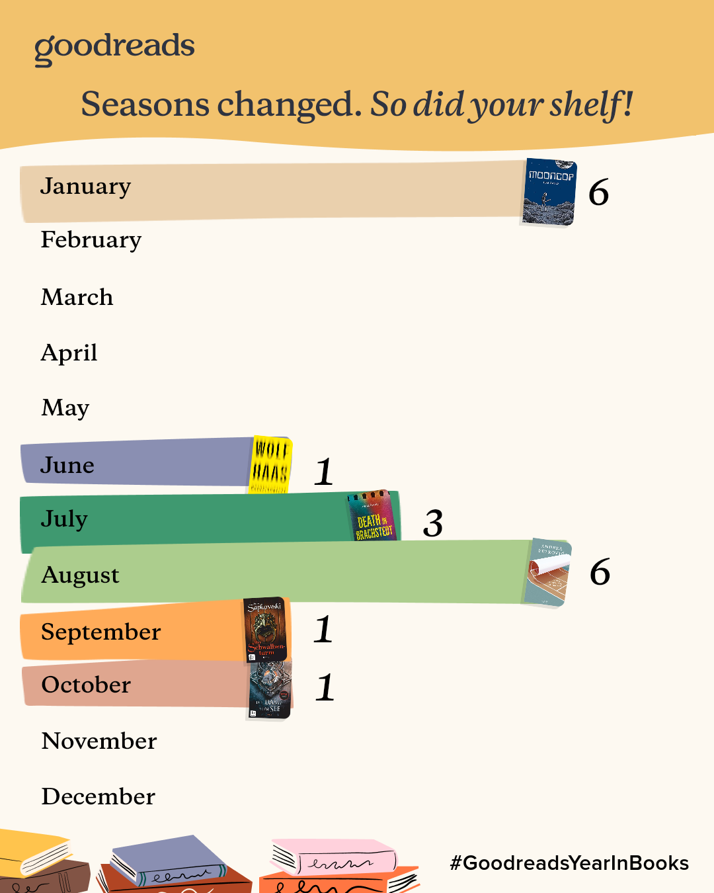
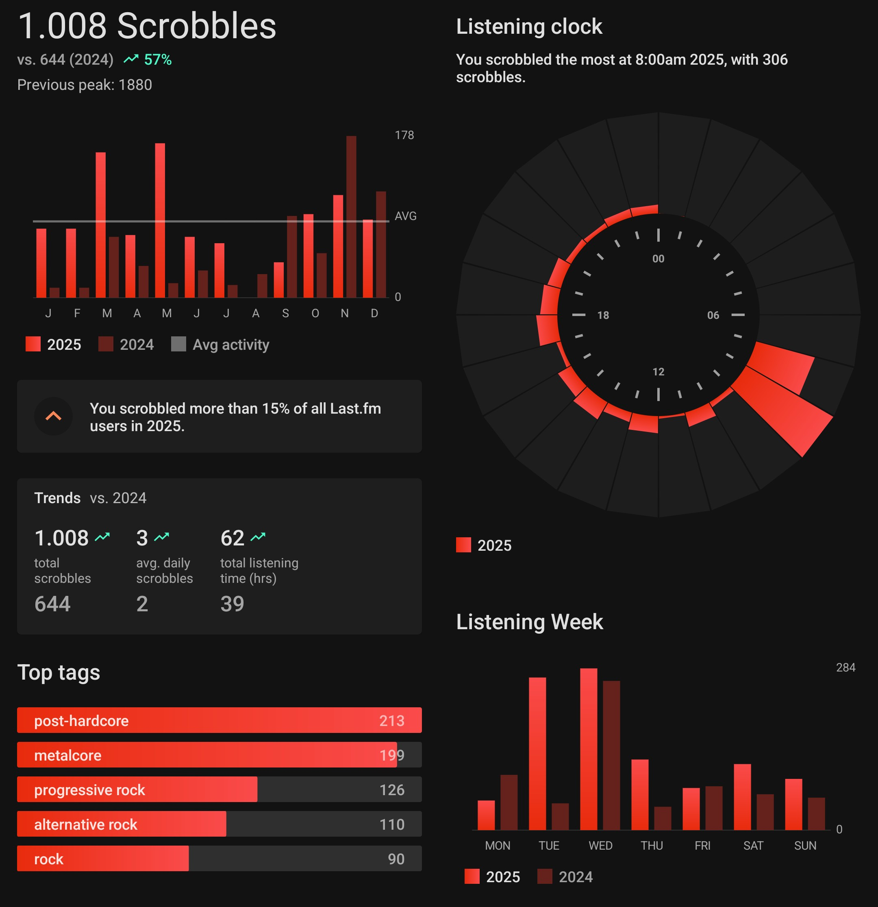
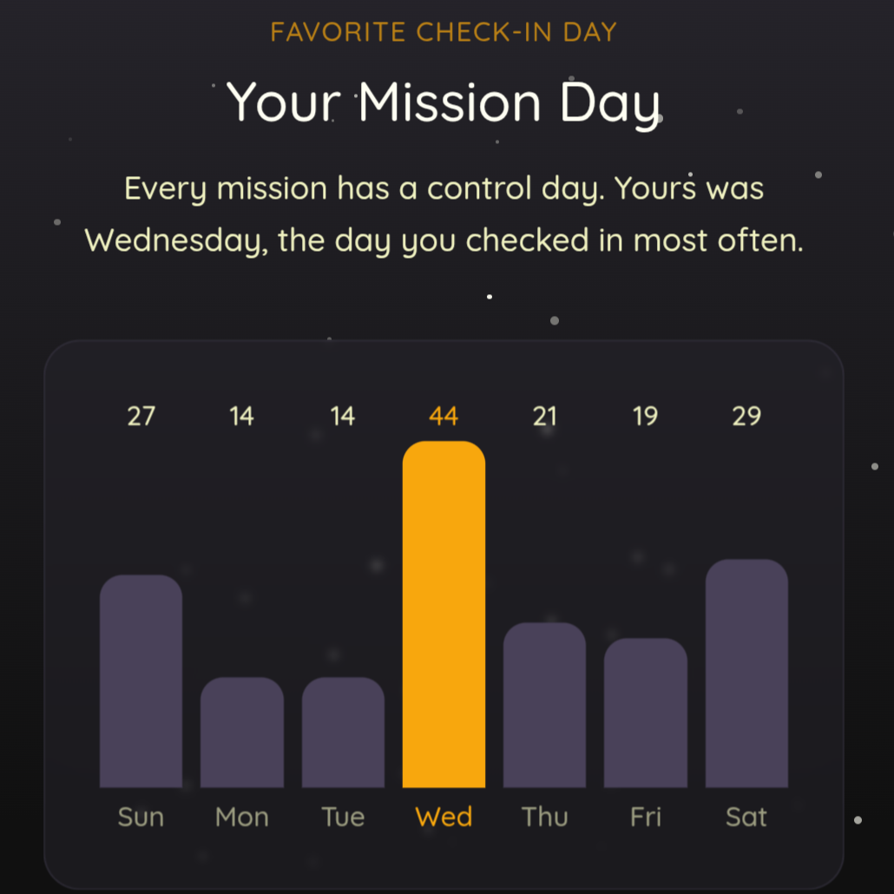

### ... in Filmen

Ein Trend hat mich dieses Jahr sowohl bei den Filmen als auch den Serien geprägt: Ich brauchte etwas zum Lachen und habe deshalb gezielt nach Humor gesucht. Und in Filmform habe ich ihn bei [Hundreds of Beavers](/2025/01/03/filme-zum-jahresstart/#hundreds-of-beavers) gefunden. Etwas deart Wildes und Verrücktes habe ich lange nicht gesehen.

Das Kontrastprogramm dazu war _Heldin_. Fast schon dokumentarisch zeigt dieser Film die Nachtschicht einer Krankenschwester und damit wie mit der Lupe die Probleme unseres Gesundheitssystems und den Stand unserer Gesellschaft. Intensiv und wichtig!

### ... in Serien

Gelacht habe ich vor allem über _Almania_, _Tschappel_ und (die leider letzte Staffel von) _Parlament_.

Aber auch im Serienbereich gibt es mit _Adolescence_ einen Beitrag, der nicht nur viel über unsere Gesellschaft zu sagen hat, sondern dies auch noch anspruchsvoll in scheibaren One-Takes verpackt.

Zum Schluss verlängere ich meine Empfehlung vom letzten Jahr für _Severance_ für dessen zweite Staffel. Es wird nicht ganz das Niveau der ersten Folgen gehalten, aber die Mischung von SciFi und _Lost_ lebt weiterhin von den vielen WTF-Momenten und wird getragen von guten Schauspielern und der fantastischen Ausstattung.

### ... in Büchern

Mit 18 Büchern konnte ich dieses Jahr mein Level von 2024 halten. Die Statistik zeigt aber schön, dass ich ein Urlaubs-Leser bin und mir ansonsten zu wenig Zeit für das Lesen nehme. Mehr Details gibt es wie immer bei [Goodreads](https://www.goodreads.com/user/year_in_books/2025/44097851).

### ... in Musik

Nachdem ich 2024 endlich auf einen Familienaccount bei Youtube Music umgestiegen bin, gibt es nun auch Statistiken, die nicht von _Bibi Blocksberg_ und _Imagine Dragons_ verfälscht sind. Da das Tool aber nicht versteht, dass ich hauptsächlich Alben von vorne bis hinten höre, greife ich doch lieber auf die Daten bei Last.fm zurück. Und dort zeigt sich: Ich habe fast doppelt so viel Musik gehört verglichen mit 2024, was vermutlich an der höheren Qualität der Releases liegt. So haben meine long-time favourites _Coheed and Cambria_, _Underoath_ und _The Birthday Massacre_ allesamt abgeliefert und mich über das Jahr getragen.

### ... in Bier

Untappd versaut den Recappd genannten Jahresrückblick dieses Mal mit einer wenig aussagekräftigen Klickstrecke, die von extrem viel Werbung garniert ist. So bleibt mir nur, von den Pubs entlang der [Hadrian's Wall Wanderung](/2025/08/03/walking-the-hadrians-wall/) zu schwärmen.

Und wie im Vorjahr ist der Mittwoch mit dem _Bier nach dem Sport_ mein "Mission Day":

